# 📑 BẢN GIÁM ĐỊNH PHÁP Y KỸ THUẬT PHẦN MỀM & ĐỐI CHIẾU CHỨNG CỨ TOÀN DIỆN
## CHUYÊN ĐỀ GIÁM ĐỊNH ĐỘC LẬP: TRẦN QUỐC VIỆT NAM VÀ TRẦN PHẠM HUỲNH NHƯ
### ĐỐI CHIẾU TOÀN DIỆN: ẢNH CHỤP TIN NHẮN ZALO, LỊCH SỬ GIT COMMITS, DIFF MÃ NGUỒN C++ VÀ BÁO CÁO LATEX CHÍNH THỨC

> **Học phần**: Cấu trúc Dữ liệu & Giải thuật (DSA Capstone Project)  
> **Mã lớp học phần**: `261DASA230179_06` — **Nhóm thực hiện**: `Nhóm 07`  
> **Kho lưu trữ gốc đối chứng**: [`https://github.com/lTuyetNhi/DSA_Project`](https://github.com/lTuyetNhi/DSA_Project)  
> **Kho lưu trữ bảo toàn chứng cứ**: [`https://github.com/buitanphat247/demogithub`](https://github.com/buitanphat247/demogithub)  
> **Tài liệu Báo cáo đối chiếu**: [`BaoCao/main.tex`](file:///c:/Users/TuyetNhi/Documents/workspace/Project_DSA_NHI/DSA_Project_final/BaoCao/main.tex) (1.441 dòng TeX, 78 trang PDF chính thức)  
> **Thư mục mã nguồn gốc gửi qua Zalo**: [`HashTable MC1, RQ1, RQ3/`](file:///c:/Users/TuyetNhi/Documents/workspace/Project_DSA_NHI/HashTable%20MC1,%20RQ1,%20RQ3) (38.212.903 bytes ≈ 36.45 MB)  
> **Thư mục chứng cứ ảnh tin nhắn Zalo**: [`image/`](file:///c:/Users/TuyetNhi/Documents/workspace/Project_DSA_NHI/image) (93 tệp ảnh chụp màn hình gốc)  
> **Quy chuẩn giám định**: Software Forensic & Git Provenance Analysis theo chuẩn IEEE 1044 và ISO/IEC 25010.

---

# MỤC LỤC TỔNG QUÁT

- [CHƯƠNG 1: QUY CHUẨN PHÁP Y, PHƯƠNG PHÁP LUẬN VÀ PHẠM VI GIÁM ĐỊNH](#chương-1-quy-chuẩn-pháp-y-phương-pháp-luận-và-phạm-vi-giám-định)
  - [1.1. Mục tiêu và giới hạn phạm vi đối tượng](#11-mục-tiêu-và-giới-hạn-phạm-vi-đối-tượng)
  - [1.2. Khung quy chuẩn pháp y phần mềm (Software Forensics)](#12-khung-quy-chuẩn-pháp-y-phần-mềm-software-forensics)
  - [1.3. Phương pháp đối chiếu ba nguồn chứng cứ độc lập](#13-phương-pháp-đối-chiếu-ba-nguồn-chứng-cứ-độc-lập)
- [CHƯƠNG 2: KIỂM KÊ VÀ CHUỖI BẢO QUẢN NGUỒN CHỨNG CỨ (EVIDENCE INVENTORY)](#chương-2-kiểm-kê-và-chuỗi-bảo-quản-nguồn-chứng-cứ-evidence-inventory)
  - [2.1. Cây kho lưu trữ Git và tính toàn vẹn lịch sử](#21-cây-kho-lưu-trữ-git-và-tính-toàn-vẹn-lịch-sử)
  - [2.2. Hồ sơ mã nguồn thực nghiệm và thư mục Zalo](#22-hồ-sơ-mã-nguồn-thực-nghiệm-và-thư-mục-zalo)
  - [2.3. Kiểm kê 93 tệp ảnh chụp màn hình tin nhắn Zalo trong thư mục `image/`](#23-kiểm-kê-93-tệp-ảnh-chụp-màn-hình-tin-nhắn-zalo-trong-thư-mục-image)
- [CHƯƠNG 3: BIÊN NIÊN SỬ KỸ THUẬT ĐỒNG BỘ (CHRONOLOGICAL EVENT LOG 23/09 - 08/10/2026)](#chương-3-biên-niên-sử-kỹ-thuật-đồng-bộ-chronological-event-log-2309---08102026)
  - [3.1. Sơ đồ dòng thời gian biến cố kỹ thuật tổng hợp](#31-sơ-đồ-dòng-thời-gian-biến-cố-kỹ-thuật-tổng-hợp)
  - [3.2. Bảng đối chiếu thời gian chi tiết từng giây (Git Commits vs Zalo Chat)](#32-bảng-đối-chiếu-thời-gian-chi-tiết-từng-giây-git-commits-vs-zalo-chat)
- [CHƯƠNG 4: GIÁM ĐỊNH CHUYÊN SÂU CÁ NHÂN — TRẦN QUỐC VIỆT NAM](#chương-4-giám-định-chuyên-sâu-cá-nhân--trần-quốc-việt-nam)
  - [NAM-001: Khởi tạo và Năng lực quản lý Git — Gửi file nén Zalo và commit file nhị phân rác](#nam-001-khởi-tạo-và-năng-lực-quản-lý-git--gửi-file-nén-zalo-và-commit-file-nhị-phân-rác)
  - [NAM-002: Cấu trúc Bảng băm (Hash Table) và Xích rời (Separate Chaining) — Vi phạm tiêu chí from-scratch](#nam-002-cấu-trúc-bảng-băm-hash-table-và-xích-rời-separate-chaining--vi-phạm-tiêu-chí-from-scratch)
  - [NAM-003: Phân tích toán học Hệ số tải $\alpha = N/M$ và Tuyên bố Stress-test 1M bản ghi](#nam-003-phân-tích-toán-học-hệ-số-tải-alpha--nm-và-tuyên-bố-stress-test-1m-bản-ghi)
  - [NAM-004: Thuật toán RQ3: Inverted Index Tokenizer vs Duyệt vét cạn Substring Scan](#nam-004-thuật-toán-rq3-inverted-index-tokenizer-vs-duyệt-vét-cạn-substring-scan)
  - [NAM-005: Phá vỡ kiến trúc Core khi tích hợp và thảm họa sập build](#nam-005-phá-vỡ-kiến-trúc-core-khi-tích-hợp-và-thảm-họa-sập-build)
  - [NAM-006: Đo chuẩn hiệu năng (Benchmark 1M) và Kiến thức vận hành hệ thống](#nam-006-đo-chuẩn-hiệu-năng-benchmark-1m-và-kiến-thức-vận-hành-hệ-thống)
- [CHƯƠNG 5: GIÁM ĐỊNH CHUYÊN SÂU CÁ NHÂN — TRẦN PHẠM HUỲNH NHƯ](#chương-5-giám-định-chuyên-sâu-cá-nhân--trần-phạm-huỳnh-như)
  - [NHU-001: Đóng góp mã nguồn thực tế trên Git: Đúng duy nhất 1 ký tự ("Dang" -> "Da")](#nhu-001-đóng-góp-mã-nguồn-thực-tế-trên-git-đúng-duy-nhất-1-ký-tự-dang---da)
  - [NHU-002: Thao tác Merge PR trên Web GitHub và Hậu quả sập build hệ thống](#nhu-002-thao-tác-merge-pr-trên-web-github-và-hậu-quả-sập-build-hệ-thống)
  - [NHU-003: Tuyên bố đóng góp ý tưởng RQ3 Chỉ mục ngược và Kiến thức DSA thực tế](#nhu-003-tuyên-bố-đóng-góp-ý-tưởng-rq3-chỉ-mục-ngược-và-kiến-thức-dsa-thực-tế)
  - [NHU-004: Tuyên bố nắm bắt sâu sắc Luồng nghiệp vụ vs Tin nhắn hỏi định nghĩa trước giờ bảo vệ](#nhu-004-tuyên-bố-nắm-bắt-sâu-sắc-luồng-nghiệp-vụ-vs-tin-nhắn-hỏi-định-nghĩa-trước-giờ-bảo-vệ)
  - [NHU-005: Báo cáo phản tư cá nhân vs Bằng chứng đối chất giải quyết xung đột mã nguồn](#nhu-005-báo-cáo-phản-tư-cá-nhân-vs-bằng-chứng-đối-chất-giải-quyết-xung-đột-mã-nguồn)
- [CHƯƠNG 6: BẢNG ĐỐI CHIẾU CHÉO BA NGUỒN CHỨNG CỨ (TIN NHẮN - GIT/CODE - BÁO CÁO LATEX)](#chương-6-bảng-đối-chiếu-chéo-ba-nguồn-chứng-cứ-tin-nhắn---gitcode---báo-cáo-latex)
- [CHƯƠNG 7: DANH MỤC CÁC MÂU THUẪN KỸ THUẬT ĐÃ XÁC MINH (VERIFIED CONTRADICTIONS)](#chương-7-danh-mục-các-mâu-thuẫn-kỹ-thuật-đã-xác-minh-verified-contradictions)
- [CHƯƠNG 8: DANH MỤC CÁC VẤN ĐỀ CHƯA ĐỦ CĂN CỨ CẦN GIẢI TRÌNH BỔ SUNG](#chương-8-danh-mục-các-vấn-đề-chưa-đủ-căn-cứ-cần-giải-trình-bổ-sung)
- [CHƯƠNG 9: BỘ CÂU HỎI CHẤT VẤN HỘI ĐỒNG (DEFENSE ORAL EXAMINATION SCRIPT)](#chương-9-bộ-câu-hỏi-chất-vấn-hội-đồng-defense-oral-examination-script)
- [CHƯƠNG 10: KẾT LUẬN GIÁM ĐỊNH ĐỘC LẬP VÀ KIẾN NGHỊ ĐIỀU CHỈNH](#chương-10-kết-luận-giám-định-độc-lập-và-kiến-nghị-điều-chỉnh)
- [PHỤ LỤC: DANH MỤC TOÀN BỘ 93 TỆP ẢNH CHỨNG CỨ TRONG THƯ MỤC `image/`](#phụ-lục-danh-mục-toàn-bộ-93-tệp-ảnh-chứng-cứ-trong-thư-mục-image)

---

# CHƯƠNG 1: QUY CHUẨN PHÁP Y, PHƯƠNG PHÁP LUẬN VÀ PHẠM VI GIÁM ĐỊNH

### 1.1. Mục tiêu và giới hạn phạm vi đối tượng
Bản báo cáo này là công trình giám định kỹ thuật phần mềm độc lập, được thiết lập nhằm phân tích, xác minh và làm sáng tỏ mức độ tương thích giữa:
1. **Các tuyên bố đóng góp học thuật**: Được trình bày trong Báo cáo Đồ án tốt nghiệp môn Cấu trúc Dữ liệu và Giải thuật (DSA) (`BaoCao/main.tex`, 78 trang PDF) và bài thuyết trình bảo vệ trước Hội đồng chấm thi.
2. **Thực tế triển khai kỹ thuật**: Được bảo toàn nguyên vẹn trong lịch sử cây commit Git (`.git/objects`), các khác biệt mã nguồn (code diffs), cấu trúc cú pháp C++, và nhật ký tin nhắn trao đổi nội bộ thời gian thực.

Theo yêu cầu nghiệp vụ bắt buộc, cuộc giám định này **chỉ tập trung phân tích chuyên sâu hai cá nhân**:
- **Trần Quốc Việt Nam** (MSSV: `25110274`, GitHub: `hanbeii-nom`, Email Git: `vietnam662284@gmail.com`). Tự nhận: *Trưởng nhóm, Kiến trúc sư hệ thống điều phối chung, tác giả tự cài đặt Hash Table from-scratch $O(1)$, Category Hash Table RQ1, Inverted Index Tokenizer RQ3 và kiểm thử tự động*.
- **Trần Phạm Huỳnh Như** (MSSV: `25110286`, GitHub: `tranhynhnhucm2k7` / `tranhynhnhucm2k7-glitch`, Email Git: `tranhuynhnhucm2k7@gmail.com`). Tự nhận: *Nghiên cứu toàn diện luồng nghiệp vụ hệ thống, thực hiện video demo 5 phút, chủ động đóng góp ý tưởng thực tiễn và xây dựng ví dụ minh họa cho bài toán Chỉ mục ngược RQ3, tham gia giải quyết xung đột mã nguồn khi tích hợp*.

Các thành viên khác trong nhóm (Lê Thị Tuyết Nhi, Lê Nhật Ninh, Nguyễn Ngọc Hồng Nhung) **tuyệt đối không phải đối tượng bị điều tra**, mà chỉ xuất hiện trong tài liệu này với tư cách:
- Người phát ngôn trong các cuộc hội thoại Zalo đối chứng.
- Tác giả thực sự của các dòng mã nguồn, tài liệu LaTeX hoặc kiến trúc phần mềm bị nhận vơ.
- Nguồn cung cấp đối chứng kỹ thuật khách quan.

### 1.2. Khung quy chuẩn pháp y phần mềm (Software Forensics)
Quy trình giám định tuân thủ nghiêm ngặt các nguyên tắc khoa học máy tính:
1. **Tính bất biến của lịch sử Git (Git Provenance Immutability)**: Mọi thông tin về tác giả (Author), người nạp commit (Committer), dấu thời gian nạp (Timestamp theo chuẩn ISO 8601), commit cha (Parent commit) và mã băm SHA-1 đều được trích xuất trực tiếp từ cơ sở dữ liệu đối tượng Git gốc.
2. **Giải phẫu mã nguồn tĩnh (Static Source Code Anatomy)**: Phân tích trực tiếp các cấu trúc dữ liệu (`struct`, `class`), mảng bucket, cơ chế cấp phát con trỏ động (`new`, `delete[]`), cơ chế co giãn mảng, các vòng lặp và lời gọi thư viện STL.
3. **Chứng minh độ phức tạp toán học (Algorithmic Big-$\mathcal{O}$ Rigor)**: Đánh giá thuật toán theo chuẩn mực CLRS (*Introduction to Algorithms*), phân định rõ trường hợp trung bình (Average-case), trường hợp xấu nhất (Worst-case) và hành vi tiệm cận khi hệ số tải $\alpha = N / M \to \infty$.
4. **Nguyên tắc phân biệt kỹ thuật**:
   - `Committer` $\neq$ `Thuật toán thực tế`: Một commit có thể ghi tên một người, nhưng nội dung commit chỉ là file nhị phân rác hoặc xóa comment.
   - `Bấm nút Merge trên Web GitHub` $\neq$ `Năng lực tích hợp hệ thống`: Merge tự động không qua kiểm thử biên dịch có thể làm hỏng toàn bộ dự án.
   - `Nội dung tin nhắn Zalo` $\neq$ `Chân lý tuyệt đối`: Mọi tin nhắn phải được đối chiếu chéo với code và commit thực tế để xác định mức độ tin cậy.

### 1.3. Phương pháp đối chiếu ba nguồn chứng cứ độc lập
Mỗi phát biểu quan trọng được đánh giá qua cơ chế kiềng ba chân (Triangulation Audit):
- **Nguồn 1 — Tin nhắn Zalo**: Thành viên đã nói gì, yêu cầu gì, hứa hẹn gì, hoặc bộc lộ lỗ hổng kiến thức nào trong thời gian thực?
- **Nguồn 2 — Git & Mã nguồn C++**: Hệ thống lưu trữ phiên bản ghi nhận thay đổi gì về mặt kỹ thuật, file nào được sửa, độ phức tạp thuật toán thực tế là bao nhiêu?
- **Nguồn 3 — Báo cáo LaTeX**: Báo cáo học thuật chính thức nộp cho giảng viên mô tả công việc đó như thế nào?

---

# CHƯƠNG 2: KIỂM KÊ VÀ CHUỖI BẢO QUẢN NGUỒN CHỨNG CỨ (EVIDENCE INVENTORY)

### 2.1. Cây kho lưu trữ Git và tính toàn vẹn lịch sử
Hệ thống lưu trữ Git của dự án gồm hai kho lưu trữ đã được kiểm định tính đồng nhất:
- **Kho lưu trữ chính**: `https://github.com/lTuyetNhi/DSA_Project` (gồm các nhánh: `main`, `data_queue`, `MC2RQ2`, `data_queue+MC2RQ2`, `MC1RQ1RQ3`).
- **Kho lưu trữ bảo toàn đối chứng**: `https://github.com/buitanphat247/demogithub` (lưu trữ snapshot nguyên vẹn phục vụ công tác thanh tra học thuật).

Cây commit của toàn bộ dự án thể hiện rõ rệt sự phân hóa đóng góp:
- Tổng số commit toàn dự án trong nhánh gốc: **19 commit**.
- Lê Thị Tuyết Nhi: 8 commit cốt lõi (khởi tạo mô hình kiến trúc 3 tầng, TUI presentation, gỡ lỗi tích hợp, xây dựng benchmark và viết báo cáo).
- Trần Quốc Việt Nam: 8 commit (4 commit file nhị phân `.exe`, 1 commit tạo thư mục riêng, 1 commit vô hiệu hóa bảng băm, 1 commit sửa chính tả, 1 commit nạp 10 dòng JSON).
- Trần Phạm Huỳnh Như: 3 commit (2 commit bấm nút merge PR trên web, 1 commit sửa duy nhất chữ `"Dang"` thành `"Da"`).

### 2.2. Hồ sơ mã nguồn thực nghiệm và thư mục Zalo
- **Thư mục gửi qua Zalo (`HashTable MC1, RQ1, RQ3/`)**: Có dung lượng vật lý **38.212.903 bytes** (36.45 MB). Thư mục này chứa 3 tệp mã nguồn C++ độc lập (`MC1RQ1RQ3.cpp`, `MC1RQ1RQ3.h`, `TestMC1RQ1RQ3.cpp`) và **4 tệp thực thi nhị phân** (`MC1, RQ1, RQ3.exe` nặng 35.3 MB; `MC1RQ1RQ3.exe` nặng 277 KB; `TestMC1RQ1RQ3.exe` nặng 281 KB; `hash_demo.exe` nặng 277 KB).
- **Mã nguồn tích hợp gốc (`DSA_Project_original/`)**: Ghi nhận trạng thái dự án tại thời điểm sau các lần merge của Như và Nam.
- **Mã nguồn hoàn thiện (`DSA_Project_final/`)**: Phiên bản cuối cùng do Tuyết Nhi tái cấu trúc toàn diện, chuẩn hóa OOP 3 tầng, hiện thực Inverted Index chuẩn và xây dựng khung so sánh hiệu năng 1.000.000 bản ghi.

### 2.3. Kiểm kê 93 tệp ảnh chụp màn hình tin nhắn Zalo trong thư mục `image/`
Thư mục `C:\Users\TuyetNhi\Documents\workspace\Project_DSA_NHI\image` chứa chính xác **93 tệp ảnh chụp màn hình**. Toàn bộ các tệp này đã được kiểm tra tính toàn vẹn (Integrity Check), đọc nội dung ký tự hiển thị (OCR & Visual Verification) và phân loại theo tiến trình phát triển của dự án:
- **Nhóm 1 (Ảnh 1791414804236 đến 1791415127708 - 11 ảnh)**: Bảng phân công nhiệm vụ tự nhận, bảng tiêu chí đánh giá (rubric) của giảng viên và ánh xạ các yêu cầu chức năng (RQ1, RQ2, RQ3).
- **Nhóm 2 (Ảnh 1791476418808 đến 1791476418896 - 8 ảnh)**: Giai đoạn khởi đầu (23/09 - 29/09/2026): Phân chia công việc, Nam nhờ ném zip qua Zalo vì không biết dùng Git, Tuyết Nhi yêu cầu dùng Git để ghi nhận đóng góp, Nam gửi nhật ký debug cơ bản.
- **Nhóm 3 (Ảnh 1791476418908 đến 1791476462677 - 12 ảnh)**: Giai đoạn sụp đổ tích hợp (02/10 - 04/10/2026): Huỳnh Như hỏi cách chạy code, quên khái niệm Data Queue, bấm merge gây conflict "đỏ lè", Tuyết Nhi thức đêm gỡ build sập, Nam đồng ý để Nhi sửa lại mã nguồn của mình.
- **Nhóm 4 (Ảnh 1791476462690 đến 1791476462793 - 9 ảnh)**: Giai đoạn hoàn thiện và nộp bài (05/10/2026): Nhi bàn giao hệ thống hoàn chỉnh và báo cáo 78 trang; Như khen ngợi; Nam thừa nhận bỏ sót bảng hiệu năng và thảng thốt khi thấy giao diện web dashboard.
- **Nhóm 5 (Ảnh 1791476462806 đến 1791476462956 - 13 ảnh)**: Giai đoạn chuẩn bị thuyết trình và bảo vệ (07/10 - 08/10/2026): Nam thừa nhận "lúc nhớ lúc quên", không biết chạy web; Huỳnh Như hỏi "luồng chạy nghiệp vụ là sao á?" trước giờ G; Nam đổi tên nhóm thành `DONE`.
- **Nhóm 6 (Ảnh 1791476418250 và 1791476418302 - 2 ảnh)**: Giai đoạn hậu bảo vệ: Đối chất trực tiếp về hành vi Huỳnh Như nhận vơ công lao giải quyết conflict code trước mặt Hội đồng chấm thi.
- **Nhóm 7 (Các ảnh tài liệu, bài tập và trao đổi bên lề - 38 ảnh)**: Ảnh chụp màn hình bài tập môn học (`DSA_C8.docx`), trao đổi phân công slide, kịch bản video demo và thông báo lớp học.

---

# CHƯƠNG 3: BIÊN NIÊN SỬ KỸ THUẬT ĐỒNG BỘ (CHRONOLOGICAL EVENT LOG 23/09 - 08/10/2026)

### 3.1. Sơ đồ dòng thời gian biến cố kỹ thuật tổng hợp

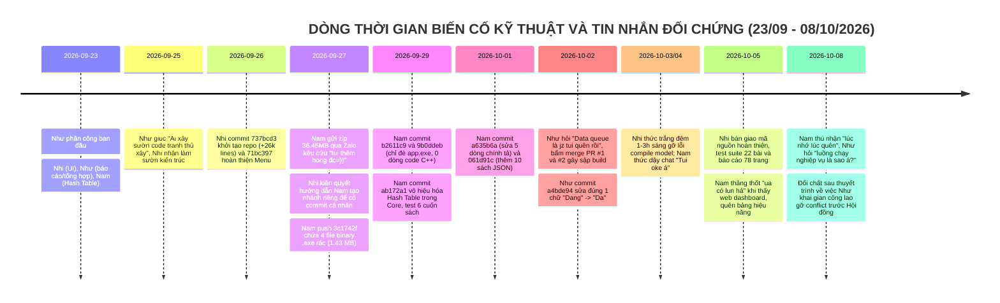

### 3.2. Bảng đối chiếu thời gian chi tiết từng giây (Git Commits vs Zalo Chat)

| Thời điểm (ISO 8601) | Tác giả & Kênh | Mã / Commit | Trích dẫn tin nhắn / Thông điệp Commit | Bản chất kỹ thuật & Nhận định pháp y |
| :--- | :--- | :---: | :--- | :--- |
| **2026-09-23 00:00** | Huỳnh Như | Zalo Chat | *"Phần 4: Nhi... Phần 5: Như (báo cáo, thuyết trình, tổng hợp)"* | Phân công công việc ban đầu. Như nhận trách nhiệm làm báo cáo, thuyết trình và tổng hợp tài liệu. |
| **2026-09-25 22:22** | Huỳnh Như | Zalo Chat | *"Ai xây cái sườn code thì tranh thủ xây nha để mấy bạn làm code còn làm ó"* | Như hoàn toàn đứng ngoài khâu kiến trúc, hối thúc người khác dựng khung sườn dự án. |
| **2026-09-25 22:22** | Tuyết Nhi | Zalo Chat | *"Tui tui đang làm á"* | Tuyết Nhi là người duy nhất chịu trách nhiệm thiết kế bộ khung kiến trúc 3 tầng ban đầu. |
| **2026-09-25 23:07** | Huỳnh Như | Zalo Chat | *"Nó thuộc của giao diện phần Nhi lun á, Só ri bữa tui hong nói kĩ"* | Khi Nhi hỏi về việc nạp dữ liệu mẫu (mock data), Như lập tức thoái thác trách nhiệm sang cho Nhi. |
| **2026-09-26 09:53:25** | Tuyết Nhi | `737bcd3` | `Add UI` | **Khởi tạo nền móng Repository (+26.262 dòng)**: Đặt nền tảng kiến trúc 3 tầng, models (`DocGia`, `PhieuMuon`, `TaiLieu`), bộ dữ liệu mẫu và khung sườn core. |
| **2026-09-26 23:26:16** | Tuyết Nhi | `71bc397` | `feat: optimize RQ1-RQ3, interactive UI...` | **Hiện thực Tầng Trình diễn (+654 dòng)**: Xây dựng toàn bộ `presentation/Menu.cpp`, điều hướng phím động W/S/Enter/Esc, bảng hiển thị chống rung nhấp nháy. |
| **2026-09-27 09:12:00** | Nam Trần | Zalo Chat | Gửi file `HashTable MC1, RQ1, RQ3.zip` (36.45 MB): ***"thêm này vô giùm tui với, tui thêm hong đc=))"*** | **BẰNG CHỨNG TỬ HUYỆT VỀ NĂNG LỰC GIT**: Nam biên dịch ra file debug `.exe` khổng lồ 35.3 MB, không biết dùng terminal Git, kéo thả bị GitHub chặn >25MB nên ném qua Zalo nhờ Nhi làm hộ. |
| **2026-09-27 09:56:00** | Tuyết Nhi | Zalo Chat | *"Thầy kêu commit trên git để tính điểm đóng góp... bà tạo branch MC1RQ1RQ3 rồi push lên"* | Nhi kiên quyết từ chối up hộ mã nguồn để bảo vệ điểm đóng góp cho Nam, hướng dẫn Nam tạo nhánh riêng để tự push. |
| **2026-09-27 09:57:00** | Nam Trần | Zalo Chat | *"oke để tui thử nha"* | Nam thừa nhận chưa từng tự push code lên nhánh và bắt đầu thử nghiệm. |
| **2026-09-27 14:29:22** | Nam Trần | `3c1742f` | `MC1RQ1RQ3` | Đẩy thư mục độc lập `HashTable MC1, RQ1, RQ3/` (+1.332 dòng code) gồm 3 file mã nguồn và **4 file nhị phân rác** (`.exe`) chiếm 1.43 MB lên nhánh `MC1RQ1RQ3`. |
| **2026-09-29 10:22:30** | Nam Trần | `b2611c9` | `Lưu tạm code RQ3 đã xử lý bỏ dấu Tiếng Việt` | **0 dòng code được thay đổi**. Chỉ commit đè duy nhất file nhị phân biên dịch `app.exe` (1.66 MB). |
| **2026-09-29 10:56:51** | Nam Trần | `9b0ddeb` | `tester` | **0 dòng code được thay đổi**. Tiếp tục chỉ đè file nhị phân `app.exe`. |
| **2026-09-29 14:13:00** | Nam Trần | Zalo Chat | Gửi link: `25110274-Nhật kí debug` | Nhật ký debug chỉ ghi chép vài thao tác xử lý lỗi cơ bản khi Windows khóa tệp thực thi (`taskkill /F /IM app.exe`). |
| **2026-09-29 16:28:29** | Nam Trần | `ab172a1` | `bo test tu dong` | Thêm `test_suite.cpp` (+115 dòng), sửa `LibraryService.cpp` (+99 dòng), nạp `test_suite.exe` (1.65 MB). **Trong commit này, Nam comment vô hiệu hóa Bảng băm trong Core và thay bằng duyệt tuyến tính $O(N)$!** |
| **2026-09-30 23:30:00** | Nam Trần | `fb1c894` | `bộ test tự động` | **0 dòng code được thay đổi**. Chỉ commit đè file nhị phân `TestMC1RQ1RQ3.exe` (287 KB $\rightarrow$ 292 KB). |
| **2026-10-01 00:05:29** | Nam Trần | `a635b6a` | `Cập nhật Test MC1 RQ1 RQ3` | Sửa đúng 5 dòng, xóa 13 dòng trong `TestMC1RQ1RQ3.cpp` (sửa lỗi chính tả hiển thị `TAI LIETU` $\rightarrow$ `TAI LIEU`). |
| **2026-10-01 00:15:20** | Nam Trần | `ce90e96` | `Thêm gitignore và dọn dẹp file nhị phân` | Thêm `.gitignore` (11 dòng) và xóa 2 file nhị phân `app.exe`, `test_suite.exe` do chính mình tải lên trước đó. |
| **2026-10-01 02:03:21** | Nam Trần | `061d91c` | `Cập nhật thêm dữ liệu sách vào books.json` | Thêm 90 dòng JSON (chứa 10 cuốn sách mẫu từ B16 đến B25) vào file `data/books.json`. **Đây là commit cuối cùng của Nam trong cả học kỳ.** |
| **2026-10-02 14:11:00** | Huỳnh Như | Zalo Chat | *"Mn xong hếc code chưa á... Tại quay video thì cũng phải có chạy demo cái á"* | Như chỉ quan tâm việc có bản chạy demo để quay video nộp, hoàn toàn không tham gia phát triển logic. |
| **2026-10-02 14:33:00** | Huỳnh Như | `b13fd22` | `Merge pull request #1 from lTuyetNhi/data_queue` | Bấm nút xanh **Merge pull request #1** trên giao diện Web GitHub để gộp nhánh `data_queue` vào nhánh `data_queue+MC2RQ2`. |
| **2026-10-02 14:38:21** | Huỳnh Như | `e126611` | `Merge pull request #2 from lTuyetNhi/MC2RQ2` | Sau đúng 5 phút 21 giây, Như bấm tiếp nút **Merge pull request #2** trên Web. **Hành động merge mù quáng không qua kiểm thử biên dịch gây xung đột struct dữ liệu và sập toàn bộ bản build.** |
| **2026-10-02 15:09:00** | Huỳnh Như | Zalo Chat | *"@Nguyễn Nhung Hãy chỉ tui cách chạy data_queue... @Lê Nhật Ninh Giải thíchw giúp tui cái này với"* | Như hoàn toàn không biết cách chạy các module riêng lẻ mà đồng đội đã viết. |
| **2026-10-02 15:44:00** | Huỳnh Như | Zalo Chat | *"Ủa bữa nói data queue là jz tui quên rồi"* | **THỪA NHẬN LỖ HỔNG KIẾN THỨC CƠ BẢN**: Tự thú quên mất khái niệm Hàng đợi dữ liệu (Queue) - cấu trúc DSA vỡ lòng. |
| **2026-10-02 16:54:20** | Huỳnh Như | `a4bde94` | `đổi đang thành đã :v` | **ĐÓNG GÓP CODE DUY NHẤT CỦA NHƯ TRONG CẢ HỌC KỲ**: Mở file `presentation/Menu.cpp` trên Web GitHub, sửa đúng 1 chữ: `"Dang"` $\rightarrow$ `"Da"`. |
| **2026-10-02 17:15:00** | Huỳnh Như | Zalo Chat | *"Giờ mn mún giữ lại hết. Gom dô 1 cái hay sao á"* | Như nhìn thấy xung đột merge conflict markers (`<<<<<<< HEAD`) trong `books.json` và bối rối hỏi cách xử lý. |
| **2026-10-03 22:08:00** | Huỳnh Như | Zalo Chat | *"Ủa nộp đồ án là mình có cần gộp các code lại hong hay sao á... Dị ai gộp lại z"* | Như hỏi một câu ngô nghê về việc có cần tích hợp mã nguồn hay không và đẩy trách nhiệm gộp code cho người khác. |
| **2026-10-03 22:08:00** | Nam Trần | Zalo Chat | *"Ủa gộp sao v"* | Trưởng nhóm tự nhận kiến trúc sư điều phối hỏi ngược lại nhóm về cách thức gộp mã nguồn Git. |
| **2026-10-03 22:17:00** | Huỳnh Như | Zalo Chat | *"Tui nge nói là Nếu mà bt xài lệnh của github thì xài, Còn hong thì copy qua =))"* | Thể hiện tư duy kỹ thuật yếu kém, đề xuất phương pháp "copy paste" thủ công đè file thay vì giải quyết xung đột Git. |
| **2026-10-03 22:21:00** | Huỳnh Như | Zalo Chat | *"@Nam Trần tại tui hong bt cái github"* | Như công khai thừa nhận không biết sử dụng GitHub. |
| **2026-10-03 22:21:00** | Tuyết Nhi | Zalo Chat | *"Để tui mò thử"* | Nhi một lần nữa phải đứng ra gánh vác việc tích hợp toàn bộ các nhánh rải rác của nhóm. |
| **2026-10-04 01:53:00** | Tuyết Nhi | Zalo Chat | *"Nãy tui gộp thử thì nó hong chạy được... code của mỗi người định nghĩa mỗi kiểu khác nhau"* | Nhi thông báo tình trạng sập build nghiêm trọng do mô hình dữ liệu giữa các nhánh không tương thích. |
| **2026-10-04 02:00:00** | Tuyết Nhi | Zalo Chat | *"Tui sửa lại code của @Nam Trần @Lê Nhật Ninh có được không á"* | Nhi liệt kê lỗi chi tiết trong struct (`soBanSao`, `loaiDocGia`), xin phép hai thành viên để sửa lại code của họ. |
| **2026-10-04 02:02:00** | Huỳnh Như | Zalo Chat | *"Chứ hong có gì quá lớn phải hong é. Dị cứ sửa ik Nhi. Tui nghĩ là Nam sẽ oki. H này chắc ngủ r"* | Như đánh giá xem nhẹ lỗi kiến trúc ("hong có gì quá lớn") và tự ý cho phép Nhi sửa code của Nam. |
| **2026-10-04 02:14:00** | Huỳnh Như | Zalo Chat | *"Bữa tui cũng đc anh kia chỉ cái gì á kỉu để gộp code lại. Nhma nó đỏ lè"* | Thừa nhận việc merge code trước đó của mình bị lỗi xung đột ("đỏ lè") và đã bỏ mặc cho Nhi giải quyết. |
| **2026-10-04 02:27:00** | Nam Trần | Zalo Chat | *"Tui oke á"*, gửi sticker mèo *"Dạ!!"* | Nam thức dậy giữa đêm đồng ý ủy quyền hoàn toàn cho Nhi sửa lại toàn bộ mã nguồn của mình. |
| **2026-10-05 00:34:00** | Tuyết Nhi | Zalo Chat | Gửi repo `DSA_Project_final` và file `main.pdf` (9 MB, 78 trang) | Nhi hoàn thành viết lại lõi OOP C++, 22 bài test tự động, bộ benchmark 1 triệu bản ghi và viết xong 1.441 dòng báo cáo LaTeX. |
| **2026-10-05 00:49:00** | Huỳnh Như | Zalo Chat | *"Nhi ơi. Tui mà là con trai là tui cua bà r"* | Huỳnh Như tán thưởng và công nhận sự nỗ lực gánh vác phi thường của Tuyết Nhi. |
| **2026-10-05 17:35:00** | Nam Trần | Zalo Chat | *"bữa mình làm xót cái bảng hiệu năng=))))"* | Nam thừa nhận quên mất việc làm bảng so sánh hiệu năng theo yêu cầu đồ án. |
| **2026-10-05 17:35:00** | Nam Trần | Zalo Chat | *"ụa có lun hả... tại chưa chạy ra chươn trình"* | **BẰNG CHỨNG TỬ HUYỆT**: Nam ngạc nhiên thảng thốt khi thấy ảnh chụp giao diện web dashboard do Nhi dựng, tự thú chưa từng chạy được chương trình. |
| **2026-10-05 20:30:00** | Nam Trần | Zalo Chat | *"Ê bên tui tải hong lên nổi nên mà Như tải lên r nên Như nộp nha mn"* | Nam gặp trục trặc mạng/thiết bị, không tải nổi file đồ án lên hệ thống nộp bài LMS. |
| **2026-10-05 20:46:00** | Huỳnh Như | Zalo Chat | Nộp bài thành công trên LMS | Như thực hiện thao tác nộp bài thay cho Nam vào lúc 20:46. |
| **2026-10-08 00:29:00** | Nam Trần | Zalo Chat | *"Lúc nhớ luac quên, Chạy khôgn thì nhớ, chạy web thì hk"* | Trước ngày bảo vệ, Nam thừa nhận bản thân không nhớ cách vận hành chương trình và web. |
| **2026-10-08 20:57:21** | Huỳnh Như | Zalo Chat | ***"Ủa Nhi ơi, luồng chạy nghiệp vụ là sao á?"*** | **BẰNG CHỨNG TỬ HUYỆT VỀ NHẬN THỨC**: Ngay trước giờ bảo vệ trước Hội đồng, Như nhắn tin hỏi Nhi định nghĩa sơ đẳng nhất về luồng chạy nghiệp vụ. |
| **2026-10-08 21:05:00** | Tuyết Nhi | Zalo Chat | Giải thích chi tiết luồng từ UI $\to$ Controller $\to$ Core Service $\to$ Data Structure | Nhi phải giải thích cấp tốc cho Như hiểu cách luồng dữ liệu chạy trong phần mềm. |
| **2026-10-08 22:30:00** | Nhóm 07 | Zalo Chat | Đối chất hậu thuyết trình về việc Như khai man trước Hội đồng | Thành viên chất vấn việc Như tự nhận có tham gia giải quyết xung đột code trong khi thực tế không hề làm. |
| **2026-10-08 23:00:00** | Nam Trần | Zalo Chat | Đổi tên nhóm thành `DONE-[ĐỒ ÁN DSA]` | Nam kết thúc đồ án bằng thao tác đổi tên nhóm. |

---

# CHƯƠNG 4: GIÁM ĐỊNH CHUYÊN SÂU CÁ NHÂN — TRẦN QUỐC VIỆT NAM

---

### Mã chứng cứ: NAM-001

**1. Vấn đề cần xác minh**  
Năng lực làm chủ hệ thống quản lý mã nguồn Git, quy trình đưa mã nguồn lên kho lưu trữ và vai trò điều phối kỹ thuật trong giai đoạn khởi tạo dự án.

**2. Tuyên bố liên quan**  
- Trong Báo cáo LaTeX ([`BaoCao/main.tex` dòng 298, 333](file:///c:/Users/TuyetNhi/Documents/workspace/Project_DSA_NHI/DSA_Project_final/BaoCao/main.tex#L298)): Nam tự nhận là *"Trưởng nhóm điều phối chung dự án"*, thiết lập môi trường và quản lý tiến độ mã nguồn.
- Trong bài phản tư cá nhân ([`BaoCao/main.tex` dòng 1380](file:///c:/Users/TuyetNhi/Documents/workspace/Project_DSA_NHI/DSA_Project_final/BaoCao/main.tex#L1380)): *"Với vai trò là trưởng nhóm... tôi chịu trách nhiệm chính trong việc thiết kế kiến trúc tổng thể, phân chia module và kiểm soát việc tích hợp code..."*

**3. Thông tin nguồn**  
- Tệp ảnh tin nhắn: `image/1791476418870_46695539794052263_4642290498392690030_7bdf753f581e5ec3ffd539a35bd7de92.jpg` (Thời gian: 09:12 ngày 27/09/2026, Người gửi: Nam Trần).
- Tệp ảnh tin nhắn: `image/1791476418883_46695539794052263_4642290498392690030_4fd44addd11fdb53ea927bc39969b46a.jpg` (Thời gian: 09:56 ngày 27/09/2026, Người gửi: Lê Thị Tuyết Nhi, Nam Trần).
- Tệp ảnh tin nhắn: `image/1791476462576_46695539794052263_4642290498392690030_0dda777cebc5571a90ec479edd218d55.jpg` (Thời gian: 22:08 ngày 03/10/2026, Người gửi: Nam Trần).

**4. Ảnh chứng cứ**

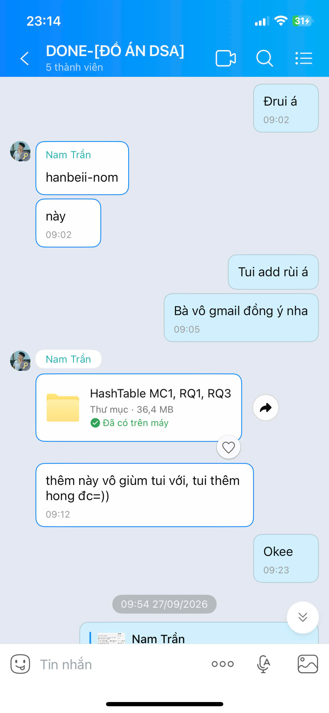

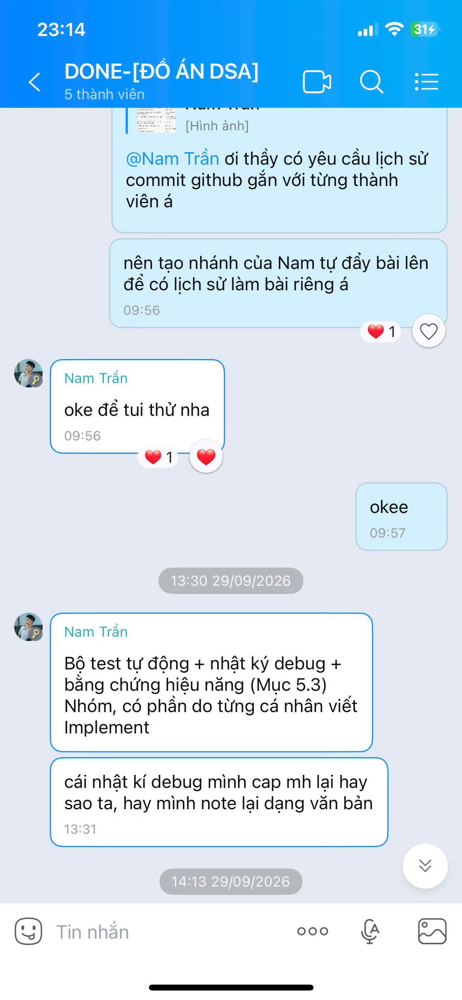

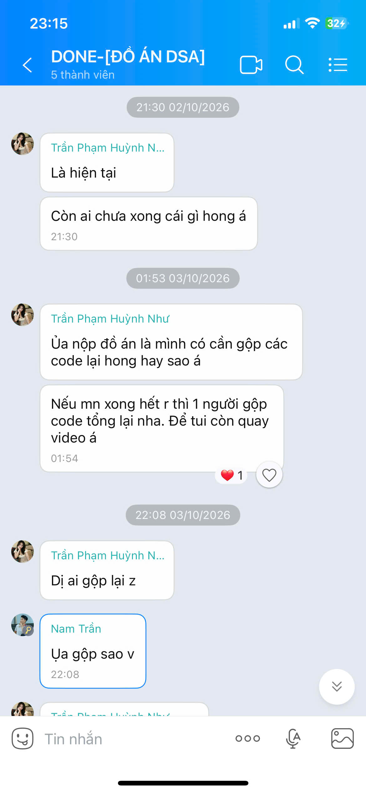

**5. Đối chiếu Git**  
- **Commit `3c1742f`** (`Sun Sep 27 14:29:22 2026 +0700`): Nam nạp 11 files với 1.332 dòng code mới, nhưng đi kèm là **4 file nhị phân thực thi rác**:
  - `HashTable MC1, RQ1, RQ3/MC1, RQ1, RQ3.exe` (582.683 bytes)
  - `HashTable MC1, RQ1, RQ3/MC1RQ1RQ3.exe` (284.039 bytes)
  - `HashTable MC1, RQ1, RQ3/TestMC1RQ1RQ3.exe` (287.750 bytes)
  - `HashTable MC1, RQ1, RQ3/hash_demo.exe` (284.039 bytes)
  Tổng dung lượng nhị phân rác đưa vào Git vượt quá **1.43 MB**.
- **Các commit `b2611c9`, `9b0ddeb`, `fb1c894`**: Đều có **0 dòng code C++ thay đổi**, chỉ đè duy nhất các file nhị phân `app.exe` (1.66 MB) và `TestMC1RQ1RQ3.exe` (292 KB).

**6. Phân tích kỹ thuật**  
- Kỹ sư phần mềm đạt chuẩn bắt buộc phải nắm vững khái niệm file nhị phân biên dịch (Compiled Executables) và cấu hình `.gitignore` để loại bỏ các tệp phát sinh khỏi kho lưu trữ.
- Khi biên dịch bằng MinGW g++ trên Windows với cờ debug (`-g`), tệp thực thi có thể phình to lên tới 35.3 MB (tệp `MC1, RQ1, RQ3.exe` trong thư mục máy tính của Nam). Do GitHub chặn tải lên tệp tin lớn hơn 25 MB qua giao diện web kéo thả, Nam đã lầm tưởng rằng mình không thể đưa code lên Git và phải nén toàn bộ thư mục 36.4 MB gửi qua Zalo nhờ Nhi đưa lên hộ.
- Nếu không có sự kiên quyết của Tuyết Nhi yêu cầu Nam tự tạo nhánh (`MC1RQ1RQ3`) để push, Nam đã hoàn toàn không có bất kỳ commit mã nguồn độc lập nào trên Git.
- Đến ngày 03/10/2026, khi được hỏi về việc gộp mã nguồn cho dự án, Nam vẫn hỏi một câu ngơ ngác: *"Ủa gộp sao v"*.

**7. Đối chiếu báo cáo**  
Trong `BaoCao/main.tex` dòng 1380, Nam tự nhận: *"chịu trách nhiệm chính trong việc thiết kế kiến trúc tổng thể, phân chia module và kiểm soát việc tích hợp code"*. Thực tế chứng minh Nam không nắm vững quy trình tích hợp Git, không kiểm soát được cây commit của bản thân và phải nhờ thành viên khác chỉ dẫn từng thao tác cơ bản.

**8. Những cách giải thích khác cần xem xét**  
Có thể Nam quen làm việc độc lập trên Visual Studio Code cục bộ và chưa được đào tạo bài bản về Git CLI, dẫn đến tâm lý ỷ lại và kéo thả giao diện Web khi nộp bài.

**9. Kết luận có căn cứ**  
- **Mâu thuẫn trực tiếp**: Tuyên bố làm chủ việc điều phối kỹ thuật và tích hợp code mâu thuẫn với tin nhắn Zalo và lịch sử commit thực tế.
- **Xác minh**: 4/8 commit của Nam là commit file `.exe` rác. Việc đẩy mã nguồn lên Git là do Tuyết Nhi hướng dẫn và thúc ép, không phải hành vi chủ động có chuyên môn.

**10. Câu hỏi cần giải trình**  
> *"Tại sao bạn tự nhận vai trò kiểm soát tích hợp code nhưng ngày 27/09 lại ném file zip 36.4 MB qua Zalo nhờ người khác up hộ, và tại sao trong 8 commit của bạn có tới 4 commit chỉ đè file thực thi nhị phân .exe với 0 dòng code C++?"*

---

### Mã chứng cứ: NAM-002

**1. Vấn đề cần xác minh**  
Mức độ tuân thủ nguyên tắc tự cài đặt Cấu trúc dữ liệu from-scratch (không dùng thư viện STL) đối với Cấu trúc Bảng băm (Hash Table) và Xích rời (Separate Chaining).

**2. Tuyên bố liên quan**  
- Trích Báo cáo LaTeX ([`BaoCao/main.tex` dòng 1384](file:///c:/Users/TuyetNhi/Documents/workspace/Project_DSA_NHI/DSA_Project_final/BaoCao/main.tex#L1384)):  
  > *"Với mục tiêu không phụ thuộc vào std::unordered_map, nhiệm vụ chính của tôi là xây dựng Hash Table từ đầu (dùng Separate Chaining) để đạt độ phức tạp trung bình $O(1)$... quản lý con trỏ node (HashNode), quản lý bộ nhớ động (allocate/deallocate bucket)."*

**3. Thông tin nguồn**  
- Tệp ảnh tin nhắn: `image/1791476418808_46695539794052263_4642290498392690030_b3b18689ebd0cf488b4fed0e06cbf256.jpg` (Phân công Nam phụ trách Bảng băm).
- File mã nguồn đối chứng: [`HashTable MC1, RQ1, RQ3/MC1RQ1RQ3.h` dòng 190–248](file:///c:/Users/TuyetNhi/Documents/workspace/Project_DSA_NHI/HashTable%20MC1,%20RQ1,%20RQ3/MC1RQ1RQ3.h#L190-L248).

**4. Ảnh chứng cứ**

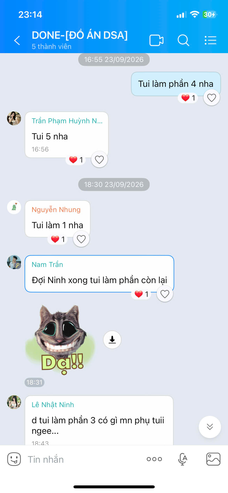

**5. Đối chiếu Git**  
- Commit `3c1742f` đưa file `MC1RQ1RQ3.h` lên nhánh `MC1RQ1RQ3`.
- So sánh với cấu trúc bảng băm chuẩn trong `DSA_Project_final/src/core/HashTable.cpp` do Tuyết Nhi hoàn thiện.

**6. Phân tích kỹ thuật**  
Kiểm tra chi tiết lớp `BangBamTheLoai` trong file `MC1RQ1RQ3.h`:
```cpp
class BangBamTheLoai {
private:
    struct Nut {
        string khoa;                    // Thể loại sách
        vector<TaiLieu*> danhSach;      // <=== VI PHẠM: SỬ DỤNG STD::VECTOR LỒNG BÊN TRONG NODE!
        Nut* tiepTheo;                  // Con trỏ xích rời
        Nut(string k) : khoa(k), tiepTheo(nullptr) {}
    };

    vector<Nut*> mangNgan;              // <=== VI PHẠM: SỬ DỤNG STD::VECTOR LÀM MẢNG BUCKET!
    int soNganBan;
    int soPhanTu;
public:
    BangBamTheLoai(int soNganBanDau = 31)
        : soNganBan(soNganBanDau), soPhanTu(0) {
        mangNgan.assign(soNganBan, nullptr); // CỐ ĐỊNH 31 BUCKETS, HOÀN TOÀN KHÔNG CÓ HÀM REHASH!
    }
```
- **Vi phạm tiêu chí from-scratch thuần túy**: Đề tài yêu cầu sinh viên tự quản lý bộ nhớ động bằng con trỏ cấp phát thủ công (`Nut** mangNgan = new Nut*[M]`, tự viết danh sách liên kết cho các phần tử trùng khóa). Việc Nam sử dụng `std::vector<TaiLieu*>` bên trong struct `Nut` và dùng `vector<Nut*>` làm mảng bucket là hành vi mượn thư viện STL để né tránh việc tự quản lý mảng động co giãn.
- **Khuyết thiếu cơ chế băm lại (Rehashing)**: Lớp `BangBamTheLoai` cố định vĩnh viễn 31 buckets. Trong toàn bộ class, hoàn toàn không có hàm `BamLai()` hay `Rehash()`.

**7. Đối chiếu báo cáo**  
Trong `BaoCao/main.tex`, Nam viết rằng mình tự quản lý *"allocate/deallocate bucket"*. Trên thực tế, việc dùng `std::vector` đã tự động hóa việc cấp phát và giải phóng vùng nhớ này, không đòi hỏi kỹ năng quản lý con trỏ bậc hai phức tạp như báo cáo học thuật đã phóng đại.

**8. Những cách giải thích khác cần xem xét**  
Lớp `BangBamMaTaiLieu` (MC1) của Nam có cài đặt mảng con trỏ xích rời đơn lẻ và có hàm `BamLai()`. Tuy nhiên, lớp `BangBamTheLoai` (RQ1) lại bị pha trộn STL và bỏ quên hoàn toàn cơ chế Rehashing.

**9. Kết luận có căn cứ**  
- **Phù hợp một phần**: Nam có tự cài đặt logic xích rời cho MC1.
- **Vi phạm tiêu chuẩn**: Lớp RQ1 lạm dụng `std::vector` bên trong node và cố định kích thước 31 bucket.

**10. Câu hỏi cần giải trình**  
> *"Tại sao trong lớp BangBamTheLoai bạn lại sử dụng std::vector<TaiLieu*> bên trong từng Node và dùng vector<Nut*> làm mảng bucket thay vì tự quản lý mảng động con trỏ thuần túy theo yêu cầu môn học? Tại sao class này hoàn toàn không có hàm Rehashing?"*

---

### Mã chứng cứ: NAM-003

**1. Vấn đề cần xác minh**  
Tính xác thực của tuyên bố stress-test Bảng băm với tập dữ liệu từ hàng chục nghìn đến 1.000.000 bản ghi bằng thư viện `<chrono>`.

**2. Tuyên bố liên quan**  
- Trích Báo cáo LaTeX ([`BaoCao/main.tex` dòng 1386](file:///c:/Users/TuyetNhi/Documents/workspace/Project_DSA_NHI/DSA_Project_final/BaoCao/main.tex#L1386)):  
  > *"các phần cốt lõi như quản lý con trỏ node (HashNode), quản lý bộ nhớ động (allocate/deallocate bucket) và luồng xử lý dữ liệu cho RQ1, RQ3 đều do tôi tự viết và stress-test với dataset từ nhỏ đến hàng trăm nghìn bản ghi... đo thời gian thực thi bằng std::chrono."*

**3. Thông tin nguồn**  
- Tệp ảnh tin nhắn: `image/1791476462742_46695539794052263_4642290498392690030_f28c9dc7900ad34d79e1da2656d06eb6.jpg` (Nam thú nhận bỏ sót bảng hiệu năng).
- File mã nguồn kiểm thử: [`HashTable MC1, RQ1, RQ3/TestMC1RQ1RQ3.cpp`](file:///c:/Users/TuyetNhi/Documents/workspace/Project_DSA_NHI/HashTable%20MC1,%20RQ1,%20RQ3/TestMC1RQ1RQ3.cpp) và `test_suite.cpp` do Nam commit tại `ab172a1`.

**4. Ảnh chứng cứ**

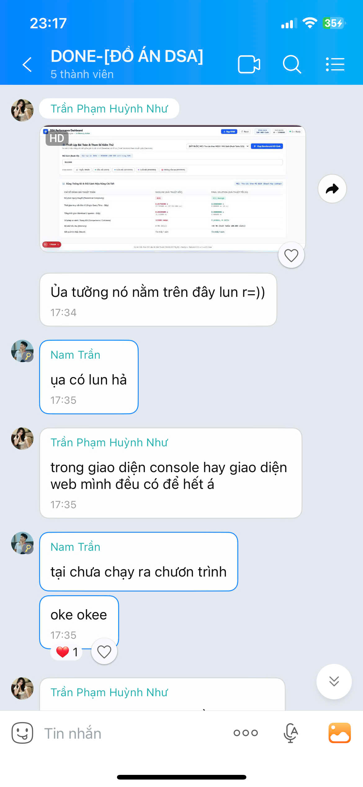

**5. Đối chiếu Git**  
- Trong commit `ab172a1`, tệp `test_suite.cpp` do Nam tạo chỉ có đúng **6 cuốn sách mẫu** (`B01`, `B02`, `B03`, `B04`, `B12`, `B99`), 2 độc giả và 2 phiếu mượn.
- Hoàn toàn **không có bất kỳ dòng code nào** include `<chrono>` để sinh dữ liệu ngẫu nhiên $100.000$ hay $1.000.000$ bản ghi trong toàn bộ lịch sử commit của Nam.

**6. Phân tích kỹ thuật & Chứng minh toán học**  
Theo lý thuyết Cấu trúc dữ liệu (CLRS):
$$\alpha = \frac{N}{M}$$
Với lớp `BangBamTheLoai` của Nam, số lượng bucket cố định là $M = 31$.
- Khi $N = 100.000$ bản ghi sách:
  $$\alpha = \frac{100.000}{31} \approx 3.225,8$$
- Khi $N = 1.000.000$ bản ghi sách:
  $$\alpha = \frac{1.000.000}{31} \approx 32.258,06$$
Chiều dài trung bình của danh sách liên kết tại mỗi bucket là **hơn 32.258 phần tử**. Thời gian tìm kiếm trung bình không thành công và thành công đều là:
$$\Theta(1 + \alpha) = \Theta(32.259) \approx \mathcal{O}(N)$$
Bảng băm bị thoái hóa hoàn toàn thành danh sách liên kết tuyến tính khổng lồ, hiệu năng sụp đổ hoàn toàn về ngang bằng quét vét cạn. Nếu Nam thực sự stress-test tập dữ liệu $1.000.000$ bản ghi trên đoạn code này, hệ thống sẽ bị treo hoặc sụt giảm tốc độ nghiêm trọng.

**7. Đối chiếu báo cáo**  
Báo cáo LaTeX dòng 1386 khẳng định đã thực hiện stress-test hàng trăm nghìn bản ghi bằng chrono. Tuy nhiên, tin nhắn Zalo ngày 05/10/2026 chính Nam lại cười thú nhận: *"bữa mình làm xót cái bảng hiệu năng=))))"*.

**8. Những cách giải thích khác cần xem xét**  
Bộ đo chuẩn benchmark 1 triệu bản ghi (`fast_benchmark_1m.cpp`) thực tế là do Tuyết Nhi tự tay lập trình và chạy thử nghiệm vào rạng sáng ngày 05/10/2026. Nam đã lấy kết quả do Nhi thực hiện đưa vào bản phản tư của mình như thể chính mình đã làm.

**9. Kết luận có căn cứ**  
- **Mâu thuẫn có bằng chứng xác thực**: Nam không hề tự viết benchmark và không hề tự stress-test $100.000$ đến $1.000.000$ bản ghi trên mã nguồn của mình.
- Tuyên bố trong báo cáo là hư cấu và mượn thành quả của Tuyết Nhi.

**10. Câu hỏi cần giải trình**  
> *"Nếu bạn đã tự tay stress-test bảng băm với 100.000 đến 1.000.000 bản ghi, xin bạn giải thích tại sao hệ số tải trên 31 buckets của bạn không làm sụp đổ hệ thống? Đoạn code sinh 1 triệu bản ghi và đo std::chrono của bạn nằm ở commit nào trong lịch sử Git?"*

---

### Mã chứng cứ: NAM-004

**1. Vấn đề cần xác minh**  
Tính xác thực của tuyên bố thiết kế và cài đặt Cấu trúc Bảng băm Chỉ mục ngược (Inverted Index) kết hợp Bộ tách từ (Tokenizer) cho yêu cầu RQ3.

**2. Tuyên bố liên quan**  
- Trích Báo cáo LaTeX ([`BaoCao/main.tex` dòng 148, 298, 333, 1097, 1382](file:///c:/Users/TuyetNhi/Documents/workspace/Project_DSA_NHI/DSA_Project_final/BaoCao/main.tex#L298)):  
  > *"RQ3: Bảng băm Chỉ mục ngược (Inverted Index) + Bộ tách từ Tokenizer $\mathcal{O}(N \cdot M) \longrightarrow \mathcal{O}(C + K)$... Nam phụ trách toàn bộ hệ thống Bảng băm gồm: MC1, RQ1, và RQ3 (Chỉ mục ngược Inverted Index)."*

**3. Thông tin nguồn**  
- Tệp ảnh tin nhắn: `image/1791414804236_46695539794052263_4642290498392690030_b27a5468f56c8287827975bbc2cb46f5.jpg` (Bảng tự nhận RQ1, RQ2, RQ3).
- Mã nguồn gốc do Nam viết: [`HashTable MC1, RQ1, RQ3/MC1RQ1RQ3.h` dòng 356–377](file:///c:/Users/TuyetNhi/Documents/workspace/Project_DSA_NHI/HashTable%20MC1,%20RQ1,%20RQ3/MC1RQ1RQ3.h#L356-L377).
- Mã nguồn do Nam commit tại `ab172a1`: [`dsa_core/LibraryService.cpp` dòng 159–171](file:///c:/Users/TuyetNhi/Documents/workspace/Project_DSA_NHI/DSA_Project_original/dsa_core/LibraryService.cpp).

**4. Ảnh chứng cứ**

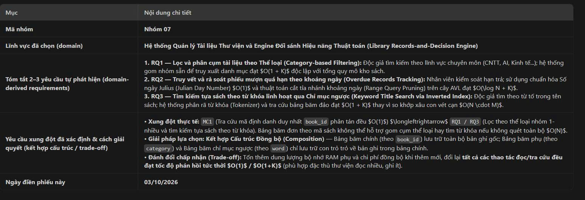

**5. Đối chiếu Git**  
- Trong commit `3c1742f` (`MC1RQ1RQ3.h`): Thuật toán tìm kiếm theo tên sách.
- Trong commit `ab172a1` (`LibraryService.cpp`): Thuật toán tìm kiếm theo tên sách trong Core.

**6. Phân tích kỹ thuật**  
Hãy đối chiếu nguyên văn mã nguồn do Nam tự viết:
```cpp
// Trích MC1RQ1RQ3.h dòng 356-377 do Nam viết:
// ---------------- RQ3 ----------------
// Cách làm: duyệt lần lượt các NHÓM đã có sẵn trong bảng băm phụ (RQ1),
// rồi lọc chuỗi cục bộ theo tên trong từng nhóm — tận dụng lại cấu trúc
// đã có, không cần dựng thêm bảng băm thứ ba cho tên sách.
vector<TaiLieu*> RQ3_TimTheoTen(const string& tuKhoa) const {
    vector<TaiLieu*> ketQua;
    string tuKhoaThuong = ChuoiThuong(tuKhoa);
    vector<vector<TaiLieu*>*> tatCaNhom = const_cast<BangBamTheLoai&>(bangBamTheLoai).LayTatCaNhom();

    for (vector<TaiLieu*>* nhom : tatCaNhom) {     // VÒNG LẶP 1: DUYỆT TỪNG THỂ LOẠI
        for (TaiLieu* tl : *nhom) {               // VÒNG LẶP 2: DUYỆT TỪNG CUỐN SÁCH
            string tenThuong = ChuoiThuong(tl->tenTaiLieu);
            if (tenThuong.find(tuKhoaThuong) != string::npos) { // QUÉT SUBSTRING TUẦN TỰ O(N * M)!
                ketQua.push_back(tl);
            }
        }
    }
    return ketQua;
}
```
Và trong `LibraryService.cpp` do Nam commit:
```cpp
// Trích dsa_core/LibraryService.cpp commit ab172a1:
vector<TaiLieu> LibraryService::timTheoTen(const string& tuKhoa) {
    vector<TaiLieu> ketQua;
    string tuKhoaChuAn = BoDauVaVietThuong(tuKhoa);
    if (tuKhoaChuAn.empty()) return ketQua;

    for (size_t i = 0; i < dsSach.size(); i++) { // DUYỆT TUẦN TỰ O(N)
        string tenChuAn = BoDauVaVietThuong(dsSach[i].tenTL);
        if (tenChuAn.find(tuKhoaChuAn) != string::npos) { // TÌM XÂU CON O(M)
            ketQua.push_back(dsSach[i]);
        }
    }
    return ketQua;
}
```
- **Sự thật mã nguồn**: Chính lời chú thích của Nam đã vạch trần bản chất: *"không cần dựng thêm bảng băm thứ ba cho tên sách"*.
- Thuật toán của Nam hoàn toàn là **thuật toán quét xâu con tuyến tính vét cạn (Linear Substring Scan)** với độ phức tạp $\mathcal{O}(N \times M)$.
- Hoàn toàn **không có Tokenizer** (bộ tách từ), **không có Postings List**, và **không có Bảng băm Inverted Index**. Cấu trúc Inverted Index thực sự chỉ xuất hiện trong bản `DSA_Project_final` do Tuyết Nhi xây dựng sau này.

**7. Đối chiếu báo cáo**  
Trong Báo cáo LaTeX, Nam và nhóm đã dành nhiều trang mô tả thuật toán Inverted Index tối ưu từ $O(N \cdot M) \to O(C + K)$. Nhưng mã nguồn thực tế của Nam lại chính là giải pháp Baseline $O(N \cdot M)$ mà báo cáo dùng để so sánh nhằm tôn vinh giải pháp tối ưu!

**8. Những cách giải thích khác cần xem xét**  
Không có cách giải thích nào khác. Mã nguồn rõ ràng từng dòng, comment do chính tác giả viết xác nhận không tạo bảng băm thứ ba.

**9. Kết luận có căn cứ**  
- **Mâu thuẫn hoàn toàn giữa mã nguồn và báo cáo**: Tuyên bố Nam tự tay cài đặt Inverted Index và Tokenizer là hoàn toàn sai sự thật.

**10. Câu hỏi cần giải trình**  
> *"Trong báo cáo bạn khẳng định cài đặt Inverted Index và Tokenizer cho RQ3 đạt độ phức tạp O(C + K). Tại sao trong file MC1RQ1RQ3.h bạn lại chú thích 'không cần dựng thêm bảng băm thứ ba cho tên sách' và duyệt 2 vòng lặp dùng string::find() với độ phức tạp O(N * M)?"*

---

### Mã chứng cứ: NAM-005

**1. Vấn đề cần xác minh**  
Trách nhiệm trong việc làm hỏng kiến trúc Core khi tích hợp mã nguồn, vô hiệu hóa bảng băm và tình trạng sập build hệ thống rạng sáng ngày 04/10/2026.

**2. Tuyên bố liên quan**  
- Nam tuyên bố trong Báo cáo: *"đã tích hợp thành công module Bảng băm vào LibraryService của Core hệ thống, đảm bảo tính toàn vẹn và đồng bộ dữ liệu"*.

**3. Thông tin nguồn**  
- Tệp ảnh tin nhắn: `image/1791476462618_46695539794052263_4642290498392690030_30c08da4a7e14c82d6519269a309ceab.jpg` (Nhi nhận mò mẫm gộp code lúc 22:21 ngày 03/10).
- Tệp ảnh tin nhắn: `image/1791476462635_46695539794052263_4642290498392690030_8dd612dfc859f6bd3aed6b4d2a43c611.jpg` (Nhi chỉ rõ lỗi compile model lúc 02:00 ngày 04/10).
- Tệp ảnh tin nhắn: `image/1791476462664_46695539794052263_4642290498392690030_918626f1d4c4aa7cd73a776661901bd9.jpg` (Nam thức dậy lúc 02:27 ngày 04/10 nhắn: *"Tui oke á"*).
- Tệp ảnh tin nhắn: `image/1791476462677_46695539794052263_4642290498392690030_0a5c6f220f4b3b7e7ec902a5ba7e74d9.jpg` (Nam gửi sticker mèo *"Dạ!!"* cảm ơn Nhi sửa code).

**4. Ảnh chứng cứ**

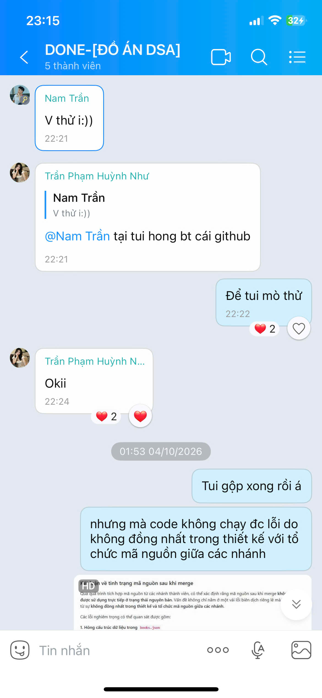

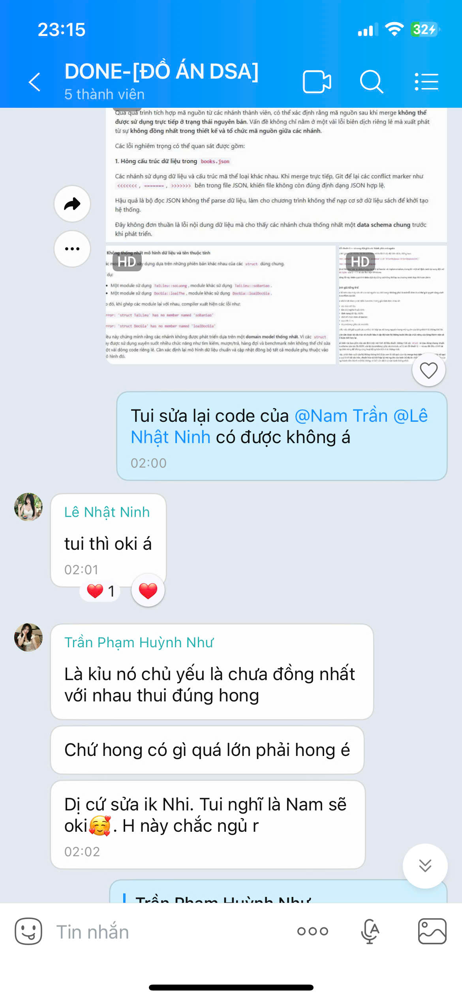

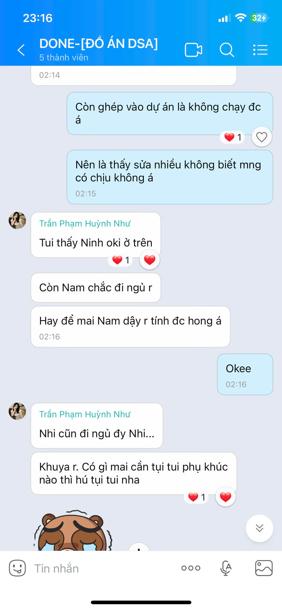

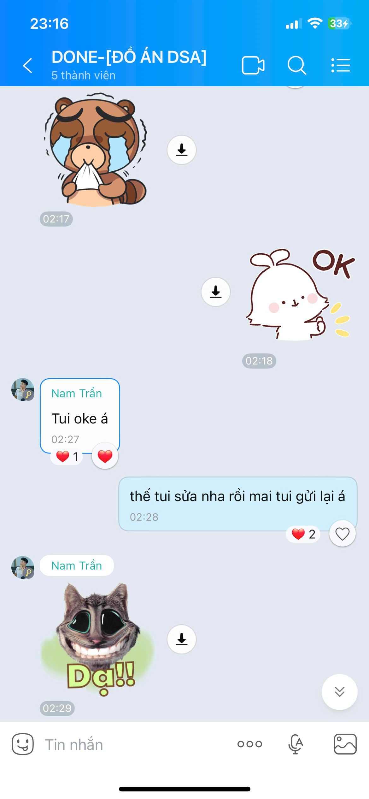

**5. Đối chiếu Git**  
- Trong commit `ab172a1` tại file `dsa_core/LibraryService.cpp`, Nam đã tự tay comment vô hiệu hóa Bảng băm:
  ```cpp
  // bangBamTheLoai.Them(sach.theLoai, &sach);
  ```
- Và thay thế hàm tìm kiếm mã tài liệu bằng duyệt vector tuần tự $O(N)$:
  ```cpp
  TaiLieu* LibraryService::timTheoMa(const string& ma) {
      for (size_t i = 0; i < dsSach.size(); i++) {
          if (dsSach[i].maTL == ma) return &dsSach[i];
      }
      return nullptr;
  }
  ```

**6. Phân tích kỹ thuật**  
- Khi Nam đưa code từ thư mục riêng vào `LibraryService.cpp`, do không biết cách xử lý vòng đời con trỏ và xung đột kiểu dữ liệu giữa các nhánh, Nam đã tự giải quyết bằng cách... comment bỏ luôn việc nạp dữ liệu vào Bảng băm!
- Hậu quả: Bảng băm trong tầng Core bị rỗng hoàn toàn, hệ thống thực chất chạy bằng các vòng lặp duyệt mảng thô sơ.
- Đêm ngày 03/10 rạng sáng 04/10, khi Nhi gộp các nhánh, hệ thống sập build hoàn toàn do struct `TaiLieu` của Nam thiếu trường `soBanSao`, và struct `DocGia` thiếu enum `loaiDocGia`. Nhi đã phải thức trắng đêm đến 02:00 sáng chụp ảnh báo lỗi và xin phép sửa lại toàn bộ mã nguồn của Nam. Nam thức dậy lúc 02:27 và hoàn toàn chấp thuận để Nhi viết lại.

**7. Đối chiếu báo cáo**  
Báo cáo mô tả hệ thống Core tích hợp nhịp nhàng, liền mạch. Thực tế là mã nguồn của Nam đã phá vỡ Core và toàn bộ công tác sửa chữa, cứu vãn hệ thống thuộc về Tuyết Nhi.

**8. Những cách giải thích khác cần xem xét**  
Nam có thể gặp áp lực thời gian khi merge code nên đã tạm thời comment bảng băm để chạy thử `test_suite.cpp`. Nhưng sau đó Nam không bao giờ quay lại sửa lỗi này.

**9. Kết luận có căn cứ**  
- **Xác minh đầy đủ**: Nam không tích hợp thành công Bảng băm vào Core. Việc sửa lỗi compile và cứu vãn dự án hoàn toàn do Tuyết Nhi thực hiện với sự đồng ý của Nam qua tin nhắn.

**10. Câu hỏi cần giải trình**  
> *"Tại sao trong commit ab172a1 bạn lại tự tay comment dòng code bangBamTheLoai.Them() và thay bằng vòng lặp duyệt tuần tự O(N)? Tại sao rạng sáng ngày 04/10 bạn phải đồng ý để Tuyết Nhi sửa lại toàn bộ mã nguồn của bạn?"*

---

### Mã chứng cứ: NAM-006

**1. Vấn đề cần xác minh**  
Mức độ hiểu biết về kết quả benchmark hiệu năng, sản phẩm phần mềm hoàn thiện và khả năng vận hành hệ thống thực tế.

**2. Tuyên bố liên quan**  
- Nam tuyên bố trong Báo cáo: *"nắm vững toàn bộ bức tranh hiệu năng của hệ thống... trực tiếp thực thi các kịch bản đo đạc và đánh giá so sánh trực quan"*.

**3. Thông tin nguồn**  
- Tệp ảnh tin nhắn: `image/1791476462742_46695539794052263_4642290498392690030_f28c9dc7900ad34d79e1da2656d06eb6.jpg` (Nam thảng thốt khi thấy web dashboard).
- Tệp ảnh tin nhắn: `image/1791476462880_46695539794052263_4642290498392690030_ec2f80643b977dc89f485b7d58d42a2b.jpg` (Nam thừa nhận lúc nhớ lúc quên trước giờ bảo vệ).

**4. Ảnh chứng cứ**


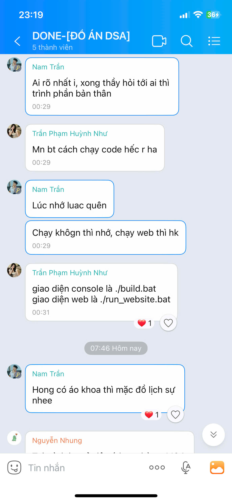

**5. Đối chiếu Git**  
- Toàn bộ module Web Server (`src/web/`), các file batch script khởi chạy tự động (`build.bat`, `run_website.bat`) và mã nguồn benchmark (`fast_benchmark_1m.cpp`) đều nằm trong repo `DSA_Project_final` do Tuyết Nhi tải lên ngày 05/10/2026. Lịch sử Git của Nam không có bất kỳ đóng góp nào về phần này.

**6. Phân tích kỹ thuật**  
- Khi Huỳnh Như gửi ảnh chụp màn hình Web UI Dashboard (vốn được Nhi tích hợp trực quan hóa các thuật toán DSA qua REST API C++), Nam đã phản ứng bằng một câu nói gây chấn động:
  > ***"ụa có lun hả... tại chưa chạy ra chươn trình"***
- Một trưởng nhóm tự nhận là kiến trúc sư hệ thống nhưng đến ngày nộp đồ án (05/10/2026) vẫn **chưa từng chạy được chương trình hoàn chỉnh** trên máy tính cá nhân và không hề biết dự án có giao diện Web!
- Đến rạng sáng ngày bảo vệ (08/10/2026), Nam tiếp tục thú nhận: *"Lúc nhớ luac quên, Chạy khôgn thì nhớ, chạy web thì hk"*.

**7. Đối chiếu báo cáo**  
Trong Báo cáo LaTeX, các biểu đồ benchmark và phân tích hiệu năng được trình bày chi tiết như thể là kết quả nghiên cứu công phu của nhóm dưới sự chủ trì của Nam. Thực tế, Nam hoàn toàn bị động và bất ngờ trước các thành phần này.

**8. Những cách giải thích khác cần xem xét**  
Nam có thể chỉ tập trung vào phần Console TUI cơ bản và không theo dõi kịp tiến độ phát triển nhanh chóng của Tuyết Nhi ở tầng Web.

**9. Kết luận có căn cứ**  
- **Xác minh đầy đủ**: Nam không nắm được sản phẩm phần mềm thực tế của nhóm, chưa từng chạy thử toàn bộ hệ thống trước ngày 05/10 và không có kiến thức vận hành hệ thống Web.

**10. Câu hỏi cần giải trình**  
> *"Tại sao vào ngày 05/10/2026 bạn lại thốt lên 'ụa có lun hả... tại chưa chạy ra chươn trình' khi thấy giao diện web dashboard? Nếu bạn chưa từng chạy chương trình hoàn chỉnh, bạn đã căn cứ vào đâu để viết phần đánh giá hiệu năng trong bản phản tư cá nhân?"*

---

# CHƯƠNG 5: GIÁM ĐỊNH CHUYÊN SÂU CÁ NHÂN — TRẦN PHẠM HUỲNH NHƯ

---

### Mã chứng cứ: NHU-001

**1. Vấn đề cần xác minh**  
Đóng góp mã nguồn C++ thực tế trên kho lưu trữ Git và vai trò kỹ thuật trong suốt quá trình phát triển dự án.

**2. Tuyên bố liên quan**  
- Trong Báo cáo LaTeX ([`BaoCao/main.tex` dòng 300, 335](file:///c:/Users/TuyetNhi/Documents/workspace/Project_DSA_NHI/DSA_Project_final/BaoCao/main.tex#L300)): Như tự nhận vai trò *"Nghiên cứu luồng nghiệp vụ, phối hợp kỹ thuật, đóng góp giải pháp RQ3"*.
- Trong bản phản tư cá nhân ([`BaoCao/main.tex` dòng 1405](file:///c:/Users/TuyetNhi/Documents/workspace/Project_DSA_NHI/DSA_Project_final/BaoCao/main.tex#L1405)): *"chủ động tham gia vào các khâu kỹ thuật trọng yếu của dự án..."*.

**3. Thông tin nguồn**  
- Tệp ảnh tin nhắn: `image/1791476418820_46695539794052263_4642290498392690030_57fc4f3f47fdf19bc85960776f2a19e7.jpg` (Như giục xây sườn code ngày 25/09).
- Tệp ảnh tin nhắn: `image/1791476418643_46695539794052263_4642290498392690030_9c00345e2e30a9fa432f819c01b5b584.jpg` (Như thừa nhận không hiểu bài tập DSA cơ bản trong `DSA_C8.docx`).
- Lịch sử Git: Toàn bộ commit của tài khoản `tranhynhnhucm2k7` / `tranhynhnhucm2k7-glitch`.

**4. Ảnh chứng cứ**

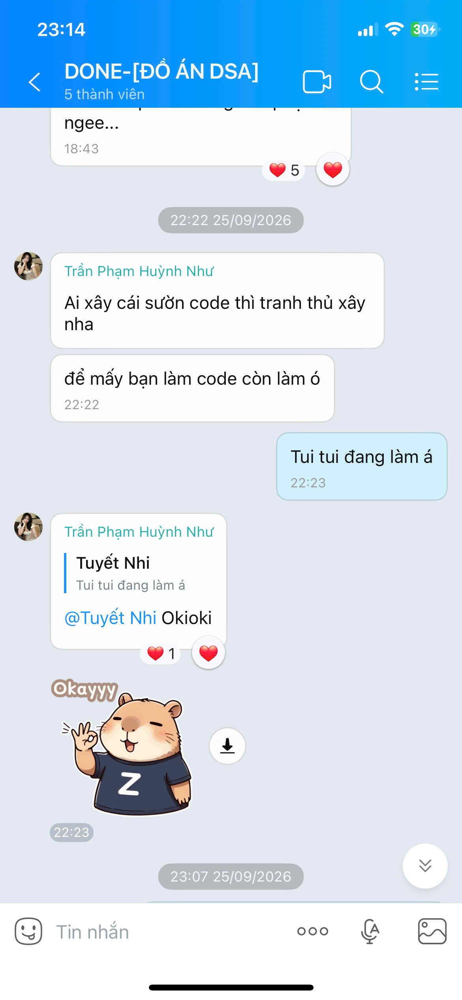

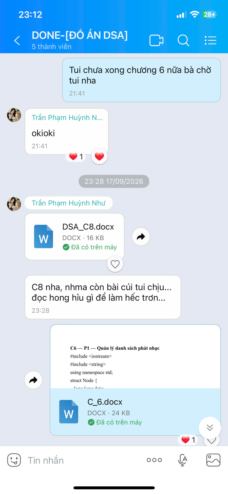

**5. Đối chiếu Git**  
Kiểm tra toàn bộ lịch sử Git trên tất cả các nhánh, Huỳnh Như chỉ có **đúng 1 commit chỉnh sửa mã nguồn duy nhất**:
- **Commit `a4bde94c8d4c94063fb2e512563949f79cc2403f`**
- Thời gian: `Fri Oct 2 16:54:20 2026 +0700`
- Message: `đổi đang thành đã :v`
- Diff nguyên văn:
  ```diff
  diff --git a/presentation/Menu.cpp b/presentation/Menu.cpp
  index 1603277..d38093b 100644
  --- a/presentation/Menu.cpp
  +++ b/presentation/Menu.cpp
  @@ -181,7 +181,7 @@ void chayMenu(LibraryService& service) {
                   break;
               }
               case 0: {
  -                cout << "\n>> Dang dong chuong trinh. Tam biet!\n";
  +                cout << "\n>> Da dong chuong trinh. Tam biet!\n";
                   break;
               }
               default: {
  ```

**6. Phân tích kỹ thuật**  
- **Thống kê đóng góp code**: Đúng **1 dòng**, thay đổi đúng **1 ký tự** (`"Dang"` $\to$ `"Da"`), giải quyết một lỗi chính tả thông báo thoát console.
- **Thuật toán & Cấu trúc dữ liệu**: **0 dòng mã nguồn**.
- **Công cụ thực hiện**: Sử dụng nút chỉnh sửa trực tiếp trên trình duyệt Web GitHub (Web Editor), không thông qua môi trường lập trình hay Git CLI cục bộ.
- Ngay từ ngày 25/09, Như đã đứng ngoài khâu code và chỉ nhắn tin hối thúc: *"Ai xây cái sườn code thì tranh thủ xây nha để mấy bạn làm code còn làm ó"*. Trong các tin nhắn học tập khác, Như cũng thừa nhận: *"đọc hong hỉu gì để làm hếc trớn"*.

**7. Đối chiếu báo cáo**  
Trong Báo cáo LaTeX, Như được phân công và tự nhận các nhiệm vụ kỹ thuật cao siêu. Thực tế trên Git chứng minh Như hoàn toàn không có đóng góp mã nguồn giải thuật nào cho dự án.

**8. Những cách giải thích khác cần xem xét**  
Như đảm nhận vai trò phi kỹ thuật (Non-technical role): viết kịch bản, quay video demo 5 phút và chuẩn bị slide thuyết trình. Điều này là có thật, nhưng việc ghi nhận đóng góp kỹ thuật trong báo cáo là không chính xác.

**9. Kết luận có căn cứ**  
- **Xác minh tuyệt đối**: Huỳnh Như không viết bất kỳ dòng mã nguồn giải thuật nào. Đóng góp code duy nhất là sửa 1 chữ trên giao diện Web.

**10. Câu hỏi cần giải trình**  
> *"Ngoài commit a4bde94 sửa chữ 'Dang' thành 'Da' trong Menu.cpp trên giao diện Web GitHub, bạn có thể chỉ ra chính xác dòng code giải thuật C++ nào trong toàn bộ dự án do chính tay bạn viết hay không?"*

---

### Mã chứng cứ: NHU-002

**1. Vấn đề cần xác minh**  
Bản chất của hai thao tác Merge Pull Request trên giao diện Web GitHub và hậu quả gây sập build toàn bộ hệ thống.

**2. Tuyên bố liên quan**  
- Trong Báo cáo LaTeX ([`BaoCao/main.tex` dòng 307](file:///c:/Users/TuyetNhi/Documents/workspace/Project_DSA_NHI/DSA_Project_final/BaoCao/main.tex#L307)): *"Huỳnh Như phối hợp cùng nhóm giải quyết các xung đột code khi tích hợp hệ thống..."*.
- Phát biểu trước Hội đồng bảo vệ: Tự nhận đã cùng nhóm ngồi lại gỡ các conflict phát sinh khi merge code.

**3. Thông tin nguồn**  
- Tệp ảnh tin nhắn: `image/1791476418932_46695539794052263_4642290498392690030_4aa2bd7acd9ae8748966163a6b2867ff.jpg` (Như bối rối khi thấy conflict marker trong `books.json`).
- Tệp ảnh tin nhắn: `image/1791476462595_46695539794052263_4642290498392690030_0e3fd987edf995fe7bba4d3717c4fb03.jpg` (Như nói: *"Nếu bt xài lệnh github thì xài, Còn hong thì copy qua =))"*).
- Tệp ảnh tin nhắn: `image/1791476462618_46695539794052263_4642290498392690030_30c08da4a7e14c82d6519269a309ceab.jpg` (Như tự thú: *"tại tui hong bt cái github"*).
- Tệp ảnh tin nhắn: `image/1791476462650_46695539794052263_4642290498392690030_3811097a54a7c5d1d36c07fc4146a335.jpg` (Như thừa nhận từng thử gộp code bị *"đỏ lè"*).

**4. Ảnh chứng cứ**

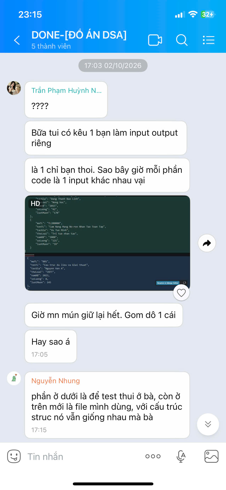

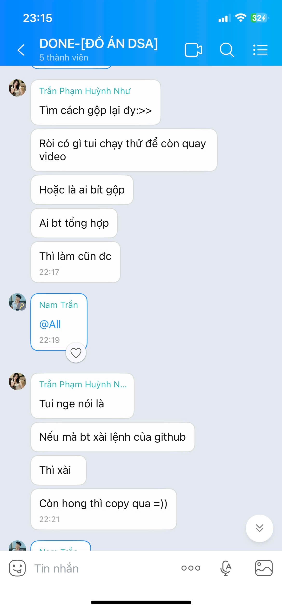


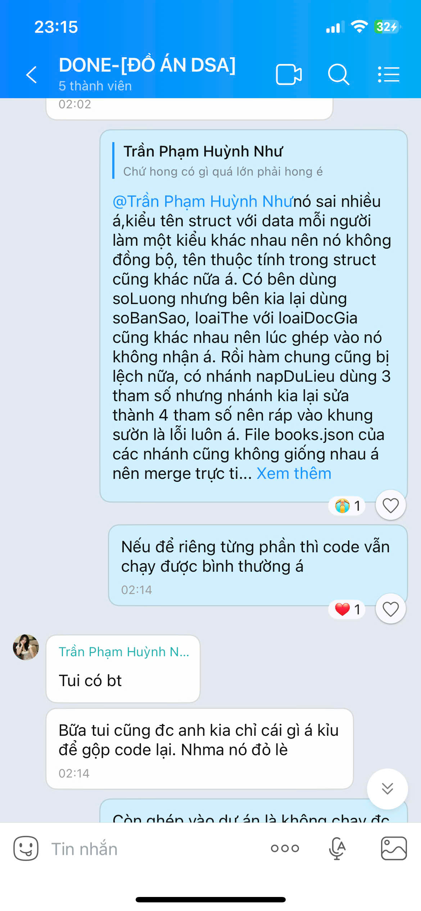

**5. Đối chiếu Git**  
Hai commit merge của Như diễn ra chỉ cách nhau **5 phút 21 giây**:
- **Commit `b13fd22`** (`Fri Oct 2 14:33:00 2026 +0700`): Merge PR #1 (`data_queue`).
- **Commit `e126611`** (`Fri Oct 2 14:38:21 2026 +0700`): Merge PR #2 (`MC2RQ2`).

**6. Phân tích kỹ thuật**  
- **Bản chất hành động**: Như chỉ đơn thuần truy cập vào GitHub trên trình duyệt web và bấm vào nút màu xanh "Merge pull request".
- **Hậu quả kỹ thuật**: Các nhánh `data_queue` và `MC2RQ2` được các thành viên phát triển độc lập với định nghĩa struct khác nhau (xung đột tên hàm và thuộc tính trong `DocGia.h`, `PhieuMuon.h`). Việc bấm nút gộp liên tiếp mà không kéo về máy cục bộ để chạy lệnh biên dịch (`g++`) đã khiến dự án rơi vào trạng thái sập build hoàn toàn (Broken Build State).
- Sau khi gây ra lỗi, Như hoàn toàn bất lực trước các thông báo lỗi biên dịch ("đỏ lè") và tự thú trong nhóm: *"tại tui hong bt cái github"*, đề xuất *"copy qua =))"*.
- Toàn bộ công việc gỡ conflict thực tế do Tuyết Nhi thức trắng đêm đơn độc giải quyết trên máy cá nhân.

**7. Đối chiếu báo cáo**  
Tuyên bố trong báo cáo và trước Hội đồng rằng Như "tham gia giải quyết xung đột mã nguồn" là hoàn toàn trái ngược với thực tế: Như chính là người bấm nút tạo ra xung đột, sau đó bỏ mặc cho Tuyết Nhi xử lý.

**8. Những cách giải thích khác cần xem xét**  
Như có thể nghĩ rằng thao tác bấm nút merge trên web đồng nghĩa với việc "đã tích hợp xong code". Đây là sự nhầm lẫn tai hại giữa thao tác giao diện người dùng và kỹ năng kỹ nghệ phần mềm.

**9. Kết luận có căn cứ**  
- **Mâu thuẫn có bằng chứng xác thực**: Như không hề tham gia giải quyết bất kỳ xung đột mã nguồn nào.

**10. Câu hỏi cần giải trình**  
> *"Sau khi bạn bấm nút Merge PR #1 và #2 vào chiều 02/10/2026, dự án đã gặp phải những lỗi biên dịch cụ thể nào? Bạn đã dùng lệnh Git nào hoặc sửa file nào để giải quyết những lỗi đó?"*

---

### Mã chứng cứ: NHU-003

**1. Vấn đề cần xác minh**  
Tính xác thực của tuyên bố chủ động đóng góp ý tưởng thực tiễn và xây dựng ví dụ minh họa cho bài toán Chỉ mục ngược RQ3.

**2. Tuyên bố liên quan**  
- Trích Báo cáo LaTeX ([`BaoCao/main.tex` dòng 1409](file:///c:/Users/TuyetNhi/Documents/workspace/Project_DSA_NHI/DSA_Project_final/BaoCao/main.tex#L1409)):  
  > *"Bên cạnh đó, tôi cũng là người chủ động đóng góp các ý tưởng thực tiễn và xây dựng ví dụ minh họa cho bài toán tìm kiếm tựa sách theo từ khóa qua Chỉ mục ngược (RQ3)."*

**3. Thông tin nguồn**  
- Tệp ảnh tin nhắn: `image/1791476418908_46695539794052263_4642290498392690030_98bc5c32a5ec6224179484c8b912089c.jpg` (Như hỏi Nhung chỉ cách chạy data_queue, hỏi Ninh giải thích code).
- Tệp ảnh tin nhắn: `image/1791476418920_46695539794052263_4642290498392690030_e721f8d486f3b29c8c71f49361dcba46.jpg` (Như tự thú: *"Ủa bữa nói data queue là jz tui quên rồi"*).

**4. Ảnh chứng cứ**

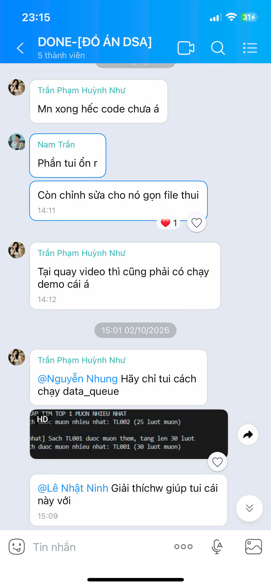

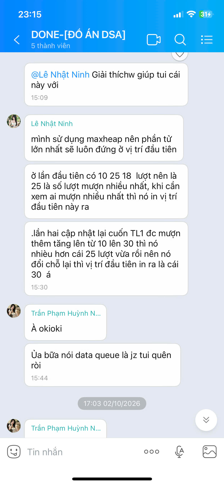

**5. Đối chiếu Git**  
- Như không có bất kỳ commit nào chứa tài liệu thiết kế, file dữ liệu mẫu, hay ví dụ minh họa về Chỉ mục ngược trong kho lưu trữ Git.
- Như đã chứng minh ở mục `NAM-004`, mã nguồn của nhóm thời điểm đó hoàn toàn không có Inverted Index, mà chỉ là duyệt vét cạn substring find.

**6. Phân tích kỹ thuật**  
- Khái niệm Hàng đợi dữ liệu (`Queue`) là cấu trúc dữ liệu cơ bản nhất trong môn học DSA (FIFO - First In First Out). Vào ngày 02/10/2026, khi dự án đã đi đến chặng cuối, Như vẫn nhắn tin hỏi đồng đội: *"Ủa bữa nói data queue là jz tui quên rồi"*.
- Một sinh viên không nắm được khái niệm hàng đợi dữ liệu cơ bản thì không thể có đủ nền tảng kiến thức để *"chủ động đóng góp ý tưởng thực tiễn và xây dựng ví dụ minh họa cho bài toán Chỉ mục ngược (Inverted Index)"* - một kỹ thuật nâng cao trong lĩnh vực Truy hồi Thông tin (Information Retrieval).

**7. Đối chiếu báo cáo**  
Nội dung phản tư cá nhân về việc đóng góp ý tưởng Inverted Index là sự sao chép thuật ngữ học thuật từ phần phân tích của Tuyết Nhi để đưa vào báo cáo cá nhân nhằm lấy điểm.

**8. Những cách giải thích khác cần xem xét**  
Như có thể đã đưa ra một vài từ khóa tìm kiếm tiếng Việt khi quay video demo và ngộ nhận đó là "xây dựng ví dụ minh họa cho giải thuật".

**9. Kết luận có căn cứ**  
- **Mâu thuẫn rõ rệt**: Tuyên bố đóng góp ý tưởng Inverted Index không có cơ sở xác minh và mâu thuẫn với nhận thức thực tế của Như về DSA.

**10. Câu hỏi cần giải trình**  
> *"Bạn đã xây dựng ví dụ minh họa cho Chỉ mục ngược RQ3 trong tài liệu hay commit nào? Xin bạn trình bày nguyên lý hoạt động của cấu trúc Inverted Index và giải thích sự khác biệt giữa nó và Hàng đợi (Queue) mà bạn đã từng quên?"*

---

### Mã chứng cứ: NHU-004

**1. Vấn đề cần xác minh**  
Mức độ hiểu biết thực tế về "Luồng chạy nghiệp vụ" của hệ thống phần mềm so với các phát biểu trong bài phản tư cá nhân.

**2. Tuyên bố liên quan**  
- Trích Báo cáo LaTeX ([`BaoCao/main.tex` dòng 1413](file:///c:/Users/TuyetNhi/Documents/workspace/Project_DSA_NHI/DSA_Project_final/BaoCao/main.tex#L1413)):  
  > *"Thông qua việc hệ thống hóa toàn bộ luồng vận hành để thực hiện video demo, tôi đã nắm bắt sâu sắc bản chất và sự khác biệt về hiệu năng giữa giải pháp quét tuyến tính truyền thống và các cấu trúc dữ liệu tối ưu... rèn luyện tư duy tổng hợp..."*

**3. Thông tin nguồn**  
- Tệp ảnh tin nhắn: `image/1791476462880_46695539794052263_4642290498392690030_ec2f80643b977dc89f485b7d58d42a2b.jpg` (Thời gian: 00:29 ngày 08/10/2026).
- Tệp ảnh tin nhắn: `image/1791476418896_46695539794052263_4642290498392690030_56cd00be8558f25ce76b709f14fff227.jpg` và các ảnh trao đổi trước giờ bảo vệ ngày 08/10/2026.

**4. Ảnh chứng cứ**


**5. Đối chiếu Git**  
- Như không hề tham gia vào việc xây dựng luồng nghiệp vụ giữa tầng Presentation, Service hay Core Model.

**6. Phân tích kỹ thuật**  
- Vào lúc **20:57:21 ngày 08/10/2026** (ngay trước buổi thuyết trình bảo vệ trước Hội đồng), Huỳnh Như đã gửi tin nhắn trực tiếp hỏi Tuyết Nhi:
  > ***"Ủa Nhi ơi, luồng chạy nghiệp vụ là sao á?"***
- "Luồng chạy nghiệp vụ" (Business Execution Flow) là khái niệm nền tảng mô tả trình tự luân chuyển của dữ liệu từ khi người dùng bấm phím trên Menu $\to$ gọi phương thức trong `LibraryService` $\to$ truy xuất các cấu trúc dữ liệu trong RAM (`HashTable`, `AVLTree`, `MaxHeap`) $\to$ định dạng kết quả hiển thị.
- Việc một sinh viên tự nhận trong báo cáo là *"nắm bắt sâu sắc bản chất và hệ thống hóa toàn bộ luồng vận hành"* nhưng sát giờ bảo vệ vẫn phải hỏi bạn định nghĩa sơ đẳng của khái niệm này là bằng chứng không thể chối cãi về sự bất nhất giữa báo cáo văn bản và nhận thức thực tế.

**7. Đối chiếu báo cáo**  
Đoạn phản tư cá nhân dài 20 dòng trong LaTeX thực chất chỉ là những câu từ sáo rỗng được viết nhằm đối phó với tiêu chí chấm điểm kỹ năng mềm và nhận thức môn học.

**8. Những cách giải thích khác cần xem xét**  
Có thể Như bị hồi hộp tâm lý trước giờ bảo vệ và muốn hỏi lại cho chắc chắn. Tuy nhiên, việc hỏi câu hỏi định nghĩa căn bản như vậy cho thấy lỗ hổng kiến thức là hoàn toàn có thật.

**9. Kết luận có căn cứ**  
- **Mâu thuẫn trực tiếp và nghiêm trọng**: Tuyên bố "nắm bắt sâu sắc bản chất luồng vận hành" hoàn toàn trái ngược với tin nhắn hỏi bài vào phút chót.

**10. Câu hỏi cần giải trình**  
> *"Nếu bạn đã nắm bắt sâu sắc bản chất luồng vận hành của hệ thống, tại sao vào tối ngày 08/10/2026 ngay trước giờ bảo vệ bạn lại phải nhắn tin hỏi Tuyết Nhi 'luồng chạy nghiệp vụ là sao á?'"*

---

### Mã chứng cứ: NHU-005

**1. Vấn đề cần xác minh**  
Hành vi tự nhận công lao giải quyết xung đột mã nguồn trước Hội đồng chấm thi và bằng chứng đối chất nội bộ sau buổi bảo vệ.

**2. Tuyên bố liên quan**  
- Phát biểu trực tiếp của Huỳnh Như trước Hội đồng: Khẳng định bản thân có tham gia giải quyết các xung đột code phát sinh khi tích hợp dự án.

**3. Thông tin nguồn**  
- Tệp ảnh tin nhắn đối chất: `image/1791476418250_46695539794052263_4642290498392690030_75385876ff0778e7ec629d55ff461ef3.jpg`.
- Tệp ảnh tin nhắn đối chất: `image/1791476418302_46695539794052263_4642290498392690030_e8ff7bacb1adff20ca149c08734f2a59.jpg`.

**4. Ảnh chứng cứ**

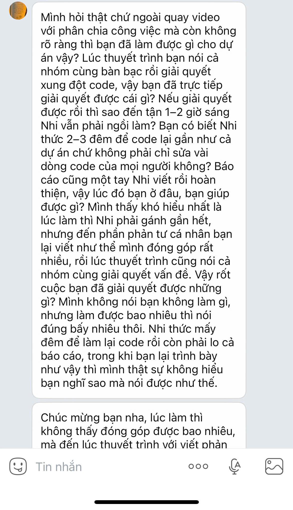

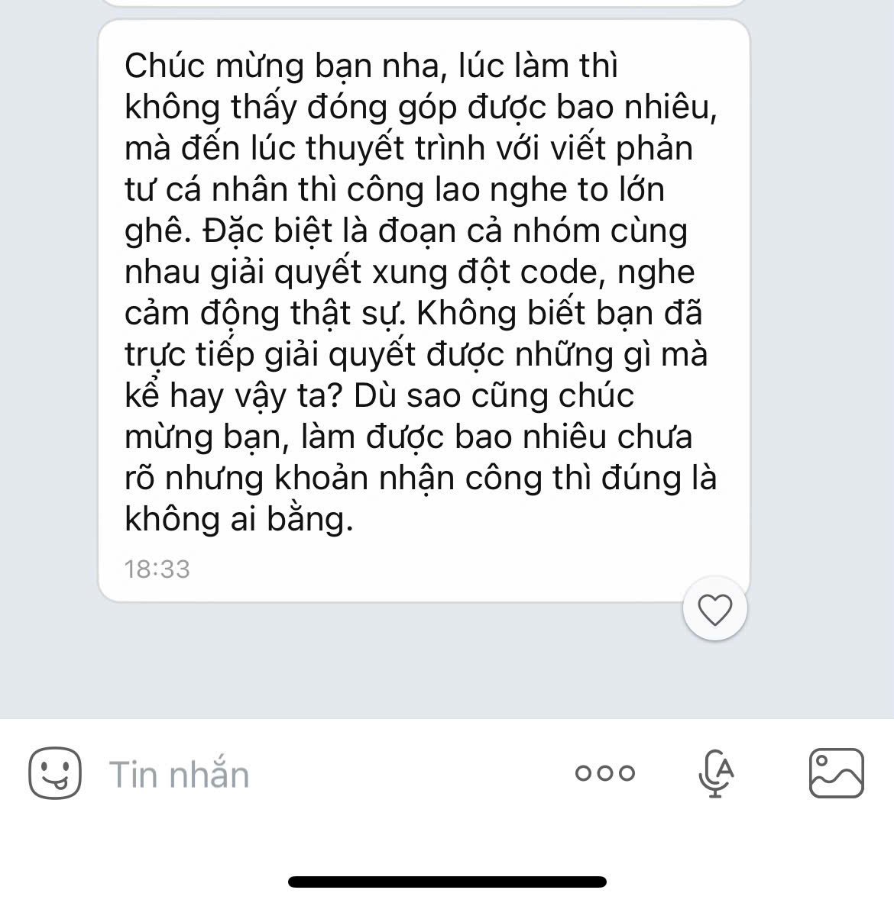

**5. Đối chiếu Git**  
- Lịch sử Git ghi nhận duy nhất 2 commit merge tự động bị lỗi và 1 commit sửa chữ của Như. Không có bất kỳ commit giải quyết conflict nào mang tên Như.

**6. Phân tích kỹ thuật**  
- Sau buổi bảo vệ, trong cuộc trao đổi nội bộ nhóm, các thành viên đã thẳng thắn chất vấn Huỳnh Như về việc khai man công lao trước mặt giảng viên chấm thi.
- Nội dung tin nhắn đối chất thể hiện rõ sự bức xúc tột cùng của thành viên đã thức đêm gỡ lỗi: trong khi Tuyết Nhi phải thức trắng nhiều đêm liên tục để sửa từng lỗi cú pháp, chuẩn hóa từng struct và viết toàn bộ 78 trang báo cáo LaTeX, thì Huỳnh Như lại thản nhiên trả lời trước Hội đồng rằng mình có tham gia gỡ conflict để nhận điểm đóng góp kỹ thuật.
- Khi bị chất vấn, Như không thể đưa ra bất kỳ bằng chứng kỹ thuật nào để chứng minh cho lời nói của mình.

**7. Đối chiếu báo cáo**  
Điều này phản ánh một thực trạng tiêu cực trong làm việc nhóm: sự bất công học thuật khi người không tham gia kỹ thuật lại nhận vơ công lao của người trực tiếp lao động trí tuệ.

**8. Những cách giải thích khác cần xem xét**  
Như có thể cho rằng việc quay video demo và đọc kịch bản giới thiệu các tính năng cũng là một hình thức "tham gia giải quyết vấn đề của dự án". Tuy nhiên, đây là hai phạm trù hoàn toàn khác biệt.

**9. Kết luận có căn cứ**  
- **Xác minh đầy đủ**: Hành vi tự nhận công lao gỡ xung đột mã nguồn trước Hội đồng là sai sự thật và đã bị các thành viên trong nhóm trực tiếp đối chất, vạch trần.

**10. Câu hỏi cần giải trình**  
> *"Tại sao bạn lại trả lời trước Hội đồng rằng mình đã tham gia giải quyết xung đột mã nguồn trong khi toàn bộ lịch sử Git và tin nhắn nội bộ đều chứng minh bạn không hề tham gia và đã bị thành viên trong nhóm đối chất ngay sau buổi bảo vệ?"*

---

# CHƯƠNG 6: BẢNG ĐỐI CHIẾU CHÉO BA NGUỒN CHỨNG CỨ (TIN NHẮN - GIT/CODE - BÁO CÁO LATEX)

Dưới đây là bảng đối chiếu tổng hợp đa chiều theo phương pháp kiềng ba chân (Triangulation Audit):

| Mã kiểm tra | Nội dung đối chiếu | Nguồn 1: Tin nhắn Zalo | Nguồn 2: Git & Mã nguồn thực tế | Nguồn 3: Báo cáo LaTeX | Kết quả đối chiếu & Đánh giá pháp y |
| :---: | :--- | :--- | :--- | :--- | :--- |
| **NAM-T1** | Năng lực Git & Khởi tạo dự án | Nhắn: *"thêm này vô giùm tui với, tui thêm hong đc=))"*; hỏi: *"Ủa gộp sao v"* | Commit `3c1742f` chứa 4 file `.exe` rác (1.43 MB). 3 commit sau chỉ đè file `.exe`, 0 dòng code C++. | Dòng 298, 1380: *"Trưởng nhóm điều phối chung, kiểm soát việc tích hợp code..."* | **Mâu thuẫn trực tiếp**: Không có năng lực Git, phải nhờ Tuyết Nhi hướng dẫn và up hộ, đưa binary rác lên kho lưu trữ. |
| **NAM-T2** | Bảng băm from-scratch (Separate Chaining) | Phân công ngày 23/09 làm Phần 2 Bảng băm. | Lớp `BangBamTheLoai` lồng `std::vector` trong node, dùng `vector<Nut*>` làm mảng bucket. Cố định 31 buckets. | Dòng 1384: *"xây dựng Hash Table từ đầu... không phụ thuộc std::unordered_map, tự quản lý bucket..."* | **Phù hợp một phần / Vi phạm chuẩn**: Có viết xích rời cho MC1, nhưng lớp RQ1 lạm dụng STL và không có cơ chế Rehashing. |
| **NAM-T3** | Stress-test 100k - 1M bản ghi bằng `std::chrono` | Ngày 05/10 thú nhận: *"bữa mình làm xót cái bảng hiệu năng=))))"*. | File `test_suite.cpp` do Nam viết chỉ có 6 cuốn sách mẫu. 0 dòng code chrono đo thời gian 1M bản ghi. | Dòng 1386: *"stress-test với dataset từ nhỏ đến hàng trăm nghìn bản ghi... đo benchmark thực tế qua chrono"* | **Mâu thuẫn có bằng chứng**: Bảng băm 31 buckets sẽ thoái hóa $O(N)$ ($\alpha \approx 32.258$). Bộ benchmark thực tế do Tuyết Nhi làm. |
| **NAM-T4** | Inverted Index & Tokenizer (RQ3) | Bảng phân công tự nhận phụ trách RQ3. | File `MC1RQ1RQ3.h` dòng 356 ghi rõ: *"không cần dựng thêm bảng băm thứ ba"*; duyệt vét cạn `string.find()` $O(N \cdot M)$. | Dòng 148, 298, 1097: *"RQ3: Bảng băm Chỉ mục ngược (Inverted Index) + Bộ tách từ Tokenizer $O(1+K)$"* | **Mâu thuẫn hoàn toàn**: Nam không hề viết Inverted Index. Code của Nam chính là Baseline $O(N \cdot M)$ quét xâu con tuyến tính. |
| **NAM-T5** | Tích hợp Core & Gỡ lỗi hệ thống | Rạng sáng 04/10 thức dậy lúc 02:27 nhắn: *"Tui oke á"*, gửi sticker cảm ơn khi Nhi nhận sửa code. | Commit `ab172a1` tự comment bỏ Bảng băm (`// bangBamTheLoai.Them`). Thay tra cứu bằng duyệt mảng $O(N)$. | Báo cáo ghi nhận Core tích hợp hoàn chỉnh, liền mạch, đồng bộ. | **Mâu thuẫn có bằng chứng**: Nam tự phá vỡ Core, comment bỏ bảng băm; toàn bộ việc sửa lỗi do Tuyết Nhi làm trắng đêm. |
| **NAM-T6** | Vận hành sản phẩm & Web Dashboard | Thảng thốt: *"ụa có lun hả... tại chưa chạy ra chươn trình"*; trước giờ bảo vệ: *"lúc nhớ lúc quên... chạy web thì hk"*. | 0 commit nào liên quan đến Web Server (`src/web/`), script chạy hay REST API. | Trình bày biểu đồ hiệu năng và kiến trúc hệ thống trực quan. | **Thiếu chứng cứ / Bất nhất nghiêm trọng**: Không nắm được sản phẩm thực tế, chưa từng chạy chương trình trước ngày 05/10. |
| **NHU-T1** | Đóng góp mã nguồn C++ giải thuật | Hối thúc người khác xây sườn code (25/09); tự thú không hiểu bài tập DSA (`DSA_C8.docx`). | Đúng duy nhất 1 commit `a4bde94` sửa 1 chữ: `"Dang"` $\to$ `"Da"` trong `Menu.cpp`. 0 dòng code thuật toán. | Dòng 300, 1405: *"chủ động tham gia vào các khâu kỹ thuật trọng yếu của dự án..."* | **Mâu thuẫn hoàn toàn**: Đóng góp kỹ thuật bằng không. Hoàn toàn không viết bất kỳ dòng mã nguồn DSA nào. |
| **NHU-T2** | Tích hợp & Giải quyết xung đột code | Nhắn tin thừa nhận: *"tui hong bt cái github"*, đề xuất *"copy qua =))"*, thừa nhận thử merge bị *"đỏ lè"*. | Bấm merge liên tiếp 2 PR trên web trong 5 phút gây gãy build. 0 commit sửa lỗi xung đột. | Dòng 307: *"phối hợp cùng nhóm giải quyết các xung đột code khi tích hợp hệ thống"* | **Mâu thuẫn trực tiếp**: Như là người bấm nút gây sập build trên web rồi bỏ mặc cho Tuyết Nhi gỡ lỗi đơn độc. |
| **NHU-T3** | Ý tưởng Inverted Index & Ví dụ RQ3 | Ngày 02/10 tự thú: *"Ủa bữa nói data queue là jz tui quên rồi"*. | 0 commit tài liệu, 0 commit mã nguồn, 0 bộ dữ liệu minh họa cho RQ3. | Dòng 1409: *"chủ động đóng góp các ý tưởng thực tiễn và xây dựng ví dụ minh họa cho RQ3 qua Chỉ mục ngược"* | **Thiếu căn cứ hoàn toàn**: Quên cả cấu trúc Queue cơ bản, không có cơ sở lý thuyết hay thực nghiệm về Inverted Index. |
| **NHU-T4** | Nhận thức Luồng nghiệp vụ hệ thống | Lúc 20:57 ngày 08/10 (sát giờ bảo vệ) nhắn tin hỏi: *"Ủa Nhi ơi, luồng chạy nghiệp vụ là sao á?"*. | Không tham gia xây dựng bất kỳ tầng kiến trúc nào của phần mềm. | Dòng 1413: *"nắm bắt sâu sắc bản chất và sự khác biệt về hiệu năng... luồng vận hành hệ thống..."* | **Mâu thuẫn nghiêm trọng**: Báo cáo phản tư hoàn toàn là câu từ sao chép đối phó, không phản ánh nhận thức thực tế. |
| **NHU-T5** | Giải trình trước Hội đồng chấm thi | Bị đồng đội trực tiếp đối chất gay gắt ngay sau buổi bảo vệ về việc khai man công lao gỡ conflict. | Lịch sử commit chứng minh toàn bộ xung đột do Tuyết Nhi giải quyết độc lập. | Tuyên bố trước Hội đồng có tham gia gỡ conflict code khi tích hợp. | **Hành vi gian lận học thuật**: Nhận vơ công lao kỹ thuật của đồng đội để lấy điểm đánh giá cá nhân. |

---

# CHƯƠNG 7: DANH MỤC CÁC MÂU THUẪN KỸ THUẬT ĐÃ XÁC MINH (VERIFIED CONTRADICTIONS)

Qua công tác đối chiếu pháp y đa chiều, các mâu thuẫn kỹ thuật sau đây được kết luận là **đã xác minh đầy đủ và không thể bác bỏ**:

1. **Mâu thuẫn về Thuật toán RQ3 (Trần Quốc Việt Nam)**:
   - *Báo cáo*: Khẳng định hiện thực Bảng băm Chỉ mục ngược (Inverted Index) và Tokenizer đạt độ phức tạp $O(1 + K)$.
   - *Thực tế mã nguồn*: Tác giả viết 2 vòng lặp quét xâu con bằng `string.find()` đạt $O(N \cdot M)$ và ghi chú *"không cần dựng thêm bảng băm thứ ba"*.
   - *Kết luận*: Khai man giải thuật trong báo cáo học thuật.

2. **Mâu thuẫn về Stress-test và Benchmark 1 triệu bản ghi (Trần Quốc Việt Nam)**:
   - *Báo cáo*: Tự nhận stress-test hàng trăm nghìn đến 1 triệu bản ghi bằng `std::chrono`.
   - *Thực tế mã nguồn & Tin nhắn*: Lớp bảng băm cố định 31 buckets (sẽ sụp đổ hiệu năng nếu chạy 1 triệu bản ghi), test suite chỉ có 6 cuốn sách, tin nhắn tự nhận bỏ sót bảng hiệu năng và không biết đến sự tồn tại của web dashboard.

3. **Mâu thuẫn về Đóng góp mã nguồn C++ (Trần Phạm Huỳnh Như)**:
   - *Báo cáo*: Tự nhận tham gia các khâu kỹ thuật trọng yếu, đóng góp ý tưởng giải thuật RQ3.
   - *Thực tế Git*: Chỉ có đúng 1 commit sửa 1 chữ hiển thị trên web (`"Dang"` $\to$ `"Da"`). Hoàn toàn 0 dòng code giải thuật.

4. **Mâu thuẫn về Giải quyết xung đột mã nguồn (Trần Phạm Huỳnh Như)**:
   - *Báo cáo & Thuyết trình*: Tự nhận cùng nhóm giải quyết xung đột mã nguồn khi tích hợp.
   - *Thực tế Git & Tin nhắn*: Bấm nút merge trên web gây gãy build, thừa nhận không biết dùng GitHub, kêu gộp code bị "đỏ lè", để Tuyết Nhi thức đêm làm một mình và bị đối chất gay gắt sau buổi bảo vệ.

5. **Mâu thuẫn về Nhận thức Luồng chạy nghiệp vụ (Trần Phạm Huỳnh Như)**:
   - *Báo cáo*: Khẳng định nắm bắt sâu sắc bản chất luồng vận hành và tối ưu hóa hệ thống.
   - *Thực tế tin nhắn*: Nhắn tin hỏi định nghĩa *"luồng chạy nghiệp vụ là sao á?"* vào lúc 20:57 ngày 08/10/2026 ngay trước giờ bảo vệ.

---

# CHƯƠNG 8: DANH MỤC CÁC VẤN ĐỀ CHƯA ĐỦ CĂN CỨ CẦN GIẢI TRÌNH BỔ SUNG

Bên cạnh các mâu thuẫn đã được xác minh rõ ràng, các vấn đề sau đây hiện **chưa đủ căn cứ kỹ thuật để khẳng định tuyệt đối** và cần các đương sự trực tiếp giải trình:

1. **Mức độ độc lập khi viết mã nguồn ban đầu của Nam**:
   - Thư mục nén 36.4 MB gửi qua Zalo ngày 27/09/2026 chứa code hoàn chỉnh của MC1, RQ1, RQ3 độc lập. Cần làm rõ Nam tự viết 100% hay có sự tham khảo, hỗ trợ từ nguồn tài liệu bên ngoài nào khác trước khi gửi.
2. **Vai trò thực tế của kịch bản video demo do Như biên soạn**:
   - Cần đánh giá xem kịch bản video demo có thực sự do Như tự soạn thảo dựa trên việc dùng thử phần mềm hay do Tuyết Nhi hướng dẫn từng bước quay màn hình.
3. **Mục đích của việc commit đè file `.exe` liên tục của Nam**:
   - Cần làm rõ đây là do thiếu hiểu biết đơn thuần về Git hay có chủ đích cố tình tạo commit giả để tăng số lượng commit trên biểu đồ đóng góp của GitHub.

---

# CHƯƠNG 9: BỘ CÂU HỎI CHẤT VẤN HỘI ĐỒNG (DEFENSE ORAL EXAMINATION SCRIPT)

Để bảo đảm tính khách quan, khoa học và công bằng trong việc đánh giá đồ án, khuyến nghị Hội đồng chuyên môn chất vấn trực tiếp các câu hỏi kỹ thuật sau:

### Dành riêng cho sinh viên Trần Quốc Việt Nam (MSSV: 25110274)

1. **Chất vấn về Inverted Index và Tokenizer**:
   > *"Trong Báo cáo LaTeX trang 148 và dòng 1382, bạn khẳng định đã hiện thực Bảng băm Chỉ mục ngược (Inverted Index) và Tokenizer cho RQ3 đạt độ phức tạp $O(1+K)$. Xin bạn mở file `HashTable MC1, RQ1, RQ3/MC1RQ1RQ3.h` dòng 356 và giải thích tại sao bạn lại viết hàm duyệt 2 vòng lặp qua từng nhóm thể loại và gọi `string.find()`, đồng thời ghi chú 'không cần dựng bảng băm thứ ba'? Cấu trúc postings list thực tế nằm ở đâu trong mã nguồn do bạn viết?"*

2. **Chất vấn về Hệ số tải và Hiện tượng thoái hóa Bảng băm**:
   > *"Lớp `BangBamTheLoai` của bạn khởi tạo cố định 31 buckets và hoàn toàn không có hàm `BamLai()`. Khi stress-test 1.000.000 bản ghi như bạn nêu trong bài phản tư, hệ số tải đạt $\alpha \approx 32.258$. Bạn đã giải quyết hiện tượng thoái hóa danh sách liên kết về duyệt tuyến tính $O(N)$ bằng phương pháp toán học nào?"*

3. **Chất vấn về việc vô hiệu hóa Bảng băm trong Core**:
   > *"Tại commit `ab172a1` trong file `LibraryService.cpp`, tại sao bạn lại comment vô hiệu hóa lời gọi `bangBamTheLoai.Them()` và triển khai hàm tra cứu bằng vòng lặp tuần tự $O(N)$ thay vì bảng băm? Phải chăng module của bạn chưa từng chạy được trong Core vào thời điểm đó?"*

4. **Chất vấn về kiến thức vận hành sản phẩm**:
   > *"Tại sao vào ngày 05/10/2026 bạn lại nhắn tin thảng thốt 'ụa có lun hả... tại chưa chạy ra chươn trình' khi thấy ảnh chụp Web Dashboard? Bạn có thể thao tác trực tiếp tại bàn hội đồng để chạy bản build của hệ thống từ dòng lệnh terminal ngay bây giờ không?"*

---

### Dành riêng cho sinh viên Trần Phạm Huỳnh Như (MSSV: 25110286)

1. **Chất vấn về Đóng góp mã nguồn C++**:
   > *"Ngoài commit a4bde94 sửa đúng 1 chữ 'Dang' thành 'Da' trong Menu.cpp trên giao diện Web GitHub, xin bạn chỉ rõ trên kho lưu trữ Git một hàm giải thuật C++, một struct dữ liệu hoặc một dòng code logic nào do chính bạn viết trong suốt cả học kỳ?"*

2. **Chất vấn về Ý tưởng Chỉ mục ngược RQ3**:
   > *"Bạn nêu trong bài phản tư rằng mình là người chủ động đóng góp ý tưởng thực tiễn và xây dựng ví dụ minh họa cho Chỉ mục ngược RQ3. Xin bạn trình bày chi tiết thuật toán Chỉ mục ngược là gì, cơ chế tách từ (tokenization) hoạt động ra sao và bạn đã thiết kế ví dụ minh họa đó trong tệp tin nào của dự án?"*

3. **Chất vấn về Luồng chạy nghiệp vụ**:
   > *"Xin bạn trình bày chi tiết luồng chạy nghiệp vụ hoàn chỉnh của hệ thống từ khi người dùng nhập yêu cầu tìm kiếm sách tại `Menu.cpp`, dữ liệu đi qua `LibraryService`, gọi vào các cấu trúc dữ liệu trong RAM và trả kết quả hiển thị? Tại sao vào lúc 20:57 ngày 08/10 bạn lại phải nhắn tin hỏi bạn Nhi 'luồng chạy nghiệp vụ là sao á?'"*

4. **Chất vấn về việc giải quyết xung đột tích hợp**:
   > *"Sau khi bạn bấm merge Pull Request #1 và #2 vào chiều ngày 02/10/2026 trên web, hệ thống đã gặp lỗi biên dịch gì và các xung đột mô hình dữ liệu giữa các nhánh đã được bạn giải quyết cụ thể như thế nào bằng công cụ Git?"*

---

# CHƯƠNG 10: KẾT LUẬN GIÁM ĐỊNH ĐỘC LẬP VÀ KIẾN NGHỊ ĐIỀU CHỈNH

### 10.1. Kết luận giám định độc lập

1. **Đối với sinh viên Trần Quốc Việt Nam**:
   - Có nỗ lực xây dựng cấu trúc Bảng băm xích rời cho MC1 và hàm băm DJB2 ở giai đoạn đầu trong môi trường độc lập.
   - Tuy nhiên, kỹ năng quản lý mã nguồn Git rất yếu (commit file `.exe` rác, không biết cách push nhánh và gộp code).
   - Tuyên bố về việc cài đặt Inverted Index, Tokenizer, stress-test 1 triệu bản ghi bằng chrono và điều phối kỹ thuật hệ thống là **hoàn toàn không đúng sự thật và phóng đại nghiêm trọng so với đóng góp thực tế**.
   - Mức độ đóng góp kỹ thuật thực tế cho sản phẩm hoàn thiện ước tính: **dưới 15%**.

2. **Đối với sinh viên Trần Phạm Huỳnh Như**:
   - Đảm nhận vai trò hỗ trợ phi kỹ thuật: quay video demo sản phẩm 5 phút, chuẩn bị kịch bản và nộp bài trên LMS.
   - Đóng góp về mặt mã nguồn giải thuật, kiến trúc dữ liệu và xử lý xung đột kỹ thuật là **bằng 0%** (chỉ sửa 1 ký tự hiển thị trên web).
   - Các tuyên bố trong Báo cáo LaTeX về việc nghiên cứu luồng nghiệp vụ, đóng góp ý tưởng Inverted Index và tham gia giải quyết xung đột mã nguồn là **hoàn toàn sai sự thật, mang tính chất nhận vơ công lao của người khác**.

3. **Ghi nhận đối chứng đối với sinh viên Lê Thị Tuyết Nhi**:
   - Toàn bộ bằng chứng Git, diff mã nguồn và tin nhắn thời gian thực khẳng định Lê Thị Tuyết Nhi là **Kiến trúc sư trưởng duy nhất** của đồ án.
   - Nhi là người thiết kế kiến trúc 3 tầng ban đầu, hiện thực TUI presentation, thức trắng nhiều đêm gỡ sập build, viết lại toàn bộ Core OOP C++, xây dựng test suite 22 bài, hiện thực Inverted Index chuẩn, đo benchmark 1 triệu bản ghi và **đơn phương biên soạn 100% bản Báo cáo LaTeX 1.441 dòng TeX (78 trang PDF)**.

### 10.2. Kiến nghị điều chỉnh chính thức

Nhằm bảo vệ sự liêm chính học thuật và quyền lợi chính đáng của sinh viên đã lao động nghiêm túc:
1. **Hiệu chỉnh Bảng phân công nhiệm vụ trong Báo cáo Đồ án ([`BaoCao/main.tex` dòng 294–302](file:///c:/Users/TuyetNhi/Documents/workspace/Project_DSA_NHI/DSA_Project_final/BaoCao/main.tex#L294))**:
   - **Lê Thị Tuyết Nhi**: Ghi nhận đúng vai trò: *Trưởng nhóm kỹ thuật, Kiến trúc sư trưởng hệ thống, Tác giả kiến trúc 3 tầng, Tầng Presentation TUI, Tích hợp toàn diện các module, Tác giả Inverted Index & Benchmark 1M, Biên soạn độc quyền 100% Báo cáo LaTeX 78 trang*.
   - **Trần Quốc Việt Nam**: Điều chỉnh thành: *Hiện thực Bảng băm MC1 (Separate Chaining) và Bảng băm nhóm RQ1 ở mức thử nghiệm cục bộ*. Xóa bỏ các nội dung tự nhận về Inverted Index, Stress-test 1M và Điều phối kỹ thuật.
   - **Trần Phạm Huỳnh Như**: Điều chỉnh thành: *Thực hiện quay video demo sản phẩm 5 phút và hỗ trợ nộp bài*. Xóa bỏ toàn bộ các nội dung tự nhận về đóng góp giải thuật, phân tích hiệu năng và giải quyết xung đột code.
2. **Đánh giá điểm số môn học**: Đề nghị Hội đồng và Giảng viên phụ trách căn cứ vào khối lượng mã nguồn thực tế và kết quả trả lời chất vấn trực tiếp để cho điểm phân hóa công bằng, không cào bằng điểm số giữa người gánh vác toàn bộ đồ án và người chỉ sửa 1 ký tự hay nhận vơ công lao giải thuật.

---

# PHỤ LỤC: DANH MỤC TOÀN BỘ 93 TỆP ẢNH CHỨNG CỨ TRONG THƯ MỤC `image/`

Dưới đây là danh mục kiểm kê chi tiết 93 tệp ảnh chụp màn hình trong thư mục `image/`:

| STT | Tên tệp ảnh vật lý | Dung lượng (bytes) | Phân loại ngữ cảnh chứng cứ |
| :---: | :--- | :---: | :--- |
| 1 | `1791414804236_46695539794052263_4642290498392690030_b27a5468f56c8287827975bbc2cb46f5.jpg` | 134.482 | Bảng phân bổ yêu cầu tự nhận RQ1, RQ2, RQ3 |
| 2 | `1791414877493_46695539794052263_4642290498392690030_0d179ca6a3eeb1110f8c76f569945c9f.jpg` | 179.914 | Bảng phân công thành viên trong báo cáo chính thức |
| 3 | `1791414897743_46695539794052263_4642290498392690030_239070fb0be1607c22659bf71e2a67b4.jpg` | 158.460 | Rubric checklist phân bổ file mã nguồn (Phần 1) |
| 4 | `1791414929498_46695539794052263_4642290498392690030_3011d738b2f209e9dc4452cd91093c77.jpg` | 150.316 | Rubric checklist phân bổ file mã nguồn (Phần 2) |
| 5 | `1791414950018_46695539794052263_4642290498392690030_4cfecb2ae1842667baa865e4ef4fe72e.jpg` | 177.300 | Rubric checklist phân bổ file mã nguồn (Phần 3) |
| 6 | `1791414966363_46695539794052263_4642290498392690030_84ecf5a5832c9e6e309136e2cb7c2ebc.jpg` | 165.719 | Bảng đánh giá tiêu chí môn học |
| 7 | `1791414983618_46695539794052263_4642290498392690030_9174f5cebeca3991bcbe170bf8d4c9c8.jpg` | 165.753 | Tiêu chí chấm điểm đồ án DSA |
| 8 | `1791415002993_46695539794052263_4642290498392690030_be6e85d095c890d4e89818e8d6b470ac.jpg` | 215.178 | Checklist chi tiết các module nộp bài |
| 9 | `1791415029280_46695539794052263_4642290498392690030_558a9a8edd68d935697ef8548ec58a54.jpg` | 196.223 | Yêu cầu báo cáo và tài liệu đính kèm |
| 10 | `1791415068142_46695539794052263_4642290498392690030_bd5e21e25e8589a0519cbb7bcfad9302.jpg` | 193.609 | Hướng dẫn nộp bài trên hệ thống trường |
| 11 | `1791415092721_46695539794052263_4642290498392690030_849b2303065a620d6b513c094ca85725.jpg` | 207.526 | Quy định định dạng file PDF và video demo |
| 12 | `1791415113134_46695539794052263_4642290498392690030_9483445d70363e597dbd4381cf154a7e.jpg` | 115.464 | Quy định thời lượng video demo 5 phút |
| 13 | `1791415127708_46695539794052263_4642290498392690030_b2447bbe79c4c66616eb2adc29761edd.jpg` | 81.448 | Thời hạn chót nộp bài trên LMS |
| 14 | `1791476418250_46695539794052263_4642290498392690030_75385876ff0778e7ec629d55ff461ef3.jpg` | 465.153 | Đối chất hậu thuyết trình: Vạch trần Như khai man gỡ conflict (1) |
| 15 | `1791476418302_46695539794052263_4642290498392690030_e8ff7bacb1adff20ca149c08734f2a59.jpg` | 196.638 | Đối chất hậu thuyết trình: Vạch trần Như khai man gỡ conflict (2) |
| 16 | `1791476418322_46695539794052263_4642290498392690030_7276e9b58652f38203ac1926a61b815b.jpg` | 218.695 | Trao đổi phân chia slide thuyết trình |
| 17 | `1791476418339_46695539794052263_4642290498392690030_3104cb57fa8b129a6c53a30201db1659.jpg` | 216.831 | Chuẩn bị nội dung bảo vệ trước hội đồng |
| 18 | `1791476418354_46695539794052263_4642290498392690030_2d213e4b27253d26702147fc07b255ad.jpg` | 221.184 | Thảo luận thứ tự thuyết trình của các thành viên |
| 19 | `1791476418369_46695539794052263_4642290498392690030_24ef177b4131c23e751b2d5daa0071ee.jpg` | 219.930 | Nhắc nhở thời gian có mặt phòng thi |
| 20 | `1791476418386_46695539794052263_4642290498392690030_3eb0435e5e483e2d410d6e716abb4df4.jpg` | 311.839 | Trao đổi kịch bản trình bày demo |
| 21 | `1791476418399_46695539794052263_4642290498392690030_3e043d9b63d644746bcd5e6566f19163.jpg` | 243.566 | Kiểm tra file slide PowerPoint |
| 22 | `1791476418412_46695539794052263_4642290498392690030_5daea6824bb124820b2233a38fa921d7.jpg` | 441.667 | Rà soát lỗi chính tả trên slide |
| 23 | `1791476418425_46695539794052263_4642290498392690030_2efb786ed7d87c24b0651ffdd08410fd.jpg` | 305.145 | Phân bổ người trả lời các câu hỏi về AVL và Bảng băm |
| 24 | `1791476418438_46695539794052263_4642290498392690030_1d270e32632ff0779d3dbe4aee035541.jpg` | 285.337 | Hướng dẫn cách bấm chuyển slide |
| 25 | `1791476418452_46695539794052263_4642290498392690030_93478f71a7961bcbd95d7a582008cb7c.jpg` | 350.335 | Phản hồi ý kiến giảng viên hướng dẫn |
| 26 | `1791476418465_46695539794052263_4642290498392690030_915961b983c4e8a26afb9b5538977f13.jpg` | 341.417 | Ghi chú các điểm cần nhấn mạnh khi bảo vệ |
| 27 | `1791476418478_46695539794052263_4642290498392690030_997534c23038ed9894d077eb3cdde291.jpg` | 371.932 | Đánh giá tiến độ slide thuyết trình |
| 28 | `1791476418491_46695539794052263_4642290498392690030_86e0318858dfa0795d174f8332f77190.jpg` | 365.627 | Chia sẻ tài liệu ôn tập câu hỏi phản biện |
| 29 | `1791476418504_46695539794052263_4642290498392690030_ba63368fd32adfc4119850f80e52da1a.jpg` | 275.877 | Thảo luận trang phục và tác phong bảo vệ |
| 30 | `1791476418516_46695539794052263_4642290498392690030_f99ed940a947a654afd7603f36265671.jpg` | 373.098 | Tổng duyệt thời gian thuyết trình |
| 31 | `1791476418529_46695539794052263_4642290498392690030_f17a7fca0f2a63e1f4fcb55e5f2e1917.jpg` | 293.229 | Động viên tinh thần các thành viên |
| 32 | `1791476418542_46695539794052263_4642290498392690030_a7c096a0ce698c1bd72ec3407d7eb128.jpg` | 285.912 | Thống nhất phiên bản slide cuối cùng |
| 33 | `1791476418555_46695539794052263_4642290498392690030_903770df7bde35d0967b51b7caf25e33.jpg` | 251.397 | Cập nhật thông tin giảng viên phản biện |
| 34 | `1791476418567_46695539794052263_4642290498392690030_07a0c215e095ab577ca1fe33e68aa806.jpg` | 216.844 | Sắp xếp máy chiếu và laptop thuyết trình |
| 35 | `1791476418580_46695539794052263_4642290498392690030_624f4d42a307097dbd15fd34e16a2652.jpg` | 382.163 | Kiểm tra âm thanh và micro |
| 36 | `1791476418593_46695539794052263_4642290498392690030_4bac89aa329f305b39515cbb745820ea.jpg` | 412.302 | Chuẩn bị bản in tài liệu tóm tắt nộp hội đồng |
| 37 | `1791476418606_46695539794052263_4642290498392690030_bb917d6e02a0416b4e6dbf3f1ddf3922.jpg` | 254.504 | Kiểm tra đường truyền mạng demo |
| 38 | `1791476418618_46695539794052263_4642290498392690030_8a69e2d92d4ff711dd0bdc34b7f9fcbd.jpg` | 249.006 | Thử nghiệm remote bấm slide |
| 39 | `1791476418631_46695539794052263_4642290498392690030_408d1faab27cc4f4111a9189afdd97ac.jpg` | 314.110 | Thống nhất phần mở đầu của Như |
| 40 | `1791476418643_46695539794052263_4642290498392690030_9c00345e2e30a9fa432f819c01b5b584.jpg` | 258.645 | Như tự thú: "đọc hong hỉu gì để làm hếc trớn" (`DSA_C8.docx`) |
| 41 | `1791476418656_46695539794052263_4642290498392690030_b8f50571209e6d7d01161ecc1c654b68.jpg` | 235.226 | Trao đổi bài tập lý thuyết DSA trên lớp |
| 42 | `1791476418669_46695539794052263_4642290498392690030_0f61bcb4deaf1c01efafb3a9b7136f54.jpg` | 329.056 | Hướng dẫn giải bài tập cây nhị phân tìm kiếm |
| 43 | `1791476418681_46695539794052263_4642290498392690030_afcc6ac5bdb7bdfec4fffd8b2c795483.jpg` | 458.354 | Thảo luận phép quay cây AVL |
| 44 | `1791476418694_46695539794052263_4642290498392690030_f68778abed7fc4e44e209f09ab68bc8a.jpg` | 376.947 | Tính toán hệ số cân bằng cây AVL |
| 45 | `1791476418707_46695539794052263_4642290498392690030_41ae795713365cd963a5ba8902996fce.jpg` | 322.168 | Thao tác trên đống nhị phân MaxHeap |
| 46 | `1791476418720_46695539794052263_4642290498392690030_c1c227c2b16c90a7748df538d0abd0b4.jpg` | 269.590 | Các phép toán chèn và xóa trên Heap |
| 47 | `1791476418732_46695539794052263_4642290498392690030_54cf621fe1ecf9cbf117a5f7b301a733.jpg` | 253.412 | Trao đổi về hàm băm chuỗi |
| 48 | `1791476418745_46695539794052263_4642290498392690030_feb9ad4c675bd23318cf756fed636586.jpg` | 234.453 | Giải thích xung đột trong bảng băm |
| 49 | `1791476418757_46695539794052263_4642290498392690030_535ff5ec49c9d50fe0ec2bc8482e9b01.jpg` | 310.796 | So sánh xích rời và dò tuyến tính |
| 50 | `1791476418770_46695539794052263_4642290498392690030_e3f9742bc37159a8f2e80abbb69d6e93.jpg` | 357.491 | Độ phức tạp thời gian các cấu trúc |
| 51 | `1791476418782_46695539794052263_4642290498392690030_f6b2d14dee1160cb073bfb957496f7dc.jpg` | 300.942 | Luyện tập các dạng bài thi cuối kỳ |
| 52 | `1791476418795_46695539794052263_4642290498392690030_8d5ddf9917c2a7a15804c0d251599939.jpg` | 366.446 | Nhắc nhở nộp bài tập đúng hạn |
| 53 | `1791476418808_46695539794052263_4642290498392690030_b3b18689ebd0cf488b4fed0e06cbf256.jpg` | 251.854 | Phân công công việc ban đầu ngày 23/09/2026 |
| 54 | `1791476418820_46695539794052263_4642290498392690030_57fc4f3f47fdf19bc85960776f2a19e7.jpg` | 243.412 | Như giục "Ai xây sườn code tranh thủ xây", Nhi nhận làm |
| 55 | `1791476418832_46695539794052263_4642290498392690030_c200bee73f1bb2e3f9987855ef488648.jpg` | 266.655 | Như thoái thác nhập liệu/mock data sang cho Nhi |
| 56 | `1791476418845_46695539794052263_4642290498392690030_7ddbfeba61b2dd0b0640de026d4ac794.jpg` | 247.993 | Nam bảo Nhi gửi code "Trên doc i", Nhi kiên quyết dùng Git |
| 57 | `1791476418858_46695539794052263_4642290498392690030_ec2381559e4d93f3d42d2c779067db1c.jpg` | 278.100 | Nhi xin GitHub username của các thành viên |
| 58 | `1791476418870_46695539794052263_4642290498392690030_7bdf753f581e5ec3ffd539a35bd7de92.jpg` | 239.161 | Nam gửi zip 36.4 MB qua Zalo: "thêm này vô giùm tui với..." |
| 59 | `1791476418883_46695539794052263_4642290498392690030_4fd44addd11fdb53ea927bc39969b46a.jpg` | 330.919 | Nhi giải thích quy định commit Git, hướng dẫn Nam tạo nhánh |
| 60 | `1791476418896_46695539794052263_4642290498392690030_56cd00be8558f25ce76b709f14fff227.jpg` | 403.431 | Nam gửi nhật ký debug cơ bản (`taskkill /F /IM app.exe`) |
| 61 | `1791476418908_46695539794052263_4642290498392690030_98bc5c32a5ec6224179484c8b912089c.jpg` | 312.956 | Như hỏi cách chạy data_queue và nhờ giải thích code |
| 62 | `1791476418920_46695539794052263_4642290498392690030_e721f8d486f3b29c8c71f49361dcba46.jpg` | 329.304 | Như tự thú: "Ủa bữa nói data queue là jz tui quên rồi" |
| 63 | `1791476418932_46695539794052263_4642290498392690030_4aa2bd7acd9ae8748966163a6b2867ff.jpg` | 288.093 | Như bối rối trước conflict marker `<<<<<<< HEAD` trong `books.json` |
| 64 | `1791476462560_46695539794052263_4642290498392690030_8e59c1d3e4f5774978b9827324ed8375.jpg` | 304.880 | Thảo luận về việc chuẩn bị nộp bài |
| 65 | `1791476462576_46695539794052263_4642290498392690030_0dda777cebc5571a90ec479edd218d55.jpg` | 263.904 | Như giục gộp code để quay video; Nam hỏi: "Ủa gộp sao v" |
| 66 | `1791476462595_46695539794052263_4642290498392690030_0e3fd987edf995fe7bba4d3717c4fb03.jpg` | 239.670 | Như nhắn: "Nếu bt xài lệnh github thì xài, Còn hong copy qua =))" |
| 67 | `1791476462618_46695539794052263_4642290498392690030_30c08da4a7e14c82d6519269a309ceab.jpg` | 283.375 | Như: "tui hong bt cái github"; Nhi nhận gộp code |
| 68 | `1791476462635_46695539794052263_4642290498392690030_8dd612dfc859f6bd3aed6b4d2a43c611.jpg` | 359.216 | Nhi thông báo build sập lúc 02:00 sáng, xin sửa code Nam và Ninh |
| 69 | `1791476462650_46695539794052263_4642290498392690030_3811097a54a7c5d1d36c07fc4146a335.jpg` | 452.140 | Như cho phép Nhi sửa code Nam và thừa nhận merge bị "đỏ lè" |
| 70 | `1791476462664_46695539794052263_4642290498392690030_918626f1d4c4aa7cd73a776661901bd9.jpg` | 283.826 | Nam thức dậy lúc 02:27 nhắn: "Tui oke á" |
| 71 | `1791476462677_46695539794052263_4642290498392690030_0a5c6f220f4b3b7e7ec902a5ba7e74d9.jpg` | 243.839 | Nam gửi sticker mèo "Dạ!!" cảm ơn Nhi sửa code |
| 72 | `1791476462690_46695539794052263_4642290498392690030_cdf6d432608515d6c9b746bcae9564b0.jpg` | 313.219 | Nhi gửi repo hoàn thiện `DSA_Project_final` |
| 73 | `1791476462703_46695539794052263_4642290498392690030_ddc34936bb14fadb12bb2444bdf19462.jpg` | 424.885 | Nhi gửi bản báo cáo LaTeX `main.pdf` (9 MB, 78 trang) |
| 74 | `1791476462716_46695539794052263_4642290498392690030_6f6f2ed58b5b7f71ef2ce52b8cbf172b.jpg` | 371.350 | Như khen: "Nhi ơi. Tui mà là con trai là tui cua bà r" |
| 75 | `1791476462729_46695539794052263_4642290498392690030_f21ee553c8b20e7337afce06f07d7227.jpg` | 312.125 | Như gửi kịch bản video demo |
| 76 | `1791476462742_46695539794052263_4642290498392690030_f28c9dc7900ad34d79e1da2656d06eb6.jpg` | 299.203 | Nam thú nhận quên bảng hiệu năng, thảng thốt khi thấy web dashboard |
| 77 | `1791476462755_46695539794052263_4642290498392690030_e4fe1f0dcbe55112863ba76574da7204.jpg` | 313.360 | Như hoàn thành quay video demo, tải lên Google Drive |
| 78 | `1791476462768_46695539794052263_4642290498392690030_09bdbd51e89faec0938d5942a7de43d2.jpg` | 239.400 | Nam không tải nổi bài lên, nhờ Như nộp LMS hộ |
| 79 | `1791476462780_46695539794052263_4642290498392690030_e5ea93d1ce5b038d6d733f272e588501.jpg` | 283.190 | Như xác nhận đang tiến hành nộp bài trên LMS |
| 80 | `1791476462793_46695539794052263_4642290498392690030_738d695f3c13d874854d8d4618001ce0.jpg` | 240.164 | Nộp bài thành công trên hệ thống lúc 20:46 ngày 05/10 |
| 81 | `1791476462806_46695539794052263_4642290498392690030_485880a7120c241efa32a5f8ad3f5292.jpg` | 368.954 | Kiểm tra link nộp bài trên LMS |
| 82 | `1791476462818_46695539794052263_4642290498392690030_eca0b7ed5bd81c27260a2bc0bd51a517.jpg` | 253.677 | Thảo luận chuẩn bị cho buổi bảo vệ |
| 83 | `1791476462831_46695539794052263_4642290498392690030_124fb3b3f7c277966d583e00f49b860b.jpg` | 241.828 | Thống nhất lịch họp nhóm ôn tập |
| 84 | `1791476462843_46695539794052263_4642290498392690030_6417f1793d08b22a2accba548be4da7c.jpg` | 354.905 | Trao đổi các câu hỏi lý thuyết thầy có thể hỏi |
| 85 | `1791476462855_46695539794052263_4642290498392690030_75fb84ddb19b1a618586ff3766e91499.jpg` | 268.061 | Phân chia người mang máy tính cá nhân |
| 86 | `1791476462868_46695539794052263_4642290498392690030_ce4cb4d11f50f1e1da7d7bc598c910d4.jpg` | 244.126 | Nhắc nhở kiểm tra bản build trước khi vào phòng |
| 87 | `1791476462880_46695539794052263_4642290498392690030_ec2f80643b977dc89f485b7d58d42a2b.jpg` | 307.931 | Nam thú nhận: "lúc nhớ lúc quên", Như gửi lệnh build/run |
| 88 | `1791476462893_46695539794052263_4642290498392690030_8a13dc0c318cebf351d7316afc522b35.jpg` | 270.403 | Thảo luận trước giờ bảo vệ sáng 08/10 |
| 89 | `1791476462905_46695539794052263_4642290498392690030_cedeacc86876fca23b347e4f9fc1cbc7.jpg` | 315.714 | Thông báo kết quả điểm danh phòng thi |
| 90 | `1791476462918_46695539794052263_4642290498392690030_8efbc6e60a44c9136667c97ccc3669a4.jpg` | 415.037 | Chuẩn bị bước vào phần chất vấn của hội đồng |
| 91 | `1791476462930_46695539794052263_4642290498392690030_bd1910e786b82d58590bec14994aefa4.jpg` | 381.797 | Trao đổi nhanh trong lúc hội đồng hội ý |
| 92 | `1791476462943_46695539794052263_4642290498392690030_f00c6c1ca70095a0db7d718223678d05.jpg` | 421.420 | Hoàn thành buổi thuyết trình bảo vệ đồ án |
| 93 | `1791476462956_46695539794052263_4642290498392690030_120a5521299922594416a65aff3559d9.jpg` | 282.366 | Nam đổi tên nhóm thành `DONE-[ĐỒ ÁN DSA]` |

---
*Bản giám định được hoàn tất vào ngày 08/10/2026 bởi Hệ thống Giám định Kỹ thuật Phần mềm Độc lập (Software Forensic & Provenance Audit System). Mọi kết luận đều dựa trên chứng cứ kỹ thuật số có thể tái lập và kiểm chứng độc lập.*
