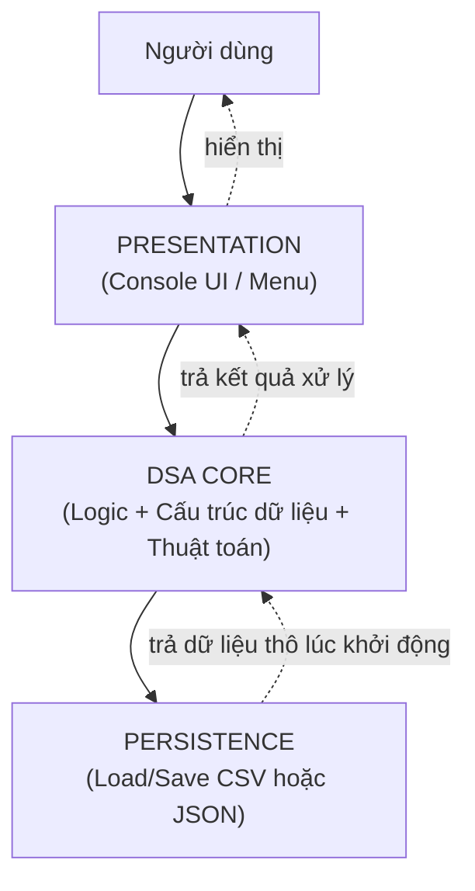
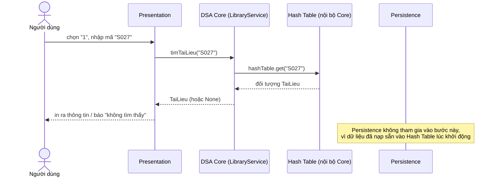
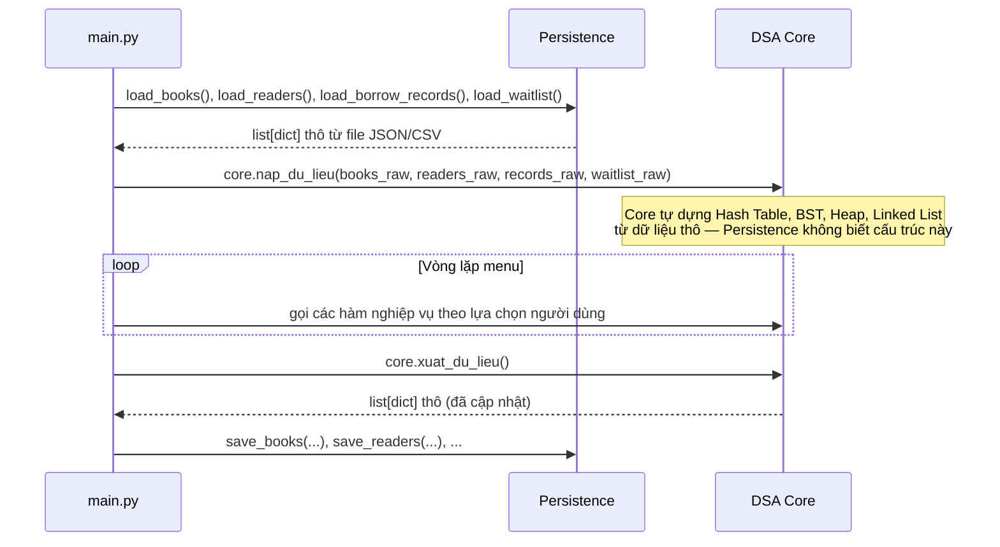
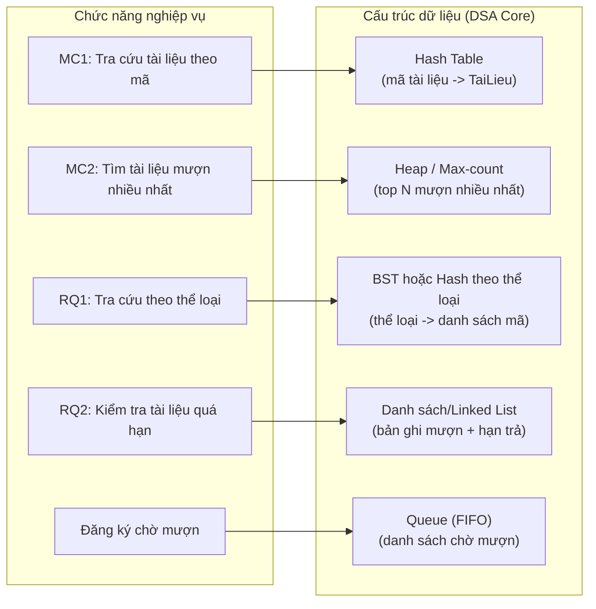
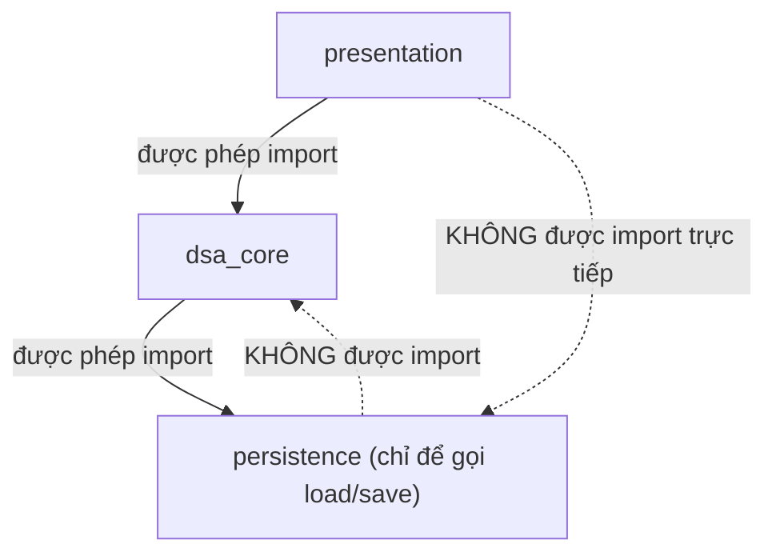
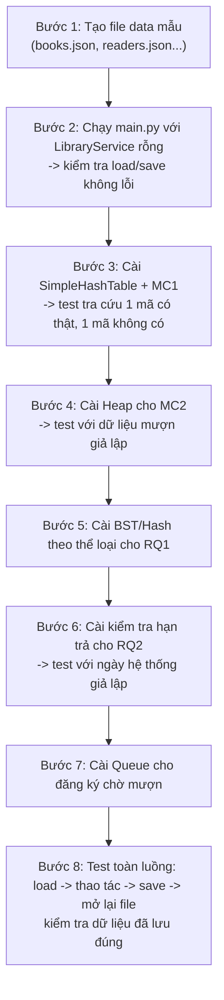

# KIẾN TRÚC HỆ THỐNG 3 TẦNG — LIBRARY MANAGEMENT (DSA)

> Giả định: ngôn ngữ code minh họa là **Python** (dễ đọc, dễ map sang Java/C++ nếu nhóm dùng ngôn ngữ khác — chỉ cần đổi `class`/`interface` tương ứng, cấu trúc thư mục và luồng gọi giữ nguyên).

---

## PHẦN 1 — SƠ ĐỒ TỔNG QUAN (vẽ trước, code sau)

### 1.1. Sơ đồ 3 tầng tổng quát



**Nguyên tắc bất di bất dịch:**
- Presentation **KHÔNG** được đụng vào Hash Table / BST / Heap / Linked List trực tiếp.
- Persistence **KHÔNG** được `ORDER BY`, `WHERE`, index DB để thay thế thuật toán — nó chỉ đọc/ghi file thô (list of dict / list of row), mọi sắp xếp, tìm kiếm là việc của DSA Core.
- DSA Core là **duy nhất một nơi** chứa cấu trúc dữ liệu và thuật toán.

### 1.2. Sơ đồ chi tiết luồng gọi (Sequence Diagram) — ví dụ MC1: Tra cứu tài liệu



### 1.3. Sơ đồ luồng khởi động chương trình (Load) & khi thoát (Save)



### 1.4. Sơ đồ ánh xạ Chức năng ↔ Cấu trúc dữ liệu (để nhóm thống nhất trước khi code)



---

## PHẦN 2 — TỪ SƠ ĐỒ SUY RA CẤU TRÚC THƯ MỤC CODE

Nhìn vào sơ đồ 1.1 và 1.4, ta chia thư mục **đúng theo 3 tầng + 1 thư mục data**, không trộn lẫn:

```
library_project/
│
├── main.py                     # điểm khởi động, nối 3 tầng lại
│
├── presentation/
│   ├── __init__.py
│   ├── menu.py                 # vòng lặp menu, in UI
│   └── input_helper.py         # đọc/validate input từ người dùng
│
├── dsa_core/
│   ├── __init__.py
│   ├── models.py                # class TaiLieu, DocGia, PhieuMuon...
│   ├── hash_table.py             # cấu trúc Hash Table tự cài đặt
│   ├── bst.py                    # hoặc cấu trúc cho tra cứu theo thể loại
│   ├── heap.py                   # cấu trúc Heap cho MC2 (top N)
│   ├── queue_structure.py        # Queue cho danh sách chờ mượn
│   ├── linked_list.py            # nếu dùng cho lịch sử mượn / quá hạn
│   └── library_service.py        # "bộ mặt" DSA Core — nơi Presentation gọi vào
│
├── persistence/
│   ├── __init__.py
│   ├── json_store.py             # load/save JSON thuần (list[dict])
│   └── csv_store.py              # (tùy chọn) load/save CSV
│
└── data/
    ├── books.json
    ├── readers.json
    ├── borrow_records.json
    └── waitlist.json
```

**Quy tắc import (rất quan trọng để giữ đúng kiến trúc):**



- `presentation/` chỉ import `dsa_core.library_service`.
- `dsa_core/` chỉ import `persistence` để gọi hàm load/save (hoặc thậm chí persistence được gọi từ `main.py` rồi "bơm" dữ liệu vào Core — cách này tách bạch hơn, khuyến nghị dùng).
- `persistence/` **không** import gì từ `dsa_core` — nó chỉ biết đọc/ghi list of dict, không biết Hash Table/BST là gì.

> Khuyến nghị: để tách bạch tuyệt đối, cho **`main.py` là nơi duy nhất gọi Persistence**, rồi truyền dữ liệu thô vào `library_service.nap_du_lieu(...)`. Như vậy `dsa_core` không phụ thuộc `persistence` luôn — càng đúng tinh thần 3 tầng độc lập.

---

## PHẦN 3 — INTERFACE GIỮA CÁC TẦNG (hợp đồng API)

Đây là phần "khế ước" — Presentation chỉ được biết các hàm này, không biết bên trong:

```python
# dsa_core/library_service.py — CHỮ KÝ HÀM (API mà Presentation được phép gọi)

class LibraryService:
    def nap_du_lieu(self, books_raw, readers_raw, records_raw, waitlist_raw): ...
    def xuat_du_lieu(self) -> dict: ...          # trả về 4 list[dict] để Persistence lưu lại

    # MC1
    def tim_tai_lieu(self, ma_tl: str) -> dict | None: ...

    # MC2
    def top_muon_nhieu_nhat(self, n: int) -> list[dict]: ...

    # RQ1
    def tim_theo_the_loai(self, the_loai: str) -> list[dict]: ...

    # RQ2
    def danh_sach_qua_han(self) -> list[dict]: ...

    # Đăng ký chờ mượn
    def dang_ky_cho_muon(self, ma_tl: str, ma_dg: str) -> bool: ...
    def xu_ly_hang_cho(self, ma_tl: str) -> str | None: ...
```

Persistence cũng có "khế ước" riêng, chỉ trả/nhận `list[dict]` thuần — không có object DSA nào lọt qua ranh giới này:

```python
# persistence/json_store.py — CHỮ KÝ HÀM

def load_books(path: str) -> list[dict]: ...
def save_books(path: str, books: list[dict]) -> None: ...

def load_readers(path: str) -> list[dict]: ...
def save_readers(path: str, readers: list[dict]) -> None: ...

def load_borrow_records(path: str) -> list[dict]: ...
def save_borrow_records(path: str, records: list[dict]) -> None: ...

def load_waitlist(path: str) -> list[dict]: ...
def save_waitlist(path: str, waitlist: list[dict]) -> None: ...
```

---

## PHẦN 4 — KHUNG CODE TỐI THIỂU ĐỂ CHẠY THỬ (skeleton)

Mục tiêu của bước này: **chạy được menu, load/save file thật, gọi xuyên 3 tầng thành công** — trước khi cắm thuật toán chi tiết vào từng cấu trúc dữ liệu.

### 4.1. `persistence/json_store.py`

```python
import json
import os

def _load(path: str) -> list[dict]:
    if not os.path.exists(path):
        return []
    with open(path, "r", encoding="utf-8") as f:
        return json.load(f)

def _save(path: str, data: list[dict]) -> None:
    os.makedirs(os.path.dirname(path), exist_ok=True)
    with open(path, "w", encoding="utf-8") as f:
        json.dump(data, f, ensure_ascii=False, indent=2)

def load_books(path="data/books.json") -> list[dict]:
    return _load(path)

def save_books(data, path="data/books.json") -> None:
    _save(path, data)

def load_readers(path="data/readers.json") -> list[dict]:
    return _load(path)

def save_readers(data, path="data/readers.json") -> None:
    _save(path, data)

def load_borrow_records(path="data/borrow_records.json") -> list[dict]:
    return _load(path)

def save_borrow_records(data, path="data/borrow_records.json") -> None:
    _save(path, data)

def load_waitlist(path="data/waitlist.json") -> list[dict]:
    return _load(path)

def save_waitlist(data, path="data/waitlist.json") -> None:
    _save(path, data)
```

### 4.2. `dsa_core/hash_table.py` (khung — thuật toán chi tiết tự cài đặt sau)

```python
class SimpleHashTable:
    """Hash Table tự cài đặt (chaining) — thay dict() gốc của Python
    khi nhóm cần chứng minh tự viết thuật toán, không dùng cấu trúc có sẵn."""

    def __init__(self, size=101):
        self.size = size
        self.buckets = [[] for _ in range(size)]

    def _hash(self, key: str) -> int:
        h = 0
        for ch in str(key):
            h = (h * 31 + ord(ch)) % self.size
        return h

    def put(self, key, value):
        idx = self._hash(key)
        bucket = self.buckets[idx]
        for i, (k, _) in enumerate(bucket):
            if k == key:
                bucket[i] = (key, value)
                return
        bucket.append((key, value))

    def get(self, key):
        idx = self._hash(key)
        for k, v in self.buckets[idx]:
            if k == key:
                return v
        return None

    def all_values(self):
        result = []
        for bucket in self.buckets:
            for _, v in bucket:
                result.append(v)
        return result
```

### 4.3. `dsa_core/library_service.py` (khung — nối cấu trúc dữ liệu với hàm nghiệp vụ)

```python
from dsa_core.hash_table import SimpleHashTable

class LibraryService:
    def __init__(self):
        self.books_ht = SimpleHashTable()
        self.readers_ht = SimpleHashTable()
        self.borrow_records = []   # sẽ thay bằng cấu trúc phù hợp (linked list) sau
        self.waitlist = {}          # ma_tl -> Queue, sẽ thay bằng Queue tự cài sau

    def nap_du_lieu(self, books_raw, readers_raw, records_raw, waitlist_raw):
        for b in books_raw:
            self.books_ht.put(b["ma_tl"], b)
        for r in readers_raw:
            self.readers_ht.put(r["ma_dg"], r)
        self.borrow_records = records_raw
        # TODO: dựng lại waitlist từ waitlist_raw

    def xuat_du_lieu(self) -> dict:
        return {
            "books": self.books_ht.all_values(),
            "readers": self.readers_ht.all_values(),
            "borrow_records": self.borrow_records,
            "waitlist": [],  # TODO: xuất lại từ cấu trúc waitlist
        }

    # ---- MC1 ----
    def tim_tai_lieu(self, ma_tl: str):
        return self.books_ht.get(ma_tl)

    # ---- MC2, RQ1, RQ2, waitlist: để TODO, code sau khi khung chạy ổn ----
    def top_muon_nhieu_nhat(self, n: int):
        return []  # TODO

    def tim_theo_the_loai(self, the_loai: str):
        return []  # TODO

    def danh_sach_qua_han(self):
        return []  # TODO

    def dang_ky_cho_muon(self, ma_tl, ma_dg):
        return True  # TODO

    def xu_ly_hang_cho(self, ma_tl):
        return None  # TODO
```

### 4.4. `presentation/menu.py`

```python
def run_menu(service):
    while True:
        print("=" * 32)
        print("      LIBRARY MANAGEMENT")
        print("=" * 32)
        print("1. Tra cứu tài liệu")
        print("2. Tìm tài liệu mượn nhiều nhất")
        print("3. Tra cứu theo thể loại")
        print("4. Kiểm tra tài liệu quá hạn")
        print("5. Đăng ký chờ mượn")
        print("0. Thoát")
        choice = input("Chọn chức năng: ").strip()

        if choice == "1":
            ma_tl = input("Nhập mã tài liệu: ").strip()
            result = service.tim_tai_lieu(ma_tl)
            print(result if result else "Không tìm thấy tài liệu.")

        elif choice == "2":
            print(service.top_muon_nhieu_nhat(5))

        elif choice == "3":
            the_loai = input("Nhập thể loại: ").strip()
            print(service.tim_theo_the_loai(the_loai))

        elif choice == "4":
            print(service.danh_sach_qua_han())

        elif choice == "5":
            ma_tl = input("Mã tài liệu: ").strip()
            ma_dg = input("Mã độc giả: ").strip()
            print(service.dang_ky_cho_muon(ma_tl, ma_dg))

        elif choice == "0":
            break
        else:
            print("Lựa chọn không hợp lệ.")
```

### 4.5. `main.py`

```python
from persistence import json_store
from dsa_core.library_service import LibraryService
from presentation.menu import run_menu

def main():
    books_raw = json_store.load_books()
    readers_raw = json_store.load_readers()
    records_raw = json_store.load_borrow_records()
    waitlist_raw = json_store.load_waitlist()

    service = LibraryService()
    service.nap_du_lieu(books_raw, readers_raw, records_raw, waitlist_raw)

    run_menu(service)

    exported = service.xuat_du_lieu()
    json_store.save_books(exported["books"])
    json_store.save_readers(exported["readers"])
    json_store.save_borrow_records(exported["borrow_records"])
    json_store.save_waitlist(exported["waitlist"])

if __name__ == "__main__":
    main()
```

---

## PHẦN 5 — QUY TRÌNH DEBUG / CHẠY THỬ THEO ĐÚNG THỨ TỰ

Đi từ khung xương ra chi tiết, không code hết một lần:



**Checklist debug cho từng bước:**
1. In `books_raw` ngay sau khi `load_books()` — chắc chắn đọc đúng file trước khi đưa vào Core.
2. Sau `nap_du_lieu()`, gọi thử `books_ht.get("mã có thật")` độc lập (viết 1 script test nhỏ, không qua menu) để cô lập lỗi giữa "đọc file sai" và "hash table sai".
3. Mỗi cấu trúc dữ liệu mới thêm vào (Heap, BST, Queue) nên có 1 file `test_xxx.py` riêng chạy thử tay, trước khi nối vào `library_service.py`.
4. Cuối cùng mới test qua `menu.py` để đảm bảo Presentation không có logic thừa lọt vào (nếu thấy `menu.py` đang tự loop tìm kiếm hay tự so sánh dữ liệu → sai kiến trúc, phải đẩy xuống `library_service.py`).

---

## PHẦN 6 — CÁC LỖI KIẾN TRÚC HAY GẶP (tự rà lại trước khi nộp)

| Lỗi thường gặp | Vì sao sai | Cách sửa |
|---|---|---|
| `menu.py` tự `for book in books: if book["ma_tl"]==...` | Presentation đang làm việc của DSA Core | Chuyển toàn bộ vòng lặp/so sánh vào `library_service.py` |
| `json_store.py` dùng `sorted()` để trả về top N mượn nhiều nhất | Persistence đang thay thế thuật toán (dù không phải SQL nhưng vi phạm tinh thần đề bài) | Persistence chỉ trả list thô, việc sắp xếp/heap nằm ở `dsa_core` |
| `library_service.py` gọi thẳng `open("books.json")` | DSA Core tự đọc file, phá vỡ ranh giới tầng | Chỉ nhận dữ liệu qua `nap_du_lieu(...)`, không tự mở file |
| Dùng `dict()` / `list.sort(key=...)` có sẵn của Python rồi gọi đó là "Hash Table", "thuật toán sắp xếp" | Không tự cài đặt cấu trúc dữ liệu như đề bài yêu cầu | Tự viết `SimpleHashTable`, thuật toán sắp xếp/Heap thủ công như mục 4.2 |
| Đối tượng `TaiLieu` (object của DSA Core) được truyền thẳng ra `menu.py` rồi in `.__dict__` | Ranh giới tầng bị lộ, Presentation "biết" cấu trúc nội bộ | `library_service.py` nên trả `dict` thuần (dữ liệu hiển thị) chứ không trả object nội bộ |

---

## TÓM TẮT QUY TRÌNH LÀM VIỆC ĐỀ XUẤT

1. Thống nhất sơ đồ Phần 1 và bảng ánh xạ Phần 1.4 với cả nhóm trước.
2. Dựng cấu trúc thư mục Phần 2 — file rỗng/TODO trước, chưa cần logic.
3. Viết khế ước hàm Phần 3 — cả nhóm thống nhất chữ ký hàm để chia việc song song (1 người làm Presentation, 1 người làm từng cấu trúc dữ liệu trong Core, 1 người làm Persistence).
4. Chạy khung xương Phần 4 để chắc chắn 3 tầng nối thông với nhau.
5. Đi theo Checklist Phần 5, code — test — nối, từng cấu trúc dữ liệu một.
6. Rà lại bảng lỗi Phần 6 trước khi nộp.
