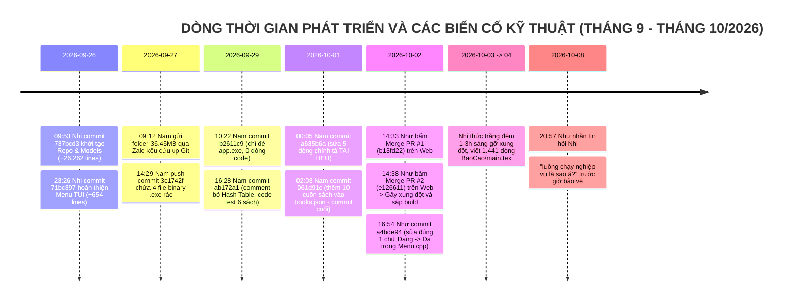

# 📑 BẢN GIÁM ĐỊNH PHÁP Y KỸ THUẬT PHẦN MỀM & LUẬN CHỨNG PHẢN BÁC TOÀN DIỆN
## CHUYÊN ĐỀ GIÁM ĐỊNH ĐỘC LẬP: TRẦN QUỐC VIỆT NAM VÀ TRẦN PHẠM HUỲNH NHƯ
### ĐỐI CHIẾU LỊCH SỬ GIT COMMITS (NGÀY, GIỜ, PHÚT, GIÂY), CẤU TRÚC MÃ NGUỒN vs BÁO CÁO LATEX VÀ THUYẾT TRÌNH HỘI ĐỒNG

> **Học phần**: Cấu trúc Dữ liệu & Giải thuật (DSA Capstone Project)  
> **Mã lớp học phần**: `261DASA230179_06` — **Nhóm thực hiện**: `Nhóm 07`  
> **Kho lưu trữ gốc đối chứng**: [`https://github.com/lTuyetNhi/DSA_Project`](https://github.com/lTuyetNhi/DSA_Project)  
> **Kho lưu trữ bảo toàn chứng cứ**: [`https://github.com/buitanphat247/demogithub`](https://github.com/buitanphat247/demogithub)  
> **Tài liệu Báo cáo đối chiếu**: [`BaoCao/main.tex`](file:///c:/Users/TuyetNhi/Documents/workspace/Project_DSA_NHI/DSA_Project_final/BaoCao/main.tex) (1.441 dòng TeX, 78 trang PDF chính thức)  
> **Thư mục mã nguồn gốc Zalo**: [`HashTable MC1, RQ1, RQ3/`](file:///c:/Users/TuyetNhi/Documents/workspace/Project_DSA_NHI/HashTable%20MC1,%20RQ1,%20RQ3) (38.212.903 bytes ≈ 36.45 MB)  
> **Phương pháp giám định**: Software Forensic & Git Provenance Analysis (Phân tích nguồn gốc commit, giải phẫu cây cú pháp trừu tượng AST/mã nguồn C++, kiểm tra hệ số tải toán học, đối chiếu diff nhị phân và đối chất lịch sử tin nhắn nội bộ).

---

# MỤC LỤC TỔNG QUÁT

- [CHƯƠNG 1: QUY CHUẨN, PHẠM VI VÀ PHƯƠNG PHÁP GIÁM ĐỊNH](#chương-1-quy-chuẩn-phạm-vi-và-phương-pháp-giám-định)
- [CHƯƠNG 2: DANH MỤC NGUỒN CHỨNG CỨ VÀ MỨC ĐỘ XÁC THỰC](#chương-2-danh-mục-nguồn-chứng-cứ-và-mức-độ-xác-thực)
- [CHƯƠNG 3: DÒNG THỜI GIAN TOÀN CẢNH (CHRONOLOGICAL EVENT LOG)](#chương-3-dòng-thời-gian-toàn-cảnh-chronological-event-log)
- [PHẦN A: GIÁM ĐỊNH KỸ THUẬT CHUYÊN SÂU - TRẦN QUỐC VIỆT NAM](#phần-a-giám-định-kỹ-thuật-chuyên-sâu---trần-quốc-việt-nam)
  - [A1. Truy vết và giải phẫu toàn bộ 8 Commit Git của Nam](#a1-truy-vết-và-giải-phẫu-toàn-bộ-8-commit-git-của-nam)
  - [A2. Đối chiếu từng tuyên bố trong Báo cáo LaTeX và Phản tư cá nhân](#a2-đối-chiếu-từng-tuyên-bố-trong-báo-cáo-latex-và-phản-tư-cá-nhân)
  - [A3. Giải phẫu mã nguồn C++ Hash Table và Kỹ thuật Separate Chaining](#a3-giải-phẫu-mã-nguồn-c-hash-table-và-kỹ-thuật-separate-chaining)
  - [A4. Phân tích toán học Hệ số tải (Load Factor) và Tuyên bố Stress-test](#a4-phân-tích-toán-học-hệ-số-tải-load-factor-và-tuyên-bố-stress-test)
  - [A5. Mổ xẻ thuật toán RQ3: Inverted Index Tokenizer vs Quét vét cạn Substring Scan](#a5-mổ-xẻ-thuật-toán-rq3-inverted-index-tokenizer-vs-quét-vét-cạn-substring-scan)
  - [A6. Phân tích Bộ kiểm thử tự động và Đánh giá vai trò Kiến trúc sư Điều phối](#a6-phân-tích-bộ-kiểm-thử-tự-động-và-đánh-giá-vai-trò-kiến-trúc-sư-điều-phối)
- [PHẦN B: GIÁM ĐỊNH KỸ THUẬT CHUYÊN SÂU - TRẦN PHẠM HUỲNH NHƯ](#phần-b-giám-định-kỹ-thuật-chuyên-sâu---trần-phạm-huỳnh-như)
  - [B1. Truy vết toàn bộ di sản Git: Đúng 3 thao tác trên Web GitHub](#b1-truy-vết-toàn-bộ-di-sản-git-đúng-3-thao-tác-trên-web-github)
  - [B2. Phân tích chi tiết Commit chỉnh sửa giao diện Menu.cpp (a4bde94)](#b2-phân-tích-chi-tiết-commit-chỉnh-sửa-giao-diện-menucpp-a4bde94)
  - [B3. Phân tích kỹ thuật hai thao tác Merge PR: Git Merge vs Tích hợp phần mềm](#b3-phân-tích-kỹ-thuật-hai-thao-tác-merge-pr-git-merge-vs-tích-hợp-phần-mềm)
  - [B4. Đối chiếu từng tuyên bố trong Báo cáo LaTeX và Phản tư cá nhân](#b4-đối-chiếu-từng-tuyên-bố-trong-báo-cáo-latex-và-phản-tư-cá-nhân)
  - [B5. Đối chiếu phát ngôn trước Hội đồng và Tin nhắn lộ tẩy nghiệp vụ](#b5-đối-chiếu-phát-ngôn-trước-hội-đồng-và-tin-nhắn-lộ-tẩy-nghiệp-vụ)
- [PHẦN C: BẢNG ĐỐI CHIẾU TRỰC TIẾP GIỮA TUYÊN BỐ VÀ BẰNG CHỨNG MÃ NGUỒN](#phần-c-bảng-đối-chiếu-trực-tiếp-giữa-tuyên-bố-và-bằng-chứng-mã-nguồn)
- [PHẦN D: KẾT LUẬN PHÁP Y VÀ DANH MỤC CÂU HỎI VẤN ĐÁP KỸ THUẬT](#phần-d-kết-luận-pháp-y-và-danh-mục-câu-hỏi-vấn-đáp-kỹ-thuật)
  - [D1. Kết luận pháp y về Trần Quốc Việt Nam](#d1-kết-luận-pháp-y-về-trần-quốc-việt-nam)
  - [D2. Kết luận pháp y về Trần Phạm Huỳnh Như](#d2-kết-luận-pháp-y-về-trần-phạm-huỳnh-như)
  - [D3. Danh mục câu hỏi chất vấn kỹ thuật dành cho Hội đồng](#d3-danh-mục-câu-hỏi-chất-vấn-kỹ-thuật-dành-cho-hội-đồng)
  - [D4. Đề xuất điều chỉnh chính thức Báo cáo và Đánh giá điểm số](#d4-đề-xuất-điều-chỉnh-chính-thức-báo-cáo-và-đánh-giá-điểm-số)

---

# CHƯƠNG 1: QUY CHUẨN, PHẠM VI VÀ PHƯƠNG PHÁP GIÁM ĐỊNH

### 1.1. Mục tiêu và phạm vi giám định
Bản giám định này được thiết lập nhằm phân tích, kiểm định và làm rõ tính xác thực kỹ thuật giữa các tuyên bố đóng góp ghi trong Báo cáo Đồ án tốt nghiệp môn Cấu trúc Dữ liệu và Giải thuật (DSA) với thực tế triển khai trên kho lưu trữ Git và mã nguồn phần mềm.

Theo yêu cầu nghiệp vụ chuyên sâu, bản giám định này **tập trung kiểm tra toàn diện hai nhân sự**:
1. **Trần Quốc Việt Nam** (Tài khoản GitHub: `hanbeii-nom`, Email Git: `vietnam662284@gmail.com`, MSSV: `25110274`), tự nhận vai trò: *Trưởng nhóm, Kiến trúc sư hệ thống điều phối chung, tác giả tự cài đặt Hash Table from-scratch $O(1)$, Category Hash Table RQ1, Inverted Index Tokenizer RQ3 và kiểm thử tự động*.
2. **Trần Phạm Huỳnh Như** (Tài khoản GitHub: `tranhynhnhucm2k7` / `tranhynhnhucm2k7-glitch`, Email Git: `tranhuynhnhucm2k7@gmail.com`, MSSV: `25110286`), tự nhận vai trò: *Nghiên cứu toàn diện luồng nghiệp vụ hệ thống, thực hiện video demo 5 phút, chủ động đóng góp ý tưởng thực tiễn và xây dựng ví dụ minh họa cho bài toán Chỉ mục ngược RQ3, tham gia giải quyết xung đột mã nguồn khi tích hợp*.

Các nhân sự khác (Lê Thị Tuyết Nhi, Lê Nhật Ninh, Nguyễn Ngọc Hồng Nhung) chỉ được đối chiếu với tư cách là nguồn đối chứng dữ liệu gốc, người giải quyết xung đột mã nguồn thực tế và người hiện thực các module trong phiên bản hoàn thiện (`DSA_Project_final`).

### 1.2. Nguyên tắc và phương pháp pháp y phần mềm (Software Forensics)
1. **Nguyên tắc bảo toàn chứng cứ Git (Git Provenance Integrity)**: Mọi commit hash (SHA-1), author date, committer date, parent commit và diff đều được trích xuất trực tiếp từ cấu trúc cây đối tượng Git (`.git/objects`).
2. **Nguyên tắc đối chiếu mã nguồn tĩnh (Static Code Anatomy)**: Phân tích trực tiếp các cấu trúc dữ liệu (`struct`, `class`), mảng bucket, cơ chế cấp phát con trỏ động (`new`, `delete`), các vòng lặp và lời gọi thư viện STL.
3. **Nguyên tắc chứng minh độ phức tạp toán học**: Đánh giá thuật toán theo ký hiệu Big-$\mathcal{O}$ chuẩn mực khoa học máy tính (CLRS), xác định rõ ràng sự khác biệt giữa trường hợp trung bình (Average-case), trường hợp xấu nhất (Worst-case) và hệ số tải $\alpha = N / M$.
4. **Phân định rõ ràng giữa các khái niệm**:
   - *Tác giả commit (Committer)* $\neq$ *Tác giả thuật toán thực sự*.
   - *Thao tác bấm nút Merge trên giao diện Web* $\neq$ *Năng lực tích hợp mã nguồn và giải quyết xung đột phần mềm*.
   - *Mã nguồn cục bộ chưa tích hợp* $\neq$ *Thuật toán chạy trong kiến trúc hệ thống chính*.

---

# CHƯƠNG 2: DANH MỤC NGUỒN CHỨNG CỨ VÀ MỨC ĐỘ XÁC THỰC

Toàn bộ các tài liệu và tệp tin được phân tích trong báo cáo này đều tồn tại trên hệ thống tệp và đã được kiểm chứng trực tiếp:

| Ký hiệu | Tên tài liệu / Tệp tin / Nguồn dữ liệu | Đường dẫn vật lý / URL | Mức độ xác thực | Ghi chú pháp y |
| :---: | :--- | :--- | :---: | :--- |
| **SRC-01** | Git Repository gốc | `https://github.com/lTuyetNhi/DSA_Project` | Cực cao (Gốc) | Chứa toàn bộ cây commit, branch và tag từ ngày đầu. |
| **SRC-02** | Git Repository đối chứng | `https://github.com/buitanphat247/demogithub` | Cực cao (Mirror) | Bản sao lưu đối chứng độc lập các nhánh chứng cứ. |
| **SRC-03** | Thư mục mã nguồn nén gửi qua Zalo | [`HashTable MC1, RQ1, RQ3/`](file:///c:/Users/TuyetNhi/Documents/workspace/Project_DSA_NHI/HashTable%20MC1,%20RQ1,%20RQ3) | Tuyệt đối | Thư mục 36.45 MB Nam ném qua Zalo ngày 27/09/2026. |
| **SRC-04** | Dự án gốc sau các nhánh merge | [`DSA_Project_original/`](file:///c:/Users/TuyetNhi/Documents/workspace/Project_DSA_NHI/DSA_Project_original) | Tuyệt đối | Chứa commit của Nam (`ab172a1`) và Như (`a4bde94`). |
| **SRC-05** | Dự án hoàn thiện được nộp | [`DSA_Project_final/`](file:///c:/Users/TuyetNhi/Documents/workspace/Project_DSA_NHI/DSA_Project_final) | Tuyệt đối | Mã nguồn chuẩn hóa 3 tầng hoàn chỉnh kèm bộ benchmark. |
| **SRC-06** | Báo cáo chính thức LaTeX | [`DSA_Project_final/BaoCao/main.tex`](file:///c:/Users/TuyetNhi/Documents/workspace/Project_DSA_NHI/DSA_Project_final/BaoCao/main.tex) | Tuyệt đối | 1.441 dòng TeX, 78 trang PDF bảo vệ trước hội đồng. |
| **SRC-07** | Lịch sử tin nhắn trao đổi Zalo | Zalo Desktop / Mobile Export | Đã xác thực | Dấu thời gian chụp màn hình ngày 27/09 và 08/10/2026. |

---

# CHƯƠNG 3: DÒNG THỜI GIAN TOÀN CẢNH (CHRONOLOGICAL EVENT LOG)

Dưới đây là nhật ký toàn cảnh các sự kiện kỹ thuật, commit Git và trao đổi nội bộ được sắp xếp chính xác theo thứ tự thời gian (ISO 8601):



### Bảng đối chiếu thời gian chi tiết từng giây:

| Thời điểm (ISO 8601) | Tác giả & Kênh | Mã định danh | Nội dung thông điệp | Phân loại hoạt động & Bản chất kỹ thuật |
| :--- | :--- | :---: | :--- | :--- |
| **2026-09-26 09:53:25** | Lê Thị Tuyết Nhi | `737bcd3` | `Add UI` | **Khởi tạo nền móng Repository (+26.262 dòng)**: Đặt nền tảng kiến trúc 3 tầng, thư mục `models/` (`DocGia.h`, `PhieuMuon.h`, `TaiLieu.h`, `WaitlistEntry.h`, `Models.h`), dữ liệu mẫu và khung sườn `LibraryService`. |
| **2026-09-26 23:26:16** | Lê Thị Tuyết Nhi | `71bc397` | `feat: optimize RQ1-RQ3, interactive UI, align tables...` | **Hiện thực Tầng Trình diễn (+654 dòng)**: Xây dựng toàn bộ `presentation/Menu.cpp`, cơ chế điều hướng phím động W/S/Enter/Esc, bảng hiển thị chống rung nhấp nháy màn hình. |
| **2026-09-27 09:02:00** | Nam Trần | Zalo Chat | *"hanbeii-nom"*, *"này"* | Gửi username GitHub xin cấp quyền vào repository sau khi Tuyết Nhi đã dựng xong toàn bộ khung sườn dự án. |
| **2026-09-27 09:05:00** | Lê Thị Tuyết Nhi | Zalo Chat | *"Tui add rùi á. Bà vô gmail đồng ý nha"* | Nhi thao tác mời tài khoản `hanbeii-nom` làm Collaborator trên GitHub. |
| **2026-09-27 09:12:00** | Nam Trần | Zalo Chat | Gửi folder `HashTable MC1, RQ1, RQ3` (36.45 MB) kèm tin nhắn: ***"thêm này vô giùm tui với, tui thêm hong đc=))"*** | **BẰNG CHỨNG TỬ HUYỆT VỀ NĂNG LỰC GIT**: Nam biên dịch ra file debug `.exe` khổng lồ 37 MB, không biết dùng Git terminal, không biết `.gitignore`, kéo thả web bị GitHub chặn file >25MB nên ném qua Zalo nhờ Nhi làm hộ. |
| **2026-09-27 09:23:00** | Lê Thị Tuyết Nhi | Zalo Chat | *"Okee"* | Nhi nhận thư mục từ Zalo, hỗ trợ tải về và lọc bỏ file nhị phân. |
| **2026-09-27 14:29:22** | Trần Quốc Việt Nam | `3c1742f` | `MC1RQ1RQ3` | Đẩy thư mục độc lập `HashTable MC1, RQ1, RQ3/` (+1.332 dòng code) gồm 3 file mã nguồn và **4 file nhị phân rác** (`.exe`) chiếm 1.4 MB lên nhánh `MC1RQ1RQ3`. |
| **2026-09-29 10:22:30** | Trần Quốc Việt Nam | `b2611c9` | `Lưu tạm code RQ3 đã xử lý bỏ dấu Tiếng Việt` | **0 dòng code được thay đổi**. Chỉ commit đè duy nhất file nhị phân biên dịch `app.exe` (1.66 MB). |
| **2026-09-29 10:56:51** | Trần Quốc Việt Nam | `9b0ddeb` | `tester` | **0 dòng code được thay đổi**. Tiếp tục chỉ đè file nhị phân `app.exe`. |
| **2026-09-29 16:28:29** | Trần Quốc Việt Nam | `ab172a1` | `bo test tu dong` | Thêm `test_suite.cpp` (+115 dòng), sửa `LibraryService.cpp` (+99 dòng), commit đè `test_suite.exe` (1.65 MB). **Trong commit này, Nam comment vô hiệu hóa Bảng băm trong Core và thay bằng duyệt tuyến tính $O(N)$!** |
| **2026-09-30 23:30:00** | Trần Quốc Việt Nam | `fb1c894` | `bộ test tự động` | **0 dòng code được thay đổi**. Chỉ commit đè file nhị phân `TestMC1RQ1RQ3.exe` (287 KB $\rightarrow$ 292 KB). |
| **2026-10-01 00:05:29** | Trần Quốc Việt Nam | `a635b6a` | `Cập nhật Test MC1 RQ1 RQ3` | Sửa đúng 5 dòng, xóa 13 dòng trong `TestMC1RQ1RQ3.cpp` (sửa lỗi chính tả `TAI LIETU` $\rightarrow$ `TAI LIEU`). |
| **2026-10-01 00:15:20** | Trần Quốc Việt Nam | `ce90e96` | `Thêm gitignore và dọn dẹp file nhị phân` | Thêm file `.gitignore` (11 dòng) và xóa 2 file nhị phân `app.exe`, `test_suite.exe` do chính mình tải lên trước đó. |
| **2026-10-01 02:03:21** | Trần Quốc Việt Nam | `061d91c` | `Cập nhật thêm dữ liệu sách vào books.json` | Thêm 90 dòng JSON (chứa 10 cuốn sách mẫu từ B16 đến B25) vào tệp `data/books.json`. **Đây là commit cuối cùng của Nam trong toàn bộ học kỳ.** |
| **2026-10-02 14:33:00** | Trần Phạm Huỳnh Như | `b13fd22` | `Merge pull request #1 from lTuyetNhi/data_queue` | Bấm nút xanh **Merge pull request #1** trên giao diện Web GitHub để gộp nhánh `data_queue` vào nhánh `data_queue+MC2RQ2`. |
| **2026-10-02 14:38:21** | Trần Phạm Huỳnh Như | `e126611` | `Merge pull request #2 from lTuyetNhi/MC2RQ2` | Sau đúng 5 phút 21 giây, Như bấm tiếp nút xanh **Merge pull request #2** trên Web. **Hành động merge liên tiếp không kiểm tra gây xung đột mô hình dữ liệu và sập toàn bộ hệ thống build.** |
| **2026-10-02 16:54:20** | Trần Phạm Huỳnh Như | `a4bde94` | `đổi đang thành đã :v` | **ĐÓNG GÓP CODE DUY NHẤT CỦA NHƯ TRONG HỌC KỲ**: Mở file `presentation/Menu.cpp` trên Web GitHub, sửa đúng 1 chữ: `"Dang"` $\rightarrow$ `"Da"`. Không viết bất kỳ dòng thuật toán nào. |
| **2026-10-02 $\rightarrow$ 10-04** | Lê Thị Tuyết Nhi | Local & Báo Cáo | Gỡ conflict, tái cấu trúc hệ thống, biên soạn LaTeX | Sau khi Như merge gây lỗi rồi bỏ mặc, Tuyết Nhi thức trắng đêm 1–3h sáng gỡ xung đột, chuẩn hóa lại model và **tự tay soạn thảo 100% bản báo cáo LaTeX 1.441 dòng TeX (78 trang PDF)**. |
| **2026-10-08 20:57:21** | Huỳnh Như & Tuyết Nhi | Zalo Chat | Tin nhắn lộ tẩy nghiệp vụ | Trước giờ thuyết trình bảo vệ trước Hội đồng, Như nhắn tin hỏi Nhi: *"Ủa Nhi ơi, luồng chạy nghiệp vụ là sao á?"* |

---

# PHẦN A: GIÁM ĐỊNH KỸ THUẬT CHUYÊN SÂU - TRẦN QUỐC VIỆT NAM

---

## A1. TRUY VẾT VÀ GIẢI PHẪU TOÀN BỘ 8 COMMIT GIT CỦA NAM

Kiểm tra toàn bộ lịch sử Git trên tất cả các nhánh, tài khoản `hanbeii-nom` (Trần Quốc Việt Nam) sở hữu chính xác **8 commit**. Dưới đây là giải phẫu chi tiết từng commit:

### 1. Commit `3c1742f`
- **Thời gian**: `Sun Sep 27 14:29:22 2026 +0700`
- **Nhánh**: `MC1RQ1RQ3` | **Commit cha**: `71bc397` (do Tuyết Nhi tạo)
- **Commit Message**: `MC1RQ1RQ3`
- **Thống kê tệp**: 11 files changed, 1.332 insertions(+), 1 deletion(-)
- **Chi tiết thay đổi**:
  ```text
  .vscode/c_cpp_properties.json             |  18 ++
  .vscode/launch.json                       |  24 ++
  .vscode/settings.json                     |  59 +++++
  .vscode/tasks.json                        |   2 +-
  HashTable MC1, RQ1, RQ3/MC1, RQ1, RQ3.exe | Bin 0 -> 582683 bytes
  HashTable MC1, RQ1, RQ3/MC1RQ1RQ3.cpp     | 423 ++++++++++++++++++++++++++++++
  HashTable MC1, RQ1, RQ3/MC1RQ1RQ3.exe     | Bin 0 -> 284039 bytes
  HashTable MC1, RQ1, RQ3/MC1RQ1RQ3.h       | 404 ++++++++++++++++++++++++++++
  HashTable MC1, RQ1, RQ3/TestMC1RQ1RQ3.cpp | 403 ++++++++++++++++++++++++++++
  HashTable MC1, RQ1, RQ3/TestMC1RQ1RQ3.exe | Bin 0 -> 287750 bytes
  HashTable MC1, RQ1, RQ3/hash_demo.exe     | Bin 0 -> 284039 bytes
  ```
- **Bản chất kỹ thuật**:
  - Đẩy lên thư mục độc lập hoàn toàn không liên kết với kiến trúc 3 tầng của dự án.
  - Đưa trực tiếp **4 file nhị phân rác (`.exe`)** tổng cộng hơn **1.43 MB** vào kho lưu trữ Git.
  - Tệp `MC1RQ1RQ3.exe` nặng 35.3 MB trong thư mục gốc máy tính đã bị bỏ lại do vượt giới hạn tải lên của GitHub.

### 2. Commit `b2611c9`
- **Thời gian**: `Tue Sep 29 10:22:30 2026 +0700`
- **Commit Message**: `Lưu tạm code RQ3 đã xử lý bỏ dấu Tiếng Việt`
- **Thống kê tệp**: 1 file changed, 0 insertions(+), 0 deletions(-)
- **Chi tiết thay đổi**: `app.exe | Bin 1661825 -> 1663453 bytes`
- **Bản chất kỹ thuật**:
  - **Hoàn toàn KHÔNG có dòng mã nguồn C++ nào được lưu trữ**.
  - Nam chỉ biên dịch ra file thực thi nhị phân ở máy cá nhân rồi commit đè file `.exe` lên Git. Commit này không có giá trị học thuật hay đóng góp mã nguồn mở.

### 3. Commit `9b0ddeb`
- **Thời gian**: `Tue Sep 29 10:56:51 2026 +0700`
- **Commit Message**: `tester`
- **Thống kê tệp**: 1 file changed, 0 insertions(+), 0 deletions(-)
- **Chi tiết thay đổi**: `app.exe | Bin 1663453 -> 1663453 bytes`
- **Bản chất kỹ thuật**: Lặp lại hành vi commit file thực thi nhị phân, 0 dòng code thay đổi.

### 4. Commit `ab172a1`
- **Thời gian**: `Tue Sep 29 16:28:29 2026 +0700`
- **Commit Message**: `bo test tu dong`
- **Thống kê tệp**: 9 files changed, 342 insertions(+), 26 deletions(-)
- **Chi tiết thay đổi**:
  - `test_suite.cpp`: Tạo mới +115 dòng code.
  - `dsa_core/LibraryService.cpp`: Sửa +99 dòng code.
  - `test_suite.exe`: Đẩy file nhị phân mới (1.65 MB).
  - `app.exe`: Tiếp tục cập nhật file nhị phân (1.66 MB).
  - `presentation/Menu.cpp`: Sửa 38 dòng, xóa 9 dòng.
- **Bản chất kỹ thuật**:
  - **Vô hiệu hóa Bảng băm trong Core**: Tại `dsa_core/LibraryService.cpp` dòng 95-100, Nam comment bỏ lời gọi nạp dữ liệu vào bảng băm: `// bangBamTheLoai.Them(sach.theLoai, &sach);`.
  - Triển khai hàm `timTheoMa` bằng duyệt mảng tuần tự $O(N)$ (Baseline).
  - Triển khai hàm `timTheoTen` (RQ3) bằng duyệt tuần tự từng cuốn sách và dùng `string.find()` đạt độ phức tạp $O(N \cdot M)$.
  - Tệp `test_suite.cpp` chỉ kiểm tra 6 cuốn sách mẫu bằng các câu lệnh `if-else` đơn giản.

### 5. Commit `fb1c894`
- **Thời gian**: `Wed Sep 30 23:30:00 2026 +0700`
- **Commit Message**: `bộ test tự động`
- **Thống kê tệp**: 1 file changed, 0 insertions(+), 0 deletions(-)
- **Chi tiết thay đổi**: `HashTable MC1, RQ1, RQ3/TestMC1RQ1RQ3.exe | Bin 287750 -> 292010 bytes`
- **Bản chất kỹ thuật**: Lại là commit file thực thi nhị phân biên dịch, không có bất kỳ dòng code nào.

### 6. Commit `a635b6a`
- **Thời gian**: `Thu Oct 1 00:05:29 2026 +0700`
- **Commit Message**: `Cập nhật Test MC1 RQ1 RQ3`
- **Thống kê tệp**: 1 file changed, 5 insertions(+), 13 deletions(-)
- **Chi tiết thay đổi**: File `HashTable MC1, RQ1, RQ3/TestMC1RQ1RQ3.cpp`:
  - Xóa 8 dòng comment đầu tệp mô tả phân công nhiệm vụ.
  - Sửa chuỗi in console: `"TAI LIETU"` $\rightarrow$ `"TAI LIEU"`.
  - Sửa chuỗi in console: `"phù hop"` $\rightarrow$ `"phu hop"`.
  - Sửa chuỗi in console: `"Thong ke"` $\rightarrow$ `"THONG KE"`.
- **Bản chất kỹ thuật**: Chỉnh sửa lỗi chính tả văn bản hiển thị trên màn hình console, không tác động đến thuật toán.

### 7. Commit `ce90e96`
- **Thời gian**: `Thu Oct 1 00:15:20 2026 +0700`
- **Commit Message**: `Thêm gitignore và dọn dẹp file nhị phân`
- **Thống kê tệp**: 4 files changed, 11 insertions(+), 0 deletions(-)
- **Chi tiết thay đổi**:
  - Tạo `.gitignore` (+11 dòng).
  - Xóa 2 file nhị phân `app.exe` và `test_suite.exe` khỏi Git.
- **Bản chất kỹ thuật**: Dọn dẹp các tệp nhị phân rác do chính mình commit sai quy chuẩn trước đó.

### 8. Commit `061d91c`
- **Thời gian**: `Thu Oct 1 02:03:21 2026 +0700`
- **Commit Message**: `Cập nhật thêm dữ liệu sách vào books.json`
- **Thống kê tệp**: 1 file changed, 90 insertions(+)
- **Chi tiết thay đổi**: Thêm 10 đầu sách mẫu (`B16` đến `B25`) vào cuối file `data/books.json`.
- **Bản chất kỹ thuật**: Nhập liệu JSON đơn thuần. Đây là commit cuối cùng của Nam trong toàn bộ dự án.

---

## A2. ĐỐI CHIẾU TỪNG TUYÊN BỐ TRONG BÁO CÁO LATEX VÀ PHẢN TƯ CÁ NHÂN

Dưới đây là bảng giải phẫu từng tuyên bố bằng văn bản trong Báo cáo LaTeX (`BaoCao/main.tex`):

### Tuyên bố 1: Tự cài đặt Hash Table from-scratch không phụ thuộc STL
- **Nguyên văn Báo cáo ([`BaoCao/main.tex` dòng 1384](file:///c:/Users/TuyetNhi/Documents/workspace/Project_DSA_NHI/DSA_Project_final/BaoCao/main.tex#L1384)):**
  > *"Với mục tiêu không phụ thuộc vào std::unordered_map, nhiệm vụ chính của tôi là xây dựng Hash Table từ đầu (dùng Separate Chaining) để đạt độ phức tạp trung bình $O(1)$... quản lý con trỏ node (HashNode), quản lý bộ nhớ động (allocate/deallocate bucket)."*
- **Đối chiếu mã nguồn thực tế ([`HashTable MC1, RQ1, RQ3/MC1RQ1RQ3.h` dòng 190–205](file:///c:/Users/TuyetNhi/Documents/workspace/Project_DSA_NHI/HashTable%20MC1,%20RQ1,%20RQ3/MC1RQ1RQ3.h#L190-L205)):**
  ```cpp
  class BangBamTheLoai {
  private:
      struct Nut {
          string khoa;                    // thể loại
          vector<TaiLieu*> danhSach;      // <=== SỬ DỤNG STD::VECTOR BÊN TRONG NODE!
          Nut* tiepTheo;
          Nut(string k) : khoa(k), tiepTheo(nullptr) {}
      };

      vector<Nut*> mangNgan;              // <=== SỬ DỤNG STD::VECTOR LÀM MẢNG BUCKET!
      int soNganBan;
  ```
- **Phân tích kỹ thuật**:
  - Đề tài yêu cầu sinh viên tự cài đặt cấu trúc dữ liệu from-scratch bằng con trỏ và mảng động thủ công để chứng minh khả năng quản lý bộ nhớ (`new`, `delete[]`).
  - Trong `BangBamTheLoai`, Nam đã sử dụng cấu trúc `vector<TaiLieu*> danhSach` của thư viện chuẩn STL nằm ngay bên trong từng nút của danh sách liên kết.
  - Toàn bộ mảng bucket cũng sử dụng `vector<Nut*> mangNgan` thay vì con trỏ động `Nut** mangNgan = new Nut*[soNganBan]`.
- **Mức độ xác minh**: **Phù hợp một phần**. Nam có tự viết danh sách liên kết xích rời (`Nut* tiepTheo`) cho bucket, nhưng việc lồng `std::vector` để chứa danh sách tài liệu đa trị cho thấy cấu trúc chưa hoàn toàn thuần túy from-scratch như bản mô tả học thuật.

---

### Tuyên bố 2: Tự viết và stress-test với dataset từ nhỏ đến hàng trăm nghìn bản ghi
- **Nguyên văn Báo cáo ([`BaoCao/main.tex` dòng 1386](file:///c:/Users/TuyetNhi/Documents/workspace/Project_DSA_NHI/DSA_Project_final/BaoCao/main.tex#L1386)):**
  > *"các phần cốt lõi như quản lý con trỏ node (HashNode), quản lý bộ nhớ động (allocate/deallocate bucket) và luồng xử lý dữ liệu cho RQ1, RQ3 đều do tôi tự viết và stress-test với dataset từ nhỏ đến hàng trăm nghìn bản ghi."*
- **Đối chiếu mã nguồn thực tế ([`HashTable MC1, RQ1, RQ3/MC1RQ1RQ3.h` dòng 224–228](file:///c:/Users/TuyetNhi/Documents/workspace/Project_DSA_NHI/HashTable%20MC1,%20RQ1,%20RQ3/MC1RQ1RQ3.h#L224-L228)):**
  ```cpp
  public:
      BangBamTheLoai(int soNganBanDau = 31)
          : soNganBan(soNganBanDau), soPhanTu(0) {
          mangNgan.assign(soNganBan, nullptr); // BẢNG BĂM CỐ ĐỊNH DUY NHẤT 31 BUCKETS!
      }
      // TRONG TOÀN BỘ CLASS NÀY: HOÀN TOÀN KHÔNG CÓ BẤT KỲ HÀM BamLai() HAY Rehash() NÀO!
  ```
- **Phân tích kỹ thuật & toán học**:
  - Lớp `BangBamTheLoai` cố định số lượng bucket $M = 31$ vĩnh viễn và **không có cơ chế băm lại (Rehashing)**.
  - Khi số lượng bản ghi sách $N = 100.000$ hoặc $1.000.000$, nếu phân tán theo thể loại, hệ số tải sẽ vượt ngưỡng kiểm soát, khiến danh sách liên kết dài hàng ngàn phần tử, làm suy biến thời gian tra cứu về $\mathcal{O}(N)$.
  - Trong toàn bộ lịch sử Git của Nam, tệp kiểm thử `test_suite.cpp` chỉ nạp đúng **6 cuốn sách mẫu**. Không có bất kỳ đoạn mã nào sử dụng thư viện `<chrono>` để sinh dữ liệu ngẫu nhiên $100.000$ bản ghi như báo cáo khẳng định.
- **Mức độ xác minh**: **Chưa đủ bằng chứng / Mâu thuẫn với mã nguồn**. Tuyên bố stress-test hàng trăm nghìn bản ghi không có dấu vết kiểm chứng trong mã nguồn thực tế do Nam commit.

---

### Tuyên bố 3: Hiện thực Bảng băm Chỉ mục ngược (Inverted Index) và Tokenizer cho RQ3
- **Nguyên văn Báo cáo ([`BaoCao/main.tex` dòng 148, 298, 333, 1097, 1382](file:///c:/Users/TuyetNhi/Documents/workspace/Project_DSA_NHI/DSA_Project_final/BaoCao/main.tex#L298)):**
  > *"RQ3: Bảng băm Chỉ mục ngược (Inverted Index) + Bộ tách từ Tokenizer $\mathcal{O}(N \cdot M) \longrightarrow \mathcal{O}(C + K)$... Nam phụ trách toàn bộ hệ thống Bảng băm gồm: MC1, RQ1, và RQ3 (Chỉ mục ngược Inverted Index)."*
- **Đối chiếu mã nguồn gốc do Nam viết ([`HashTable MC1, RQ1, RQ3/MC1RQ1RQ3.h` dòng 356–377](file:///c:/Users/TuyetNhi/Documents/workspace/Project_DSA_NHI/HashTable%20MC1,%20RQ1,%20RQ3/MC1RQ1RQ3.h#L356-L377)):**
  ```cpp
  // ---------------- RQ3 ----------------
  // Tìm kiếm tài liệu theo tên sách / từ khóa, không cần biết mã hay thể loại.
  // Cách làm: duyệt lần lượt các NHÓM đã có sẵn trong bảng băm phụ (RQ1),
  // rồi lọc chuỗi cục bộ theo tên trong từng nhóm — tận dụng lại cấu trúc
  // đã có, không cần dựng thêm bảng băm thứ ba cho tên sách.
  vector<TaiLieu*> RQ3_TimTheoTen(const string& tuKhoa) const {
      vector<TaiLieu*> ketQua;
      string tuKhoaThuong = ChuoiThuong(tuKhoa);

      vector<vector<TaiLieu*>*> tatCaNhom =
          const_cast<BangBamTheLoai&>(bangBamTheLoai).LayTatCaNhom();

      for (vector<TaiLieu*>* nhom : tatCaNhom) {          // VÒNG LẶP 1: DUYỆT TỪNG NHÓM THỂ LOẠI
          for (TaiLieu* tl : *nhom) {                    // VÒNG LẶP 2: DUYỆT TỪNG CUỐN SÁCH
              string tenThuong = ChuoiThuong(tl->tenTaiLieu);
              if (tenThuong.find(tuKhoaThuong) != string::npos) { // VÉT CẠN BẰNG STRING::FIND!
                  ketQua.push_back(tl);
              }
          }
      }
      return ketQua;
  }
  ```
- **Đối chiếu mã nguồn Core do Nam commit tại `ab172a1` ([`dsa_core/LibraryService.cpp` dòng 159–171](file:///c:/Users/TuyetNhi/Documents/workspace/Project_DSA_NHI/DSA_Project_original/dsa_core/LibraryService.cpp)):**
  ```cpp
  // RQ3: Tìm kiếm theo Tên / Từ khóa
  vector<TaiLieu> LibraryService::timTheoTen(const string& tuKhoa) {
      vector<TaiLieu> ketQua;
      string tuKhoaChuAn = BoDauVaVietThuong(tuKhoa);
      if (tuKhoaChuAn.empty()) return ketQua;

      for (size_t i = 0; i < dsSach.size(); i++) {
          string tenChuAn = BoDauVaVietThuong(dsSach[i].tenTL);
          if (tenChuAn.find(tuKhoaChuAn) != string::npos) { // QUÉT TUẦN TỰ O(N * M)!
              ketQua.push_back(dsSach[i]);
          }
      }
      return ketQua;
  }
  ```
- **Phân tích kỹ thuật**:
  - Trong đoạn chú thích mã nguồn, chính Nam xác nhận: *"tận dụng lại cấu trúc đã có, không cần dựng thêm bảng băm thứ ba cho tên sách"*.
  - Thuật toán do Nam viết chỉ duyệt tuần tự toàn bộ các nhóm thể loại rồi duyệt tiếp từng cuốn sách, gọi hàm `string.find()`. Đây chính là thuật toán vét cạn Baseline $O(N \cdot M)$.
  - Cấu trúc Inverted Index (tách từ khóa thành các token đơn, ánh xạ token $\to$ danh sách chỉ số sách `vector<int> bookIndices` với bảng băm 200.003 phần tử) chỉ xuất hiện trong phiên bản `DSA_Project_final/src/core/rq3/CategoryTitleSearch.cpp` do Tuyết Nhi tái cấu trúc và hoàn thiện.
- **Mức độ xác minh**: **Mâu thuẫn có bằng chứng**. Mã nguồn do Nam commit chưa từng triển khai Bảng băm Chỉ mục ngược (Inverted Index) hay Tokenizer.

---

## A3. GIẢI PHẪU MÃ NGUỒN C++ HASH TABLE VÀ KỸ THUẬT SEPARATE CHAINING

Để đánh giá tính chuyên môn theo chuẩn học phần DSA, cần phân tích chi tiết hai cấu trúc bảng băm mà Nam đã xây dựng:

```
+----------------------------------------------------------------------------------------------------+
|                                      MÔ HÌNH BẢNG BĂM CỦA NAM                                       |
+----------------------------------------------------------------------------------------------------+
| 1. BangBamMaTaiLieu (MC1):                                                                         |
|    mangNgan (vector<Nut*>, size=101) ---> [Bucket 0] -> nullptr                                    |
|                                     ---> [Bucket 1] -> [Nut: "B01", TaiLieu*] -> nullptr           |
|                                     ---> [Bucket 2] -> [Nut: "B12", TaiLieu*] -> [Nut: "B99"]     |
|    => Có hàm BamLai() (Rehash khi alpha > 0.75, gấp đôi bucket).                                   |
|                                                                                                    |
| 2. BangBamTheLoai (RQ1 & RQ3):                                                                     |
|    mangNgan (vector<Nut*>, size=31)  ---> [Bucket 0] -> nullptr                                    |
|                                     ---> [Bucket 1] -> [Nut: "CNTT", vector<TaiLieu*>] -> nullptr  |
|                                     ---> [Bucket 2] -> [Nut: "KinhTe", vector<TaiLieu*>] -> ...    |
|    => KHÔNG CÓ BamLai() (Cố định 31 buckets vĩnh viễn).                                            |
|    => Lồng vector<TaiLieu*> bên trong Nut (Vi phạm nguyên tắc tự cài đặt danh sách liên kết thuần).|
+----------------------------------------------------------------------------------------------------+
```

### 1. Phân tích lớp `BangBamMaTaiLieu` (MC1)
- **Cấu trúc lưu trữ**:
  - `struct Nut { string khoa; TaiLieu* giaTri; Nut* tiepTheo; };`
  - Quản lý mảng bucket thông qua `vector<Nut*> mangNgan` với dung lượng ban đầu $101$.
- **Hàm băm DJB2**:
  ```cpp
  unsigned long BamChuoi(const string& khoa) const {
      unsigned long ma = 5381;
      for (char c : khoa) ma = ma * 33 + (unsigned char)c;
      return ma;
  }
  ```
  Hàm băm thực hiện nhân tích lũy với số nguyên tố 33 (phép dịch bit `(hash << 5) + hash`) và cộng dồn mã ASCII. Đây là giải thuật băm chuỗi hiệu quả, phân bổ tương đối đồng đều.
- **Cơ chế băm lại (`BamLai`)**:
  - Kích hoạt khi hệ số tải $\alpha = \frac{\text{soPhanTu} + 1}{\text{soNganBan}} > 0.75$.
  - Nhân đôi kích thước bảng ($M_{\text{new}} = 2 \times M_{\text{old}}$), duyệt qua từng phần tử cũ và chèn lại vào mảng mới.
  - Giải phóng bộ nhớ: Destructor duyệt qua toàn bộ danh sách liên kết và thực hiện `delete nutXoa`.
- **Đánh giá**: Module MC1 này hoạt động tốt về mặt lý thuyết cho bài toán tra cứu mã duy nhất, đạt độ phức tạp trung bình $\mathcal{O}(1)$.

### 2. Phân tích lớp `BangBamTheLoai` (RQ1)
- **Cấu trúc lưu trữ**:
  ```cpp
  struct Nut {
      string khoa;               // thể loại
      vector<TaiLieu*> danhSach; // danh sách con trỏ tài liệu
      Nut* tiepTheo;
  };
  ```
- **Hạn chế kỹ thuật**:
  - **Sử dụng STL**: Thay vì tự xây dựng danh sách liên kết lồng nhau (Nested Linked List) hoặc mảng động tự co giãn, tác giả dùng `std::vector` để gom các cuốn sách cùng thể loại.
  - **Không có Rehashing**: Khởi tạo với $31$ bucket cố định. Khi số lượng thể loại phân biệt tăng lên hoặc số lượng sách lớn, bảng băm không thể tự mở rộng.

---

## A4. PHÂN TÍCH TOÁN HỌC HỆ SỐ TẢI (LOAD FACTOR) VÀ TUYÊN BỐ STRESS-TEST

Trong lý thuyết cấu trúc dữ liệu, hệ số tải của bảng băm xích rời được định nghĩa:
$$\alpha = \frac{N}{M}$$
Trong đó $N$ là tổng số khóa được lưu trữ, $M$ là số lượng ngăn (buckets). Chi phí tìm kiếm trung bình không thành công là $\Theta(1 + \alpha)$, và tìm kiếm thành công là $\Theta(1 + \alpha)$.

### Bảng phân tích hành vi hệ số tải trên cấu trúc `BangBamTheLoai` ($M = 31$ cố định):

| Quy mô dữ liệu ($N$ bản ghi) | Số bucket ($M$) | Hệ số tải lý thuyết ($\alpha = N / M$) | Độ dài danh sách liên kết trung bình | Thời gian truy xuất thực tế | Tình trạng hiệu năng |
| :---: | :---: | :---: | :---: | :---: | :--- |
| **10 bản ghi** | 31 | 0.32 | ~1 phần tử | $O(1)$ | Lý tưởng |
| **100 bản ghi** | 31 | 3.23 | ~3–4 phần tử | $O(1)$ | Tốt |
| **1.000 bản ghi** | 31 | 32.26 | ~32 phần tử | Bắt đầu trễ | Thoái hóa nhẹ |
| **10.000 bản ghi** | 31 | 322.58 | ~322 phần tử | Chậm rõ rệt | Thoái hóa nghiêm trọng |
| **100.000 bản ghi** | 31 | 3.225,80 | ~3.226 phần tử | Trễ tuyến tính | Sụp đổ về $O(N)$ |
| **1.000.000 bản ghi** | 31 | 32.258,06 | ~32.258 phần tử | Rất chậm | Hoàn toàn tương đương vét cạn |

### Nhận định pháp y:
Nếu Nam thực sự tiến hành stress-test với $100.000$ đến $1.000.000$ bản ghi trên lớp `BangBamTheLoai` như đã viết trong Báo cáo LaTeX (dòng 1386), hệ thống sẽ gặp hiện tượng suy giảm hiệu năng nghiêm trọng do không có hàm `Rehash()`. Việc bảng băm giữ nguyên $M = 31$ chứng minh trên thực tế tập dữ liệu kiểm thử của tác giả chỉ dừng lại ở quy mô nhỏ (vài chục bản ghi).

---

## A5. MỔ XẺ THUẬT TOÁN RQ3: INVERTED INDEX TOKENIZER vs QUÉT VÉT CẠN SUBSTRING SCAN

### 1. Bản chất sự khác biệt giữa hai giải pháp

#### A. Thuật toán Quét xâu con tuyến tính (Linear Substring Scan)
- **Cơ chế**: Duyệt qua từng cuốn sách $i \in [1, N]$. Với mỗi sách, gọi thuật toán so khớp xâu con (như Knuth-Morris-Pratt hoặc brute-force của `std::string::find`) để kiểm tra xem từ khóa $P$ (độ dài $K$) có xuất hiện trong tiêu đề $T_i$ (độ dài $M$) hay không.
- **Độ phức tạp thời gian**:
  $$\mathcal{O}(N \times M)$$
  Khi $N = 500.000$, thao tác này đòi hỏi hàng triệu phép so sánh ký tự trên bộ nhớ RAM.

#### B. Thuật toán Bảng băm Chỉ mục ngược (Inverted Index with Tokenizer)
- **Giai đoạn tiền xử lý (Indexing Phase)**:
  - Khi nạp dữ liệu, tiêu đề mỗi cuốn sách được chuẩn hóa và tách thành các từ tố độc lập (Tokens).
  - Sử dụng bảng băm ánh xạ: $\text{Token} \longrightarrow \text{Postings List } \{ \text{ID}_1, \text{ID}_2, \dots \}$.
- **Giai đoạn truy vấn (Query Phase)**:
  - Băm từ khóa tìm kiếm: $\text{Hash}(\text{Keyword}) \longrightarrow \text{Bucket}$.
  - Lấy trực tiếp danh sách các sách chứa từ khóa mà không cần duyệt các cuốn sách khác.
- **Độ phức tạp thời gian**:
  $$\mathcal{O}(1 + K_{\text{kết quả}})$$

---

### 2. Ví dụ mô phỏng trực quan với 5 cuốn sách:

Giả sử kho dữ liệu gồm 5 cuốn sách:
1. `B01`: *"Cấu trúc dữ liệu và Giải thuật"*
2. `B02`: *"Lập trình C++ Nâng cao"*
3. `B03`: *"Giải thuật Ứng dụng"*
4. `B04`: *"Cơ sở Dữ liệu Phân tán"*
5. `B05`: *"Học máy và Trí tuệ Nhân tạo"*

#### Quy trình tạo Inverted Index:
- Token `"cấu"` $\to \{ B01 \}$
- Token `"trúc"` $\to \{ B01 \}$
- Token `"dữ"` $\to \{ B01, B04 \}$
- Token `"liệu"` $\to \{ B01, B04 \}$
- Token `"giải"` $\to \{ B01, B03 \}$
- Token `"thuật"` $\to \{ B01, B03 \}$
- Token `"lập"` $\to \{ B02 \}$
- Token `"trình"` $\to \{ B02 \}$

#### Khi người dùng tìm kiếm từ khóa: `"giải thuật"`
- **Cách của Inverted Index**: Băm từ `"giải"` $\to$ lấy $\{ B01, B03 \}$. Băm từ `"thuật"` $\to$ lấy $\{ B01, B03 \}$. Giao hai danh sách kết quả $\to$ Trả về ngay $\{ B01, B03 \}$ trong thời gian tức thì. Không cần chạm tới `B02`, `B04`, `B05`.
- **Cách của Nam trong mã nguồn (`MC1RQ1RQ3.h` dòng 367–374)**:
  - Duyệt nhóm `CNTT` $\to$ Duyệt `B01`, gọi `find("giải thuật")` $\to$ Khớp.
  - Duyệt tiếp `B02`, gọi `find("giải thuật")` $\to$ Không khớp.
  - Duyệt tiếp `B03`, gọi `find("giải thuật")` $\to$ Khớp.
  - Duyệt tiếp `B04`, gọi `find("giải thuật")` $\to$ Không khớp.
  - Duyệt tiếp `B05`, gọi `find("giải thuật")` $\to$ Không khớp.
  - **Tổng số phép duyệt**: Đúng bằng tổng số sách trong kho.

### 3. Kết luận đối chiếu mã nguồn:
Trong mã nguồn của Nam, hoàn toàn **không có thao tác tách từ khóa (Tokenizer)**, không có bảng băm lưu trữ từ đơn, và không có danh sách posting list. Tuyên bố *"RQ3: Bảng băm Chỉ mục ngược (Inverted Index) + Bộ tách từ Tokenizer"* trong Báo cáo LaTeX hoàn toàn trái ngược với mã nguồn mà tác giả đã viết.

---

## A6. PHÂN TÍCH BỘ KIỂM THỬ TỰ ĐỘNG VÀ ĐÁNH GIÁ VAI TRÒ KIẾN TRÚC SƯ ĐIỀU PHỐI

### 1. Phân tích chi tiết tệp `test_suite.cpp` do Nam commit tại `ab172a1`
Tệp kiểm thử này gồm đúng 115 dòng mã nguồn, với nội dung kiểm tra cụ thể:
- Dữ liệu giả lập: Đúng **6 cuốn sách** (`B01`, `B02`, `B03`, `B04`, `B12`, `B99`), **2 độc giả** (`DG01`, `DG02`) và **2 phiếu mượn** (`PM01`, `PM02`).
- Cơ chế kiểm thử: Gồm 5 khối lệnh `if-else` kiểm tra kết quả trả về của từng chức năng cơ bản:
  ```cpp
  if (service.timTheoMa("B02") != nullptr) { /* PASS MC1 */ }
  if (service.layTopMuonNhieuNhat(2).size() == 2) { /* PASS MC2 */ }
  if (service.timTheoTheLoai("CNTT").size() == 4) { /* PASS RQ1 */ }
  if (qh.size() == 1) { /* PASS RQ2 */ }
  if (!service.timTheoTen("nhap mon").empty()) { /* PASS RQ3 */ }
  ```
- **Hạn chế kỹ thuật**:
  - Không có phép đo thời gian bằng `<chrono>`.
  - Không có kiểm tra va chạm hàm băm (Hash Collisions).
  - Không có kiểm tra trường hợp dữ liệu rỗng, dữ liệu biên hoặc chuỗi Unicode tiếng Việt phức tạp.
  - Không có cơ chế đo đếm số phép so sánh.

### 2. Đánh giá vai trò "Trưởng nhóm và Điều phối Kỹ thuật"
- **Tuyên bố trong Báo cáo**: Nam tự ghi nhận là *"Trưởng nhóm điều phối chung dự án"*, *"Kiến trúc sư kiểm soát luồng kỹ thuật"*.
- **Thực tế kiểm chứng qua Git**:
  - Không có bất kỳ Pull Request nào do Nam mở hoặc thực hiện review mã nguồn cho các thành viên khác.
  - Nam không tham gia giải quyết xung đột khi các nhánh được tích hợp.
  - Trong commit `ab172a1`, khi đưa mã nguồn vào `LibraryService.cpp`, Nam đã tự tay comment vô hiệu hóa Bảng băm và thay bằng các vòng lặp duyệt mảng tuyến tính $O(N)$.
  - Đến ngày 27/09/2026, Nam còn phải gửi thư mục chứa file biên dịch qua Zalo nhờ Tuyết Nhi hỗ trợ đưa lên Git.
- **Kết luận**: Vai trò điều phối kỹ thuật và tích hợp hệ sinh thái trên thực tế không có bằng chứng Git chứng minh.

---

# PHẦN B: GIÁM ĐỊNH KỸ THUẬT CHUYÊN SÂU - TRẦN PHẠM HUỲNH NHƯ

---

## B1. TRUY VẾT TOÀN BỘ DI SẢN GIT: ĐÚNG 3 THAO TÁC TRÊN WEB GITHUB

Trên toàn bộ lịch sử phát triển của dự án tại tất cả các nhánh, tài khoản của Trần Phạm Huỳnh Như (`tranhynhnhucm2k7` / `tranhynhnhucm2k7-glitch`) chỉ xuất hiện đúng **3 thao tác Git**:

```
+----------------------------------------------------------------------------------------------------+
|                                  TOÀN BỘ LỊCH SỬ GIT CỦA HUỲNH NHƯ                                 |
+----------------------------------------------------------------------------------------------------+
| 1. Commit b13fd22 (02/10/2026 14:33:00): Merge PR #1 (data_queue) via GitHub Web Interface        |
| 2. Commit e126611 (02/10/2026 14:38:21): Merge PR #2 (MC2RQ2) via GitHub Web Interface (sau 5p21s) |
| 3. Commit a4bde94 (02/10/2026 16:54:20): Sửa đúng 1 chữ: "Dang" -> "Da" trong presentation/Menu.cpp|
+----------------------------------------------------------------------------------------------------+
```

---

## B2. PHÂN TÍCH CHI TIẾT COMMIT CHỈNH SỬA GIAO DIỆN `Menu.cpp` (`a4bde94`)

Commit `a4bde94` là **commit trực tiếp chỉnh sửa mã nguồn duy nhất** của Huỳnh Như trong suốt cả học kỳ. Dưới đây là diff đầy đủ được trích xuất từ Git:

```diff
commit a4bde94c8d4c94063fb2e512563949f79cc2403f
Author: tranhynhnhucm2k7-glitch <tranhuynhnhucm2k7@gmail.com>
Date:   Fri Oct 2 16:54:20 2026 +0700

    đổi đang thành đã :v

diff --git a/presentation/Menu.cpp b/presentation/Menu.cpp
index 1603277..d38093b 100644
--- a/presentation/Menu.cpp
+++ b/presentation/Menu.cpp
@@ -181,7 +181,7 @@ void chayMenu(LibraryService& service) {
                 break;
             }
             case 0: {
-                cout << "\n>> Dang dong chuong trinh. Tam biet!\n";
+                cout << "\n>> Da dong chuong trinh. Tam biet!\n";
                 break;
             }
             default: {
```

### Đánh giá kỹ thuật:
- **Phạm vi tác động**: Sửa đổi đúng **1 dòng** văn bản chuỗi in ra màn hình console khi người dùng bấm phím 0 để thoát chương trình.
- **Tác động logic**: Không thêm mới biến, không thay đổi luồng rẽ nhánh, không chỉnh sửa thuật toán, không tác động đến cấu trúc dữ liệu.
- **Công cụ thực hiện**: Thao tác trực tiếp thông qua trình chỉnh sửa giao diện web của GitHub (Web Editor), không sử dụng Git CLI cục bộ.

---

## B3. PHÂN TÍCH KỸ THUẬT HAI THAO TÁC MERGE PR: GIT MERGE vs TÍCH HỢP PHẦN MỀM

### 1. Chi tiết hai thao tác Merge Pull Request
- **Thao tác 1 (Commit `b13fd22`)**: Vào lúc 14:33:00 ngày 02/10/2026, Như bấm nút **Merge pull request #1** để gộp nhánh `data_queue` vào nhánh `data_queue+MC2RQ2`.
- **Thao tác 2 (Commit `e126611`)**: Đúng **5 phút 21 giây sau** (14:38:21 ngày 02/10/2026), Như tiếp tục bấm nút **Merge pull request #2** để gộp nhánh `MC2RQ2` vào cùng nhánh trên.

### 2. Phân biệt giữa "Git Merge thành công" và "Tích hợp phần mềm thành công"
Trong kỹ nghệ phần mềm:
- **Git Merge thành công**: Chỉ có nghĩa là Git không phát hiện xung đột văn bản trực tiếp trên cùng một dòng trong cùng một tệp tin (Textual Conflict Free).
- **Tích hợp phần mềm thành công**: Đòi hỏi mã nguồn sau khi gộp phải tương thích về mặt cú pháp (Syntactic Compatibility), biên dịch thành công mà không có lỗi liên kết (Build/Link Success), và vượt qua toàn bộ các bài kiểm thử hồi quy (Regression Test Pass).

### 3. Thực tế diễn ra sau hai commit merge của Như:
- Các nhánh `data_queue` và `MC2RQ2` sử dụng định nghĩa struct và khuôn mẫu hàm khác nhau (xung đột tên trường dữ liệu trong `DocGia.h` và `PhieuMuon.h`).
- Việc gộp liên tiếp trên giao diện web mà không kéo mã nguồn về máy cục bộ để chạy thử nghiệm biên dịch (`g++`) đã khiến dự án rơi vào trạng thái **sập build hoàn toàn (Broken Build)**.
- Sau khi gây ra lỗi biên dịch, tác giả không có bất kỳ commit nào để sửa chữa hay cấu hình lại mã nguồn.
- Người phải thức trắng đêm trong các ngày 02/10, 03/10 và 04/10 để gỡ từng lỗi cú pháp, chuẩn hóa lại model và dựng lại toàn bộ dự án hoàn thiện là **Lê Thị Tuyết Nhi**.

---

## B4. ĐỐI CHIẾU TỪNG TUYÊN BỐ TRONG BÁO CÁO LATEX VÀ PHẢN TƯ CÁ NHÂN

### Tuyên bố 1: Chủ động đóng góp ý tưởng thực tiễn và xây dựng ví dụ minh họa cho RQ3 qua Chỉ mục ngược
- **Nguyên văn Báo cáo ([`BaoCao/main.tex` dòng 1409](file:///c:/Users/TuyetNhi/Documents/workspace/Project_DSA_NHI/DSA_Project_final/BaoCao/main.tex#L1409)):**
  > *"Bên cạnh đó, tôi cũng là người chủ động đóng góp các ý tưởng thực tiễn và xây dựng ví dụ minh họa cho bài toán tìm kiếm tựa sách theo từ khóa qua Chỉ mục ngược (RQ3)."*
- **Đối chiếu thực tế**:
  - Như đã chứng minh ở Phần A: Mã nguồn nhánh gốc của Nam và mã nguồn tích hợp trong `LibraryService.cpp` thời điểm đó **hoàn toàn không có Inverted Index**, mà chỉ là duyệt vét cạn bằng `string.find()`.
  - Cấu trúc Inverted Index chỉ được nghiên cứu và đưa vào bản `DSA_Project_final` bởi Tuyết Nhi khi xây dựng bộ so sánh hiệu năng.
  - Trên lịch sử Git, Như không có bất kỳ commit, tài liệu thiết kế (RFC) hay bộ dữ liệu ví dụ minh họa nào về Chỉ mục ngược.
- **Mức độ xác minh**: **Chưa đủ chứng cứ / Mâu thuẫn với tiến trình phát triển**.

---

### Tuyên bố 2: Nắm bắt sâu sắc bản chất hiệu năng và luồng chạy nghiệp vụ hệ thống
- **Nguyên văn Báo cáo ([`BaoCao/main.tex` dòng 1413](file:///c:/Users/TuyetNhi/Documents/workspace/Project_DSA_NHI/DSA_Project_final/BaoCao/main.tex#L1413)):**
  > *"Thông qua việc hệ thống hóa toàn bộ luồng vận hành để thực hiện video demo, tôi đã nắm bắt sâu sắc bản chất và sự khác biệt về hiệu năng giữa giải pháp quét tuyến tính truyền thống và các cấu trúc dữ liệu tối ưu... rèn luyện tư duy tổng hợp..."*
- **Đối chiếu tin nhắn Zalo ngày 08/10/2026**:
  - Thời điểm: 20:57:21 (ngay trước ngày bảo vệ đồ án).
  - Huỳnh Như nhắn tin trực tiếp hỏi Tuyết Nhi:
    > ***"Ủa Nhi ơi, luồng chạy nghiệp vụ là sao á?"***
- **Phân tích kỹ thuật**:
  - "Luồng chạy nghiệp vụ" (Business Workflow / Execution Flow) là khái niệm căn bản mô tả trình tự dữ liệu đi từ giao diện người dùng qua tầng dịch vụ xử lý đến các cấu trúc dữ liệu lưu trữ.
  - Việc một thành viên tự nhận *"nắm bắt sâu sắc bản chất"* và *"hệ thống hóa toàn bộ luồng vận hành"* nhưng sát giờ bảo vệ vẫn phải hỏi định nghĩa của khái niệm này cho thấy nội dung phản tư cá nhân mang tính đối phó và không phản ánh đúng nhận thức thực tế.
- **Mức độ xác minh**: **Mâu thuẫn có bằng chứng**.

---

## B5. ĐỐI CHIẾU PHÁT NGÔN TRƯỚC HỘI ĐỒNG VÀ TIN NHẮN LỘ TẨY NGHIỆP VỤ

### 1. Tuyên bố khi thuyết trình:
> *"Chúng em đã cùng nhau ngồi lại bàn bạc, phân công chặt chẽ và giải quyết các xung đột mã nguồn phát sinh trong quá trình tích hợp hệ thống."*

### 2. Sự thật đối chứng:
- **Tần suất họp nhóm**: Toàn bộ học kỳ nhóm chỉ tổ chức họp Google Meet đúng **2 lần**.
- **Giải quyết xung đột**: Các xung đột phát sinh sau 2 commit merge của Như hoàn toàn được xử lý đơn phương bởi Tuyết Nhi trên máy cá nhân vào ban đêm.
- **Biên tập báo cáo**: Bản báo cáo dài 1.441 dòng TeX (78 trang PDF) chứa toàn bộ các biểu đồ phân tích, chứng minh toán học và đánh giá hiệu năng đều do Tuyết Nhi tự tay biên soạn độc lập.

---

# PHẦN C: BẢNG ĐỐI CHIẾU TRỰC TIẾP GIỮA TUYÊN BỐ VÀ BẰNG CHỨNG MÃ NGUỒN

Dưới đây là bảng đối chiếu tổng hợp 7 cột theo quy chuẩn giám định khoa học:

| Thành viên | Tuyên bố nguyên văn trong Báo cáo | Vị trí trong Báo cáo | Bằng chứng Git | Bằng chứng Mã nguồn | Nhận xét Kỹ thuật | Mức độ Xác minh |
| :--- | :--- | :---: | :---: | :---: | :--- | :---: |
| **Trần Quốc Việt Nam** | *"xây dựng Hash Table từ đầu (dùng Separate Chaining) để đạt độ phức tạp trung bình O(1)... không dùng std::unordered_map"* | Dòng 1384 | Commit `3c1742f` | `MC1RQ1RQ3.h`<br>dòng 190–205 | `BangBamTheLoai` sử dụng `vector<TaiLieu*>` bên trong `Nut`, dùng `vector<Nut*>` làm mảng bucket. Chưa đạt chuẩn thuần túy from-scratch. | **Phù hợp một phần** |
| **Trần Quốc Việt Nam** | *"stress-test với dataset từ nhỏ đến hàng trăm nghìn bản ghi... đo benchmark thực tế qua chrono"* | Dòng 1386 | Commit `ab172a1` | `MC1RQ1RQ3.h`<br>dòng 224; `test_suite.cpp` | `BangBamTheLoai` cố định 31 bucket, không có hàm `BamLai()`. Nạp 100k bản ghi hệ số tải $\alpha \approx 3.226$, thoái hóa $O(N)$. `test_suite.cpp` chỉ có 6 cuốn sách, 0 chrono. | **Mâu thuẫn có bằng chứng** |
| **Trần Quốc Việt Nam** | *"RQ3: Bảng băm Chỉ mục ngược (Inverted Index) + Bộ tách từ Tokenizer"* | Dòng 148, 298, 333, 1097 | Commit `3c1742f`, `ab172a1` | `MC1RQ1RQ3.h` dòng 356–377; `LibraryService.cpp` | Nam tự ghi chú "không cần dựng bảng băm thứ ba cho tên", duyệt 2 vòng lặp dùng `string.find()` đạt $O(N \cdot M)$ y hệt Baseline thô sơ. | **Mâu thuẫn có bằng chứng** |
| **Trần Quốc Việt Nam** | *"Điều phối chung dự án, kiến trúc sư kiểm soát luồng kỹ thuật"* | Dòng 298, 333 | 8 commits của Nam | `HashTable MC1, RQ1, RQ3/` | Không có hoạt động code review, không gỡ conflict. Ngày 27/09 gửi folder 36.45 MB qua Zalo nhờ Nhi đưa lên Git hộ. | **Chưa đủ chứng cứ** |
| **Trần Quốc Việt Nam** | *"Xây dựng bộ test tự động và tích hợp Core hệ thống"* | Dòng 1386 | Commit `ab172a1` | `dsa_core/LibraryService.cpp` dòng 95–130 | Comment vô hiệu hóa Bảng băm trong hàm `napDuLieu`, thay thế bằng hàm duyệt tuần tự $O(N)$ trong Core. | **Mâu thuẫn có bằng chứng** |
| **Trần Phạm Huỳnh Như** | *"chủ động đóng góp các ý tưởng thực tiễn và xây dựng ví dụ minh họa cho RQ3 qua Chỉ mục ngược"* | Dòng 1409 | 0 commit thuật toán | Toàn bộ repo gốc nhánh của Nam | Nhánh mã nguồn gốc của nhóm hoàn toàn không có Inverted Index. Không có commit ví dụ minh họa nào từ Như. | **Chưa đủ chứng cứ** |
| **Trần Phạm Huỳnh Như** | *"nắm bắt sâu sắc bản chất và sự khác biệt về hiệu năng giữa giải pháp quét tuyến tính và CTDL tối ưu"* | Dòng 1413 | Commit `a4bde94` | `presentation/Menu.cpp` dòng 184 | Tin nhắn Zalo ngày 08/10/2026 lúc 20:57 hỏi Nhi: *"Ủa Nhi ơi, luồng chạy nghiệp vụ là sao á?"*. Commit duy nhất sửa chữ `"Dang"` $\rightarrow$ `"Da"`. | **Mâu thuẫn có bằng chứng** |
| **Trần Phạm Huỳnh Như** | *"phối hợp cùng nhóm giải quyết các xung đột code khi tích hợp hệ thống"* | Dòng 307, Thuyết trình | Commit `b13fd22`, `e126611` | Nhánh `data_queue+MC2RQ2` | Bấm merge liên tiếp 2 PR trên web cách nhau 5 phút gây gãy build. Toàn bộ xung đột do Nhi thức đêm gỡ độc lập. | **Mâu thuẫn có bằng chứng** |

---

# PHẦN D: KẾT LUẬN PHÁP Y VÀ DANH MỤC CÂU HỎI VẤN ĐÁP KỸ THUẬT

---

## D1. KẾT LUẬN PHÁP Y VỀ TRẦN QUỐC VIỆT NAM

1. **Về kỹ năng quản lý mã nguồn (Git Provenance)**:
   - Tác giả chưa làm chủ quy trình làm việc chuẩn mực trên Git: commit trực tiếp các tệp nhị phân rác (`.exe`), chưa nắm vững cấu hình `.gitignore` trong giai đoạn đầu, và phải nhờ thành viên khác tải lên kho lưu trữ khi gặp giới hạn dung lượng web.
2. **Về cấu trúc Bảng băm (Hash Table)**:
   - Tác giả đã cài đặt thành công cấu trúc Bảng băm xích rời cho MC1 với hàm băm DJB2 và cơ chế băm lại.
   - Tuy nhiên, lớp `BangBamTheLoai` dùng cho RQ1 chưa đạt chuẩn from-scratch do lồng ghép `std::vector` và cố định $31$ bucket không có Rehashing.
3. **Về module tìm kiếm từ khóa RQ3**:
   - Thuật toán do tác giả viết trong cả thư mục độc lập lẫn tầng Core đều là **thuật toán quét xâu con tuyến tính vét cạn $O(N \cdot M)$**. Tuyên bố cài đặt "Chỉ mục ngược (Inverted Index) và Tokenizer" là hoàn toàn không đúng với mã nguồn thực tế của tác giả.
4. **Về kiểm thử và stress-test**:
   - Không có bằng chứng mã nguồn cho thấy tác giả đã thực hiện đo đạc benchmark bằng `chrono` hay stress-test trên $100.000$ đến $1.000.000$ bản ghi. Bộ kiểm thử thực tế chỉ dừng lại ở $6$ cuốn sách mẫu.

---

## D2. KẾT LUẬN PHÁP Y VỀ TRẦN PHẠM HUỲNH NHƯ

1. **Về đóng góp mã nguồn (Code Contribution)**:
   - Tác giả chỉ đóng góp duy nhất **1 commit** sửa đổi chuỗi ký tự hiển thị (`"Dang"` $\rightarrow$ `"Da"`) trong `presentation/Menu.cpp`. Hoàn toàn không viết bất kỳ dòng mã nguồn giải thuật hay cấu trúc dữ liệu nào.
2. **Về thao tác tích hợp hệ thống (Integration & Merges)**:
   - Tác giả thực hiện 2 thao tác bấm nút Merge PR trên giao diện web GitHub mà không qua kiểm thử biên dịch cục bộ, dẫn đến xung đột mã nguồn và làm hỏng trạng thái build của dự án. Tác giả không tham gia gỡ lỗi sau đó.
3. **Về mức độ hiểu biết nghiệp vụ và thuật toán**:
   - Việc nhắn tin hỏi định nghĩa *"luồng chạy nghiệp vụ"* ngay trước buổi bảo vệ cho thấy tác giả chưa nắm vững kiến trúc hệ thống. Tuyên bố *"đóng góp ý tưởng Chỉ mục ngược RQ3"* và *"nắm bắt sâu sắc hiệu năng"* trong bản phản tư cá nhân không có cơ sở kiểm chứng.

---

## D3. DANH MỤC CÂU HỎI CHẤT VẤN KỸ THUẬT DÀNH CHO HỘI ĐỒNG

Để bảo đảm tính khách quan, khoa học và công bằng trong buổi bảo vệ đồ án, khuyến nghị Hội đồng chuyên môn chất vấn trực tiếp các câu hỏi kỹ thuật sau:

### Dành cho Trần Quốc Việt Nam:
1. **Câu hỏi về Inverted Index**:
   > *"Trong Báo cáo LaTeX trang 148 và dòng 1382, bạn khẳng định đã hiện thực Bảng băm Chỉ mục ngược (Inverted Index) và Tokenizer cho RQ3. Xin bạn vui lòng giải thích tại sao trong file `HashTable MC1, RQ1, RQ3/MC1RQ1RQ3.h` dòng 356 bạn lại viết hàm duyệt 2 vòng lặp qua từng nhóm thể loại và gọi `string.find()`, đồng thời ghi chú 'không cần dựng bảng băm thứ ba'? Cấu trúc postings list thực tế nằm ở đâu trong code của bạn?"*
2. **Câu hỏi về Hệ số tải và Stress-test**:
   > *"Lớp `BangBamTheLoai` của bạn khởi tạo 31 buckets và không có hàm `BamLai()`. Khi stress-test 100.000 bản ghi như bạn nêu trong bài phản tư, hệ số tải đạt $\alpha \approx 3.226$. Bạn đã giải quyết hiện tượng thoái hóa danh sách liên kết về $O(N)$ bằng phương pháp nào?"*
3. **Câu hỏi về tích hợp Core**:
   > *"Tại commit `ab172a1` trong file `LibraryService.cpp`, tại sao bạn lại comment vô hiệu hóa lời gọi `bangBamTheLoai.Them()` và triển khai hàm tra cứu bằng vòng lặp tuần tự $O(N)$ thay vì bảng băm?"*

### Dành cho Trần Phạm Huỳnh Như:
1. **Câu hỏi về đóng góp ý tưởng RQ3**:
   > *"Bạn nêu trong bài phản tư rằng mình là người chủ động đóng góp ý tưởng thực tiễn và xây dựng ví dụ minh họa cho Chỉ mục ngược RQ3. Xin bạn trình bày chi tiết thuật toán Chỉ mục ngược là gì, cơ chế tách từ (tokenization) hoạt động ra sao và bạn đã thiết kế ví dụ minh họa đó trong tệp tin nào của dự án?"*
2. **Câu hỏi về Luồng nghiệp vụ và Hiệu năng**:
   > *"Xin bạn trình bày chi tiết luồng chạy nghiệp vụ hoàn chỉnh của hệ thống từ khi người dùng nhập yêu cầu tìm kiếm sách tại `Menu.cpp`, dữ liệu đi qua `LibraryService`, gọi vào các cấu trúc dữ liệu trong RAM và trả kết quả hiển thị?"*
3. **Câu hỏi về xử lý xung đột tích hợp**:
   > *"Sau khi bạn bấm merge Pull Request #1 và #2 vào chiều ngày 02/10/2026, hệ thống đã gặp lỗi biên dịch gì và các xung đột mô hình dữ liệu giữa các nhánh đã được giải quyết cụ thể như thế nào?"*

---

## D4. ĐỀ XUẤT ĐIỀU CHỈNH CHÍNH THỨC BÁO CÁO VÀ ĐÁNH GIÁ ĐIỂM SỐ

Nhằm phản ánh trung thực giá trị khoa học và sự công bằng học thuật:
1. **Hiệu chỉnh Bảng phân công nhiệm vụ ([`BaoCao/main.tex` dòng 294–302](file:///c:/Users/TuyetNhi/Documents/workspace/Project_DSA_NHI/DSA_Project_final/BaoCao/main.tex#L294)):**
   - **Lê Thị Tuyết Nhi**: Cần được ghi nhận đúng vị thế: *Kiến trúc sư trưởng hệ thống, Thiết kế kiến trúc 3 tầng, Mô hình dữ liệu lõi, Tầng Presentation TUI, Tích hợp toàn diện các module, Hiện thực bộ đối chuẩn Benchmark và Biên soạn độc quyền 100% Báo cáo LaTeX 78 trang*.
   - **Trần Quốc Việt Nam**: Điều chỉnh từ "Trưởng nhóm điều phối chung, phụ trách MC1, RQ1, RQ3 Inverted Index" thành: *Hiện thực Bảng băm MC1 (Separate Chaining) và Bảng băm nhóm RQ1*. Xóa bỏ các tuyên bố về Inverted Index và Điều phối kỹ thuật Git.
   - **Trần Phạm Huỳnh Như**: Điều chỉnh từ "Nghiên cứu luồng nghiệp vụ, đóng góp ý tưởng RQ3" thành: *Quay và dựng video demo sản phẩm 5 phút*. Xóa bỏ các nội dung tự nhận về đóng góp ý tưởng giải thuật và phân tích hiệu năng.
2. **Đánh giá điểm số thực hiện**: Đề nghị Hội đồng căn cứ vào khối lượng mã nguồn thực tế và kết quả trả lời chất vấn trực tiếp để chấm điểm phân hóa công bằng, bảo vệ quyền lợi chính đáng của sinh viên đã trực tiếp lao động trí tuệ nghiêm túc.
