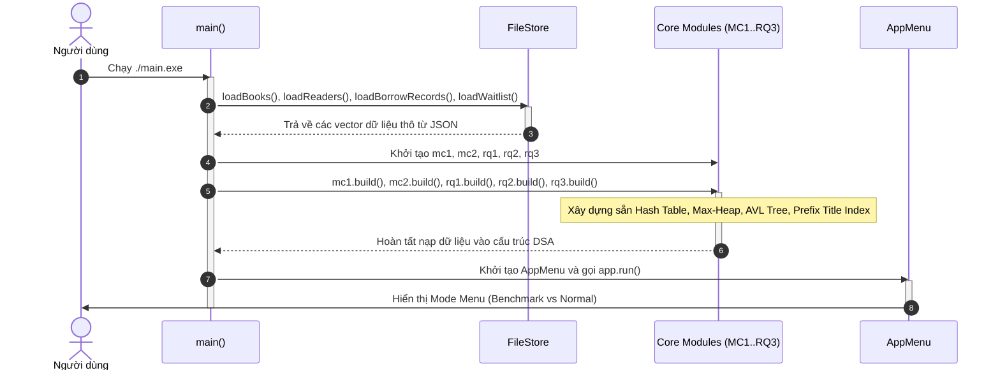
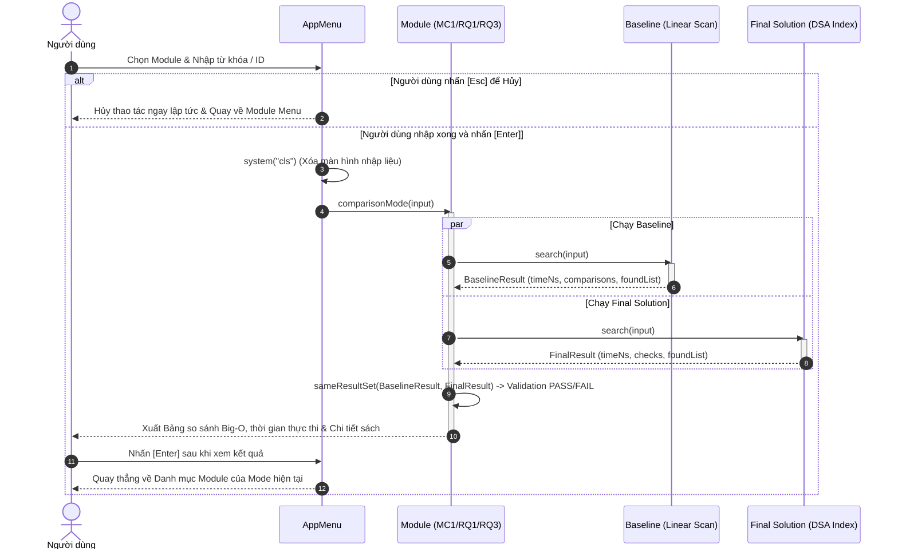
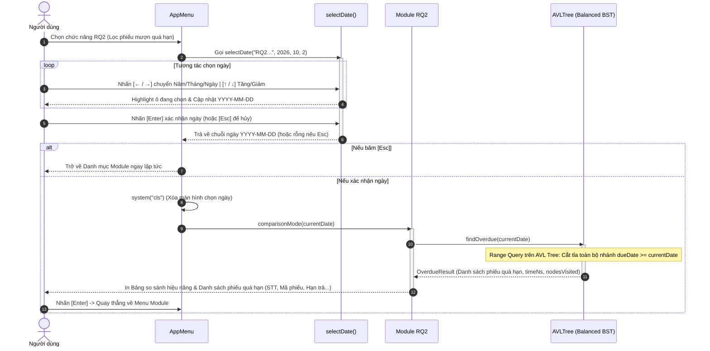

# 📚 HỆ THỐNG QUẢN LÝ THƯ VIỆN & TRA CỨU TÀI LIỆU (DSA FINAL PROJECT)

> **Đồ án môn học**: Cấu trúc Dữ liệu & Giải thuật (Data Structures & Algorithms)  
> **Ngôn ngữ & Chuẩn**: C++17 | Hướng đối tượng (OOP) | Terminal UI Tương tác | Tối ưu hóa Big-O  
> **Dữ liệu**: Quản lý và lưu trữ liên tục qua định dạng JSON (`nlohmann/json`)

---

## 📑 MỤC LỤC
1. [Tổng quan Dự án](#-tong-quan-du-an)
2. [Cấu trúc Thư mục Dự án](#-cau-truc-thu-muc-du-an)
3. [Kiến trúc Chế độ Hoạt động (2 Modes)](#-kien-truc-che-do-hoat-dong-2-modes)
4. [Biểu đồ Trình tự (Sequence Diagrams)](#-bieu-do-trinh-tu-sequence-diagrams)
   - [1. Luồng Khởi động & Điều phối Hệ thống](#1-luong-khoi-dong--dieu-phoi-he-thong-system-lifecycle)
   - [2. Luồng Thực thi Benchmark Mode](#2-luong-thuc-thi-tra-cuu--benchmark-mode)
   - [3. Luồng Bộ chọn Ngày & Lọc quá hạn RQ2 (AVL Tree)](#3-luong-bo-chon-ngay--loc-qua-han-rq2-avl-tree)
5. [Chi tiết 5 Module Nghiệp vụ & Thuật toán DSA](#-chi-tiet-5-module-nghiep-vu--thuat-toan-dsa)
   - [MC1: Tra cứu chính xác tài liệu theo Book ID](#1-module-mc1-tra-cuu-chinh-xac-tai-lieu-theo-book_id)
   - [MC2: Tìm tài liệu có lượt mượn nhiều nhất](#2-module-mc2-tim-tai-lieu-co-luot-muon-nhieu-nhat)
   - [RQ1: Tra cứu danh mục sách theo Thể loại](#3-module-rq1-tra-cuu-tat-ca-tai-lieu-theo-the-loai)
   - [RQ2: Lọc danh sách phiếu mượn quá hạn](#4-module-rq2-loc-danh-sach-phieu-muon-qua-han)
   - [RQ3: Tìm kiếm tài liệu theo Tên sách / Từ khóa](#5-module-rq3-tim-kiem-tai-lieu-theo-ten-sach--tu-khoa)
6. [Cấu trúc Dữ liệu JSON (Data Schemas)](#-cau-truc-du-lieu-json-data-schemas)
7. [Hướng dẫn Trải nghiệm UI & Phím điều hướng](#-huong-dan-trai-nghiem-ui--phim-dieu-huong)
8. [Hướng dẫn Biên dịch & Chạy chương trình](#-huong-dan-bien-dich--chay-chuong-trinh)

---

## 🌟 TỔNG QUAN DỰ ÁN

Dự án là một **Hệ thống Quản lý Thư viện hoàn chỉnh**, tập trung giải quyết các bài toán tra cứu, thống kê, kiểm tra hạn trả và tìm kiếm từ khóa với hiệu năng cao. Hệ thống được xây dựng nhằm đối sánh trực quan giữa:
- **Baseline Solution**: Các thuật toán thô sơ duyệt tuần tự (Linear Scan $O(n)$).
- **Final Solution**: Các Cấu trúc Dữ liệu Nâng cao tự thiết kế (Hash Table, Max-Heap, AVL Tree, Prefix Title Index) để tối ưu theo từng nghiệp vụ.

### Điểm nổi bật về mặt Kỹ thuật:
- **Không dùng STL nâng cao có sẵn cho core**: Tự cài đặt Bảng băm Chaining, Cây AVL tự cân bằng, Cấu trúc Max-Heap mảng động.
- **Terminal UI Tương tác mượt mà**: Điều hướng bằng phím mũi tên (`↑ / ↓`, `← / →`), không tải lại giật lag, hiển thị bảng ASCII gọn gàng chuẩn Monochrome.
- **Bộ chọn ngày thông minh (Date Picker)**: Chuyển đổi giữa Năm/Tháng/Ngày bằng phím `← / →`, tự động kiểm soát năm nhuận và số ngày trong tháng.
- **Xử lý ngắt phím `Esc` tức thì**: Người dùng có thể nhấn `Esc` ở bất kỳ bước nhập liệu nào để hủy và quay về Menu ngay lập tức.

---

## 📁 CẤU TRÚC THƯ MỤC DỰ ÁN

```text
DSA_Project_final/
├── data/                               # Dữ liệu nguồn JSON
│   ├── books.json                      # Danh mục sách (Mã, tên, tác giả, thể loại, tồn kho, lượt mượn...)
│   ├── readers.json                    # Hồ sơ độc giả thư viện
│   ├── borrow_records.json             # Lịch sử phiếu mượn/trả sách
│   └── waitlist.json                   # Danh sách chờ khi sách hết tồn kho
├── include/
│   ├── presentation/                   # Điều hướng & Giao diện người dùng
│   │   └── AppMenu.h
│   ├── core/                           # Các Header định nghĩa thuật toán DSA
│   │   ├── mc1/                        # MC1: Tra cứu sách theo ID
│   │   │   ├── MC1.h
│   │   │   ├── LinearSearch.h
│   │   │   ├── HashTable.h
│   │   │   └── SearchResult.h
│   │   ├── mc2/                        # MC2: Sách mượn nhiều nhất
│   │   │   ├── MC2.h
│   │   │   ├── LinearMaxScan.h
│   │   │   ├── MaxHeap.h
│   │   │   └── MaxResult.h
│   │   ├── rq1/                        # RQ1: Sách theo thể loại
│   │   │   ├── RQ1.h
│   │   │   ├── LinearCategoryScan.h
│   │   │   ├── CategoryHashTable.h
│   │   │   └── CategoryResult.h
│   │   ├── rq2/                        # RQ2: Phiếu mượn quá hạn
│   │   │   ├── RQ2.h
│   │   │   ├── LinearOverdueScan.h
│   │   │   ├── AVLTree.h
│   │   │   └── OverdueResult.h
│   │   └── rq3/                        # RQ3: Tìm kiếm theo từ khóa
│   │       ├── RQ3.h
│   │       ├── LinearTitleScan.h
│   │       ├── CategoryTitleSearch.h
│   │       └── TitleSearchResult.h
│   ├── utils/                          # Tiện ích kiểm định ngày tháng
│   │   └── DateUtils.h
│   └── nlohmann/                       # Thư viện JSON for Modern C++
│       └── json.hpp
├── src/
│   ├── presentation/
│   │   └── AppMenu.cpp                 # Quản lý giao diện, menu phím mũi tên & bắt phím Esc
│   ├── core/                           # Cài đặt chi tiết các thuật toán DSA
│   │   ├── mc1/ (MC1.cpp, LinearSearch.cpp, HashTable.cpp)
│   │   ├── mc2/ (MC2.cpp, LinearMaxScan.cpp, MaxHeap.cpp)
│   │   ├── rq1/ (RQ1.cpp, LinearCategoryScan.cpp, CategoryHashTable.cpp)
│   │   ├── rq2/ (RQ2.cpp, LinearOverdueScan.cpp, AVLTree.cpp)
│   │   └── rq3/ (RQ3.cpp, LinearTitleScan.cpp, CategoryTitleSearch.cpp)
│   ├── models/                         # Khai báo Struct/Class thực thể
│   │   ├── Book.h
│   │   ├── Reader.h
│   │   ├── BorrowRecord.h
│   │   ├── WaitlistEntry.h
│   │   └── Models.h
│   └── persistence/                    # Đọc/ghi và parse file JSON
│       ├── FileStore.h
│       └── FileStore.cpp
├── build.bat                           # Script biên dịch & chạy nhanh trên CMD
├── build.ps1                           # Script biên dịch & chạy nhanh trên PowerShell
├── main.cpp                            # Điểm khởi động chương trình (Bootstrap)
├── doc/                                # Tài liệu đặc tả và prompt thiết kế
└── README.md                           # Tài liệu dự án chi tiết
```

---

## 🧭 KIẾN TRÚC CHẾ ĐỘ HOẠT ĐỘNG (2 MODES)

Hệ thống cung cấp 2 chế độ độc lập phục vụ cả việc nghiên cứu đối sánh và vận hành thực tế:

```text
                  ┌─────────────────────────────────────┐
                  │          CHỌN CHẾ ĐỘ HOẠT ĐỘNG       │
                  └──────────────────┬──────────────────┘
                                     │
           ┌─────────────────────────┴─────────────────────────┐
           ▼                                                   ▼
┌───────────────────────────────┐               ┌───────────────────────────────┐
│        BENCHMARK MODE         │               │          NORMAL MODE          │
│   (So sánh 2 thuật toán)      │               │     (Vận hành thực tế)        │
├───────────────────────────────┤               ├───────────────────────────────┤
│ • Chạy đồng thời Baseline     │               │ • Chỉ chạy Final Solution     │
│   và Final Solution.          │               │   đã tối ưu hóa.              │
│ • Đo thời gian (nanoseconds). │               │ • Xuất kết quả trực tiếp      │
│ • Đếm so sánh / Nodes duyệt.  │               │   với độ trễ thấp nhất.       │
│ • Kiểm định kết quả (PASS).   │               │ • Hiển thị bảng chi tiết      │
│ • Xuất bảng so sánh Big-O.    │               │   các bản ghi tìm thấy.       │
└───────────────────────────────┘               └───────────────────────────────┘
```

---

## 📊 BIỂU ĐỒ TRÌNH TỰ (SEQUENCE DIAGRAMS)

### 1. Luồng Khởi động & Điều phối Hệ thống (System Lifecycle)



---

### 2. Luồng Thực thi Tra cứu & Benchmark Mode (MC1 / MC2 / RQ1 / RQ3)



---

### 3. Luồng Bộ chọn Ngày & Lọc quá hạn RQ2 (AVL Tree)



---

## 🔍 CHI TIẾT 5 MODULE NGHIỆP VỤ & THUẬT TOÁN DSA

### 1. Module MC1: Tra cứu chính xác tài liệu theo `book_id`
- **Mục tiêu**: Người dùng nhập chính xác Mã sách (ví dụ: `B001`, `b002` - hỗ trợ *case-insensitive*), trả về thông tin chi tiết của sách.
- **Baseline**: `Linear Search`
  - Quét tuần tự từ đầu đến cuối danh sách `vector<Book>`.
  - Độ phức tạp: $O(n)$.
- **Final Solution**: `Custom Hash Table` (Separate Chaining)
  - Áp dụng hàm băm DJB2 chuyển đổi `book_id` thành chỉ số bucket.
  - Xử lý xung đột bằng Danh sách liên kết đơn (Singly Linked List).
  - Độ phức tạp: $O(1)$ average.

---

### 2. Module MC2: Tìm tài liệu có lượt mượn nhiều nhất
- **Mục tiêu**: Xác định cuốn sách có `borrow_count` lớn nhất trong thư viện (Tie-break: nếu bằng lượt mượn, ưu tiên `book_id` nhỏ hơn).
- **Baseline**: `Linear Max Scan`
  - Quét toàn bộ mảng sách và cập nhật biến `maxBook`.
  - Độ phức tạp: $O(n)$.
- **Final Solution**: `Max-Heap` (Cài đặt trên Mảng động tùy biến)
  - Tự xây dựng thao tác `heapifyDown`, `heapifyUp`, `extractMax`.
  - Khởi tạo Heap: `buildHeap` mất $O(n)$.
  - Lấy phần tử lớn nhất: `getMax()` chỉ mất $O(1)$.

---

### 3. Module RQ1: Tra cứu tất cả tài liệu theo Thể loại (`category`)
- **Mục tiêu**: Nhập một thể loại (ví dụ: `Computer Science`, `Database`), trả về toàn bộ sách thuộc thể loại đó.
- **Baseline**: `Linear Category Scan`
  - Quét toàn bộ kho sách, kiểm tra chuỗi `category`.
  - Độ phức tạp: $O(n)$.
- **Final Solution**: `Category Hash Table`
  - Bảng băm ánh xạ: `category_key -> vector<Book*>`.
  - Khi tra cứu, chỉ cần băm tên thể loại và lấy trực tiếp danh sách con trỏ `Book*`.
  - Độ phức tạp: $O(1 + k)$ average (với $k$ là số sách thuộc thể loại đó).

---

### 4. Module RQ2: Lọc danh sách phiếu mượn quá hạn
- **Mục tiêu**: Nhập ngày kiểm tra (qua bộ chọn ngày trực quan `YYYY-MM-DD`), lọc tất cả các phiếu có `status == "BORROWING"` và `due_date < currentDate`.
- **Baseline**: `Linear Overdue Scan`
  - Duyệt qua toàn bộ danh sách `vector<BorrowRecord>`, so sánh ngày chuỗi.
  - Độ phức tạp: $O(n)$.
- **Final Solution**: `AVL Tree` (Cây nhị phân tìm kiếm tự cân bằng)
  - Cây AVL được đánh chỉ mục theo khóa `due_date`, lưu danh sách các phiếu cùng ngày đến hạn tại mỗi Node.
  - Cân bằng độ cao qua 4 phép quay: `Left-Left`, `Right-Right`, `Left-Right`, `Right-Left`.
  - Thuật toán `Range Query Overdue`:
    - Nếu `node->dueDate < currentDate`: Duyệt toàn bộ cây con bên trái (chắc chắn quá hạn), lấy bản ghi tại node hiện tại, và duyệt tiếp cây con bên phải.
    - Nếu `node->dueDate >= currentDate`: **Cắt tỉa toàn bộ cây con bên phải** (chắc chắn chưa quá hạn) và chỉ kiểm tra cây con bên trái.
  - Độ phức tạp: $O(\log n + k)$ (với $k$ là số phiếu quá hạn tìm thấy).

---

### 5. Module RQ3: Tìm kiếm tài liệu theo Tên sách / Từ khóa
- **Mục tiêu**: Người dùng nhập một từ khóa bất kỳ trong tên sách (ví dụ: `data`, `python`, `algorithms`, `system`), hệ thống tìm tất cả các sách có tiêu đề chứa từ khóa đó.
- **Baseline**: `Full Linear Title Scan`
  - Quét toàn bộ danh mục sách và thực hiện `substring find` không phân biệt hoa thường.
  - Độ phức tạp: $O(n \cdot m)$ (với $n$ là số sách, $m$ là độ dài tiêu đề).
- **Final Solution**: `Prefix Title Index`
  - Chuẩn hóa tiêu đề và từ khóa, tách token, sau đó lập chỉ mục theo prefix của từng token để lọc tập ứng viên.
  - Sau khi lấy tập ứng viên, hệ thống kiểm tra lại `substring find` trên tiêu đề đã chuẩn hóa để giữ kết quả không lệch so với baseline.
  - Với truy vấn prefix thông thường: chi phí phụ thuộc vào số ứng viên $O(c + k)$. Với substring nằm giữa từ, hệ thống fallback quét toàn bộ để bảo toàn tính đúng.

---

## 💾 CẤU TRÚC DỮ LIỆU JSON (DATA SCHEMAS)

| Tệp Dữ Liệu | Đường Dẫn | Các Trường Chính (Fields) |
|---|---|---|
| **Books** | `data/books.json` | `book_id`, `title`, `author`, `category`, `published_year`, `total_quantity`, `available_quantity`, `borrow_count` |
| **Readers** | `data/readers.json` | `reader_id`, `name`, `email`, `phone` |
| **Borrow Records** | `data/borrow_records.json` | `borrow_id`, `reader_id`, `book_id`, `borrow_date`, `due_date`, `return_date`, `status` (`BORROWING` / `RETURNED`) |
| **Waitlist** | `data/waitlist.json` | `wait_id`, `book_id`, `reader_id`, `registered_at` |

---

## ⌨️ HƯỚNG DẪN TRẢI NGHIỆM UI & PHÍM ĐIỀU HƯỚNG

Giao diện được thiết kế theo phong cách **Tối giản - Đơn sắc (Monochrome) - Tối ưu công thái học**:

```text
======================================================================
   DANH MUC MODULE CHUC NANG
 Che do hien tai: [ BENCHMARK MODE - SO SANH THUAT TOAN ]
----------------------------------------------------------------------

  -> 1. MC1 - Tra cuu chinh xac sach theo Book ID (Hash Table vs Linear Search)
     2. MC2 - Tim sach co luot muon cao nhat (Max-Heap vs Linear Max Scan)
     3. RQ1 - Tra cuu tat ca sach theo The loai (Category Hash Table vs Linear Scan)
     4. RQ2 - Loc danh sach phieu muon qua han (AVL Tree vs Linear Scan)
     5. RQ3 - Tim kiem sach theo Tu khoa / Ten sach (Prefix Title Index vs Linear Scan)
     9. Doi Che do hoat dong (Change Mode)
     0. Thoat chuong trinh (Exit)

======================================================================
 [^/v] Di chuyen   [Enter] Chon   [Esc] Quay lai
======================================================================
```

### Các phím điều hướng chính:
- **`↑ / ↓` hoặc `W / S`**: Di chuyển con trỏ lựa chọn lên / xuống giữa các mục.
- **`Enter`**: Xác nhận chọn chức năng / xác nhận ngày / gửi từ khóa tìm kiếm.
- **`Esc`**:
  - Khi ở Menu: Quay lại menu cha hoặc thoát chương trình.
  - Khi đang nhập liệu (**MC1, RQ1, RQ3**): Nhấn `Esc` bất kỳ lúc nào để **hủy ngay lập tức và quay về Menu**, không cần gõ chữ hay nhấn Enter.
- **Bộ chọn ngày `selectDate` (RQ2)**:
  - Phím `← / →` (hoặc `A / D`): Chuyển vị trí chọn giữa `[ NĂM ]` $\longleftrightarrow$ `[ THÁNG ]` $\longleftrightarrow$ `[ NGÀY ]`.
  - Phím `↑ / ↓` (hoặc `W / S`): Tăng / giảm giá trị của ô đang chọn.
  - Tự động xóa màn hình và xuất danh sách phiếu mượn quá hạn ngay sau khi nhấn `Enter`.

---

## 🚀 HƯỚNG DẪN BIÊN DỊCH & CHẠY CHƯƠNG TRÌNH

### Cách 1: Sử dụng Script tự động (Khuyên dùng)

- **Trên PowerShell**:
  ```powershell
  .\build.ps1
  ```
- **Trên Command Prompt (CMD)**:
  ```cmd
  build.bat
  ```

---

### Cách 2: Lệnh `g++` thủ công (Hỗ trợ chuẩn C++17)

```powershell
# Biên dịch toàn bộ các file nguồn vào main.exe
g++ -std=c++17 main.cpp src/persistence/FileStore.cpp src/core/mc1/LinearSearch.cpp src/core/mc1/HashTable.cpp src/core/mc1/MC1.cpp src/core/mc2/LinearMaxScan.cpp src/core/mc2/MaxHeap.cpp src/core/mc2/MC2.cpp src/core/rq1/LinearCategoryScan.cpp src/core/rq1/CategoryHashTable.cpp src/core/rq1/RQ1.cpp src/core/rq2/LinearOverdueScan.cpp src/core/rq2/AVLTree.cpp src/core/rq2/RQ2.cpp src/core/rq3/LinearTitleScan.cpp src/core/rq3/CategoryTitleSearch.cpp src/core/rq3/RQ3.cpp src/presentation/AppMenu.cpp -o main.exe

# Chạy file thực thi
.\main.exe
```

---

## 👥 THÀNH VIÊN THỰC HIỆN & BÁO CÁO

- **Đồ án**: Cấu trúc Dữ liệu & Giải thuật nâng cao (DSA Final Project)
- **Chủ đề**: Thiết kế và Đánh giá Hiệu năng Hệ thống Quản lý Thư viện (MC1 - MC2 - RQ1 - RQ2 - RQ3)
- **Bản quyền**: © 2026 Library Management DSA Team.
